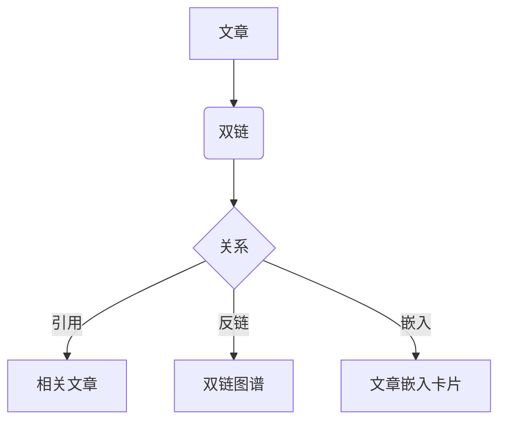

## 基础文本样式

这是一段包含 **加粗**、*斜体*、~~删除线~~ 与 `行内代码` 的文字。

外部链接：[Qwik 官网](https://qwik.dev)；内部双链指向 [[在这里写文章标题|本文自身（存在）]]，以及一条 [[一篇还没写的文章|缺失双链（虚线样式）]]。行内公式：$E = mc^2$。

> 想**展示**双链语法本身（而不是真的链接），就放进反引号里：`[[目标标题|别名]]`。放在正文里会被解析成真链接。

## 代码块

TypeScript（只写语言标签即可，高亮由 Prism 处理，主题随站点明暗切换）：

```ts
function greet(name: string): string {
  const msg = `Hello, ${name}!`;
  return msg;
}

console.log(greet('World'));
```

Bash：

```bash
npm install
npm run build
npm run validate
```

## 数学公式

行内：$a^2 + b^2 = c^2$；独立成块：

$$
\int_{0}^{\infty} e^{-x^2}\,dx = \frac{\sqrt{\pi}}{2}
$$

## 列表

### 无序列表

- 苹果
- 香蕉
- 橙子

### 有序列表

1. 第一步
2. 第二步
3. 第三步

### 任务列表

- [x] 已完成的任务
- [ ] 未完成的任务

## 引用与 Callout

> 这是一句普通的引用。

> [!tip] 提示：tip 类型，给出更好做法。

> [!note] 说明：note 类型，补充说明。

> [!info] 信息：info 类型，背景知识。

> [!warning] 警告：warning 类型，需要注意。

> [!danger] 危险：danger 类型，严禁操作。

> [!quote] 引用：quote 类型，引述他人观点。

## 表格

| 语言 | 类型 | 用途 |
| --- | --- | --- |
| Go | 静态 | 后端 / 合约 |
| TypeScript | 动态 | 前端 / 工具 |

## 图片与嵌入

普通图片有两种写法：

1. **方案 A（推荐，随数据仓存）**——图片放 Obsidian 风格附件目录 `content/<本文标题>.assets/`，写相对路径，构建期自动重写为 raw 绝对 URL：

    <!-- 图片放 content/在这里写文章标题.assets/arch-flow.webp（与 .md 同名目录） -->

2. **完整外链 / 站点根图**——以下两类**不重写、不校验**，用作引用外部图或站点自带图：

   
   

文章嵌入卡片（语法 `![[目标标题]]`，渲染目标文章的标题 / 描述 / 标签）：

![[在这里写文章标题]]

交互式代码示例（StackBlitz 嵌入）：

![[stackblitz|https://stackblitz.com/edit/qwik-starter?embed=1&file=src%2Froot.tsx]]

## 脚注

这句话带一个脚注[^1]，用于演示脚注上下标跳转。

[^1]: 脚注内容：这里是补充说明文字。

## 流程图（Mermaid）

> Mermaid 节点标签里**别写 `[[` 或 `[]`**，会被当成子程序节点语法而解析失败。



---

_收尾：删掉用不到的语法块，再按 SKILL 的 §6 自检清单过一遍。_
