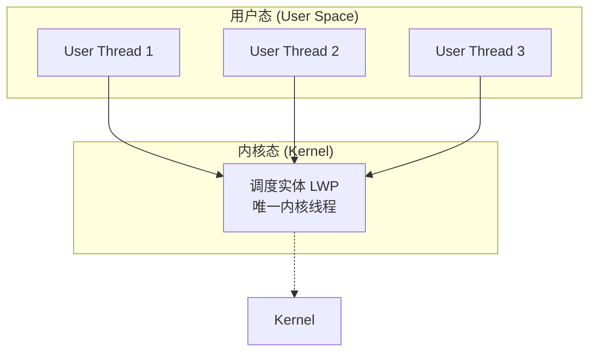
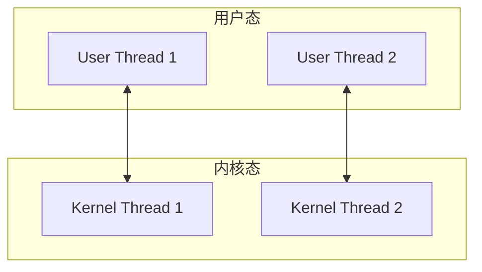
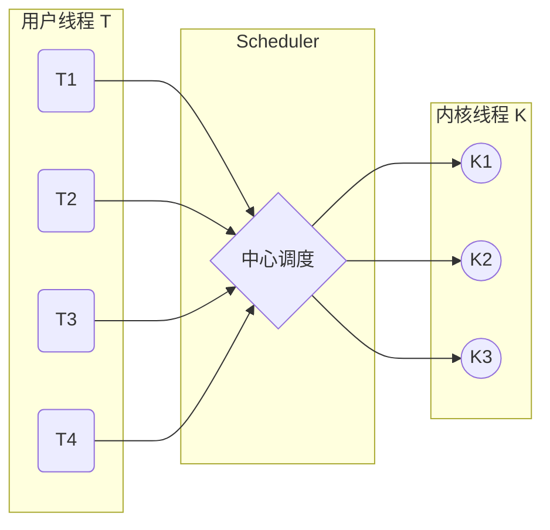
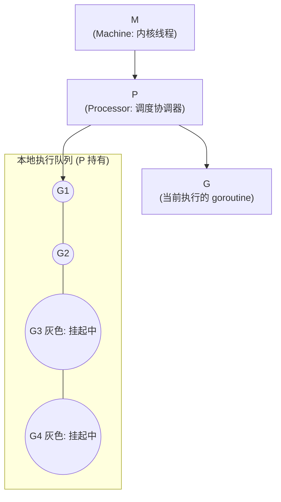

来源：C:\node\学无止境\golang\Golang的并发机制.md（4 张配图重绘）
主题：Golang 并发模型的理论基础（CSP）+ 调度器实现（GMP）

### 1. CSP 并发模型

CSP（Communicating Sequential Processes）模型是 1970 年代 Tony Hoare 提出的并发理论，描述两个独立的并发实体通过共享的 channel（管道）进行通信的并发模型。

#### 1.1 核心思想

|||
|---|---|
|Process|独立的并发实体（如 goroutine）|
|Channel|第一类对象，用于进程间消息传递|
|关注点|不关注是谁在发送消息，只关注用的是哪个 channel|


关键哲学：Don't communicate by sharing memory; share memory by communicating（不要通过共享内存来通信，而要通过通信来共享内存）

### 2. Golang 的 CSP 实现

Golang 借鉴了 CSP 模型的部分概念实现并发，但没有完全实现 CSP 的所有理论，仅借用了 process 和 channel 这两个概念。

|||
|---|---|
|Process|goroutine（实际并发执行的实体）|
|Channel|channel（用于 goroutine 间通信）|
|数据共享|通过 channel 通信实现|


### 3. Channel

#### 3.1 核心特征

- 被单独创建，可以在 goroutine 之间传递
- 通信模式类似 boss-worker 模式
- 实体之间匿名（不感知对方身份），实现解耦
- 是同步的：消息被发送到 channel 后，最终一定会被另一个实体消费
#### 3.2 实现原理

- 底层是一个阻塞的消息队列
- 发送时若无接收者，发送方阻塞
- 接收时若无消息，接收方阻塞
### 4. Goroutine

Goroutine 是实际并发执行的实体，底层使用协程（coroutine）实现。

#### 4.1 coroutine 的 3 大优势

||||
|---|---|---|
|1|用户态|避免内核态与用户态切换的开销|
|2|自定义调度|可由语言/框架层调度|
|3|栈空间小|允许创建大量实例（几万个）|


#### 4.2 与其他语言对比

||||
|---|---|---|
|Java 1.3|JVM 统一调度（green thread）|已改为内核线程|
|Ruby Fiber|用户自行调度|半协程|
|Go goroutine|Go 运行时调度器|内置，提供统一语法|


### 5. 线程模型：N:1 / 1:1 / M:N

用户线程与内核线程的 3 种对应关系。

#### 5.1 N:1 模型（多对一）



特点：多个用户线程跑在一个内核线程上。无法利用多核；某用户线程阻塞会卡住所有。

#### 5.2 1:1 模型（一一对应）



特点：Java 现在的模型。利用多核；但创建/切换成本高，线程数受限。

#### 5.3 M:N 模型（多对多，Go 选用）



特点：Go 的 GMP 模型基础，结合 N:1 的轻量 + 1:1 的多核优势。

### 6. Goroutine 调度器：G-M-P 模型

Go 实现了语言层面的调度器，通过 M:N 线程模型达到高效率。

#### 6.1 三个核心角色

||||
|---|---|---|
|G|Goroutine|待执行的 goroutine，包含栈空间|
|M|Machine|内核线程，实际执行单元|
|P|Processor|调度协调器，协调 M 和 G 的执行|


关键规则：内核线程必须拿到 P 才能调度 goroutine。通常通过限定 P 的数量控制并发度（默认 = CPU 核数）。

#### 6.2 调度示意



说明：
- P 通过 epoll 监听网络 I/O
- 灰色 Gn 是已挂起的 goroutine（在等待 I/O）
- 当 P 通过 epoll 发现对应 fd 就绪时，会重新调度对应的挂起 goroutine

#### 6.3 Work Stealing（工作窃取）算法

为保证调度公平性，Go 调度器引入了 work stealing：

1. P 先处理自己的本地执行队列
        ↓
2. 队列空后，到全局执行队列偷 G
        ↓
3. 全局队列也空，再到其他 P 的队列抢 G


避免部分 P 饥饿 + 充分利用多核。

### 7. 总结

|||
|---|---|
|并发基础|CSP 模型|
|并发实体|goroutine（轻量级，可创建几十万个）|
|通信方式|channel（匿名消息传递，解耦）|
|调度|Go 运行时调度器（语言层面，自动）|
|优势|屏蔽内部细节，对外提供简洁 go 关键字|


### 附录 A：Go 并发三件套速查

```go
// 1. 启动 goroutine
go func() { /* ... */ }()

// 2. 创建 channel
ch := make(chan int)       // 无缓冲（同步）
ch := make(chan int, 10)   // 有缓冲（容量 10）

// 3. 通信
ch <- 42        // 发送
v := <-ch      // 接收
```

### 附录 B：经典问答

|||
|---|---|
|goroutine 是线程吗？|不是，是用户态协程（coroutine）|
|为什么 goroutine 轻量？|用户态调度 + 栈可伸缩（2KB 起步）|
|GMP 中 P 的作用？|调度协调器，控制并发度（默认 = GOMAXPROCS）|
|M 和 G 是几比几？|通过 P 动态映射（M:N），不是固定比|
|goroutine 切换成本？|纳秒级（vs 线程切换微秒级）|


### 参考资料

- 原文作者：falm
- 原文链接：https://www.jianshu.com/p/36e246c6153d
- 来源：简书

整理版本：v1.0 · 2026-08-19
图片：4 张原始配图已用 Mermaid 重绘，可结构化的关系图全部内联为文本
