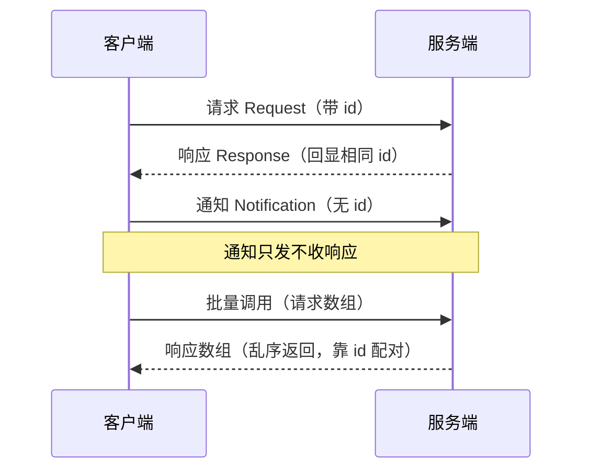
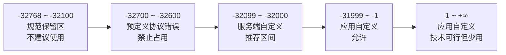
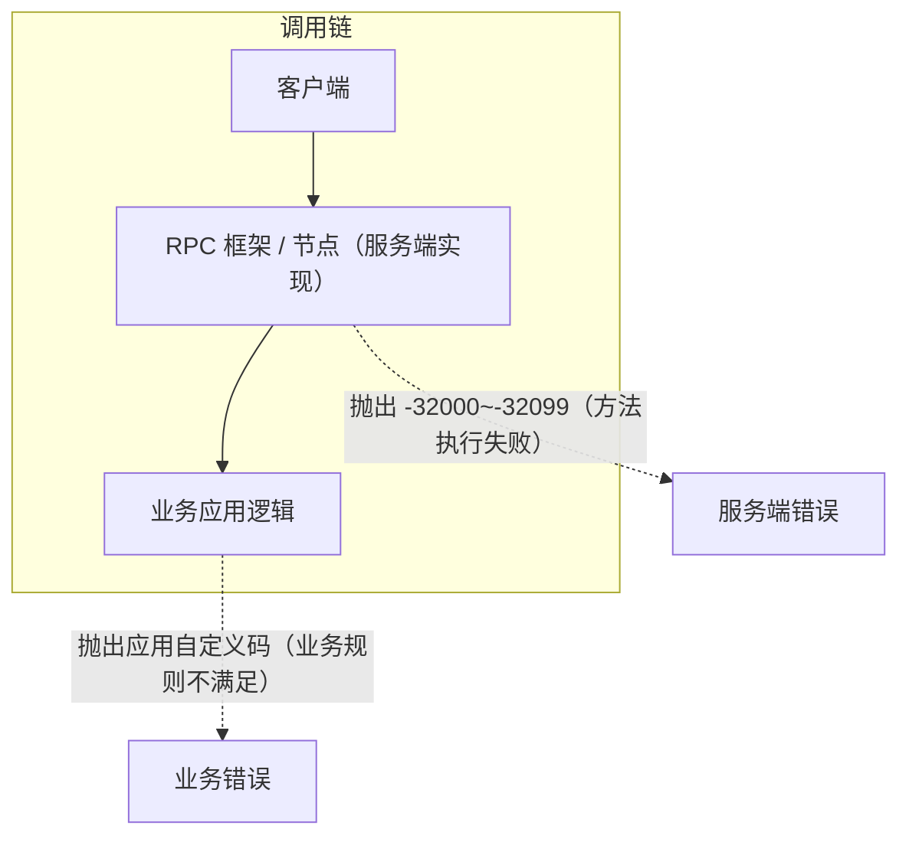

整理版本：v1.0 · 2026-08-22

### 1. 什么是 JSON-RPC

JSON-RPC 是一个基于 JSON 的远程过程调用（Remote Procedure Call）协议——它让客户端像调用本地函数一样，通过网络调用远端的服务。核心设计是"轻量 + 无状态 + 与传输层无关"，目前主流版本为 JSON-RPC 2.0（2010 年定稿）。

#### 1.1 通信流程



通信的核心规则只有一条：请求和响应通过 id 字段配对，客户端发什么 id，服务端就回什么 id。

#### 1.2 协议要点

|||
|---|---|
|无状态|协议本身不保存会话，每个请求独立处理|
|传输层无关|HTTP、WebSocket、TCP 均可承载，协议不关心底层|
|通知（Notification）|不带 id 的请求，服务端处理但不返回任何内容|
|批量调用（Batch）|一次发送请求数组 [...]，响应数组可乱序，靠 id 匹配|
|版本字段|"jsonrpc": "2.0" 必填，声明协议版本|


#### 1.3 典型应用场景

- 区块链节点接口：Ethereum、ChainMaker 等链的节点 RPC 均为 JSON-RPC（如 eth_call、eth_sendTransaction）
- VS Code / LSP：语言服务器协议（LSP）底层就是 JSON-RPC，走 stdio 或 socket
- 通用服务接口：适合"服务端已是一组函数"的场景
#### 1.4 与 REST 的对比

||||
|---|---|---|
|导向|资源导向（URL 定位资源 + 动词）|动作导向（method 直接调函数）|
|语义|重语义、支持缓存|轻量直接|
|适用|Web API、资源 CRUD|节点接口、语言服务器、函数式服务|


### 2. 消息结构

#### 2.1 请求对象

||||
|---|---|---|
|jsonrpc|✅|固定 "2.0"|
|method|✅|方法名（字符串）|
|params|❌|参数，数组或对象两种形式|
|id|❌|请求标识；无 id 即为通知|


#### 2.2 响应对象

|||
|---|---|
|jsonrpc|固定 "2.0"|
|result / error|二选一，不能同时出现|
|id|与请求一致；无法确定时（如解析错误）为 null|


error 对象结构：code（整数）/ message（简短描述）/ data（可选，任意结构，放详细错误信息）。

### 3. 错误码体系

#### 3.1 标准错误码（预定义）

|||
|---|---|
|-32700|解析错误（Invalid JSON，语法问题）|
|-32600|无效请求（是合法 JSON 但不是合法 Request 对象）|
|-32601|方法不存在|
|-32602|无效参数|
|-32603|内部错误（框架兜底）|
|-32000 ~ -32099|实现定义的服务端错误（推荐自定义区间）|


#### 3.2 错误码空间划分

规范原文：


-32000 to -32099: Reserved for implementation-defined server-errors.
The remainder of the error code space is available for application defined errors.

||||
|---|---|---|
|-32700、-32600 ~ -32603|❌ 禁止占用|预定义协议错误，占用会导致客户端误判|
|-32768 ~ -32100|⚠️ 不建议|规范"保留给预定义错误"的区域，虽未定义具体含义|
|-32000 ~ -32099|✅ 首选|规范指定的"实现定义的服务端错误"区间|
|-31999 ~ -1|✅ 可用|应用自定义（规范明确开放）|
|1 ~ +∞（正数）|✅ 技术合法|应用自定义，但实践中兼容性差，不推荐|




#### 3.3 三类自定义区间对比

|||||
|---|---|---|---|
|定义者|JSON-RPC 规范|规范开放给应用|规范开放给应用（同左）|
|谁抛出的|RPC 框架 / 节点实现者|具体业务应用逻辑|具体业务应用逻辑（同左）|
|语义层级|"方法存在，但执行失败"|纯业务语义（规则违反等）|纯业务语义（同左）|
|客户端能否识别|✅ 有生态共识，中间件/工具认识该区间|⚠️ 无共识，只能透传|⚠️ 无共识，部分客户端假设错误码为负|
|典型例子|geth 返回 -32000、LSP 服务端错误|如 -1001 参数校验失败|如 1001 业务异常|
|使用频率|高（惯例）|中|低|


核心区别在于"谁定义、谁抛出"：



- 服务端自定义区间：错误来自 RPC 服务本身（写框架/节点的人），客户端识别到 -32000 系列即可安全认为"方法调用没成功"，无需理解具体含义。
- 应用自定义（含正数）：错误来自跑在 RPC 之上的业务（用框架的人），只有业务客户端能理解，规范不承诺任何语义。
- 正数 vs 负数：规范上零差别，差别在实践——JSON-RPC 继承自 XML-RPC，错误码约定用负数；生态里的调试工具、日志聚合、监控告警多假设"错误码是负数"。只在自家前后端之间用，正数完全合法；对接第三方客户端或开源工具链，负数更稳妥。
### 4. 多种情况调用示例

以下示例假设 DID service 暴露了 JSON-RPC 方法 did_getDocument。

#### 4.1 正常成功

```json
// 请求
{"jsonrpc": "2.0", "method": "did_getDocument", "params": {"did": "did:cm:7cdb436b..."}, "id": 1}
// 响应（result 与 error 互斥，只出现 result）
{"jsonrpc": "2.0", "result": {"id": "did:cm:7cdb436b...", "verificationMethod": [...]}, "id": 1}
```

#### 4.2 解析错误 -32700（发来的根本不是合法 JSON）

```json
// 客户端实际发送：{"jsonrpc":"2.0","method":"did_getDocument",   ← 截断/语法错误
// 服务端返回（此时无法得知 id，所以 id 为 null）：
{"jsonrpc": "2.0", "error": {"code": -32700, "message": "Parse error"}, "id": null}
```

#### 4.3 无效请求 -32600（是合法 JSON，但不是合法的 Request 对象）

```json
// 请求：jsonrpc 版本值错误 / 缺 method / id 是非法类型
{"jsonrpc": "1.0", "method": "did_getDocument", "id": 1}
// 响应：
{"jsonrpc": "2.0", "error": {"code": -32600, "message": "Invalid Request"}, "id": null}
```

#### 4.4 方法不存在 -32601

```json
// 请求：方法名拼错或未注册
{"jsonrpc": "2.0", "method": "did_getDocumen", "params": {"did": "did:cm:xxx"}, "id": 2}
// 响应（id 正常回显，客户端据此配对）：
{"jsonrpc": "2.0", "error": {"code": -32601, "message": "Method not found"}, "id": 2}
```

#### 4.5 无效参数 -32602

```json
// 请求：did 应为字符串，传成了数字
{"jsonrpc": "2.0", "method": "did_getDocument", "params": {"did": 12345}, "id": 3}
// 响应：
{"jsonrpc": "2.0", "error": {"code": -32602, "message": "Invalid params"}, "id": 3}
```

#### 4.6 内部错误 -32603（框架内部异常：panic、DB 连接断）

```json
{"jsonrpc": "2.0", "error": {"code": -32603, "message": "Internal error"}, "id": 4}
// 注意：-32603 是"框架兜底"，一旦捕获异常并转成业务错误，就不应再抛它
```

#### 4.7 服务端自定义 -32000 ~ -32099（方法存在、参数合法，但执行失败）

```json
{"jsonrpc": "2.0", "error": {"code": -32001, "message": "database unavailable"}, "id": 5}
{"jsonrpc": "2.0", "error": {"code": -32002, "message": "signature verification failed"}, "id": 6}
// 特点：错误来自"RPC 服务实现层"，客户端不用懂细节，知道"调用没成功"即可
```

#### 4.8 应用自定义（负数）——业务规则不满足，配 data 带详情

```json
{"jsonrpc": "2.0", "error": {
  "code": -1001,
  "message": "DID document not found",
  "data": {"did": "did:cm:7cdb436b...", "queryTime": "2026-08-22T15:00:00+08:00"}
}, "id": 7}
// 特点：只有业务客户端能理解；data 字段是规范给的"放任意详情"的位置
```

#### 4.9 正数自定义（技术上合法，实践中不推荐）

```json
{"jsonrpc": "2.0", "error": {"code": 1001, "message": "VC already registered"}, "id": 8}
// 风险：部分客户端/日志工具假设"错误码是负数"，正数码可能被忽略或误归类
```

#### 4.10 通知（无 id —— 只发不收，服务端不回任何东西）

```json
// 请求：fire-and-forget，比如上报埋点
{"jsonrpc": "2.0", "method": "log_event", "params": {"event": "page_view"}}
// 响应：无。服务端处理完即结束，绝不返回
```

#### 4.11 批量调用（一次数组，乱序响应靠 id 匹配）

```json
// 请求：一次发 3 个
[
  {"jsonrpc": "2.0", "method": "did_getDocument", "params": {"did": "did:cm:a"}, "id": 10},
  {"jsonrpc": "2.0", "method": "did_getDocument", "params": {"did": "did:cm:b"}, "id": 11},
  {"jsonrpc": "2.0", "method": "no_such_method", "id": 12}
]
// 响应：可以乱序，客户端按 id 归位
[
  {"jsonrpc": "2.0", "error": {"code": -32601, "message": "Method not found"}, "id": 12},
  {"jsonrpc": "2.0", "result": {"id": "did:cm:a"}, "id": 10},
  {"jsonrpc": "2.0", "result": {"id": "did:cm:b"}, "id": 11}
]
```

#### 4.12 特殊情况：批量全部失败 / 空数组

```json
// 请求：[]（空数组）
// 响应：单对象错误（不是数组）
{"jsonrpc": "2.0", "error": {"code": -32600, "message": "Invalid Request"}, "id": null}

// 请求：批量中所有请求都无 id（全是通知）
// 响应：什么也不返回
```

### 5. 实践建议：错误码选型速查

|||
|---|---|
|客户端发来的 JSON 坏了 / 请求结构非法 / 方法不存在 / 参数类型错|交给框架，-32700 ~ -32603（不需要自己抛）|
|方法内部执行失败（DB 挂、签名失败、依赖不可用）|-32001 ~ -32099|
|业务规则不满足（DID 不存在、VC 已注册、余额不足）|自定义负数 -1001 起，详情放 data|
|正数|别用，没有收益还牺牲兼容性|


核心心法：协议错误让框架抛，服务端错误用 -32000 系列，业务错误用负数自定义 + data 详情——三层各司其职，客户端拿到码先看区间即可决定是重试、报障还是走业务分支。

### 6. 参考资料

- JSON-RPC 2.0 官方规范：https://www.jsonrpc.org/specification
- JSON-RPC 维基百科：https://en.wikipedia.org/wiki/JSON-RPC
- XML-RPC（JSON-RPC 的历史渊源）：http://xmlrpc.com/
- Language Server Protocol（LSP，基于 JSON-RPC）：https://microsoft.github.io/language-server-protocol/
- Ethereum JSON-RPC 接口规范：https://ethereum.org/en/developers/docs/apis/json-rpc/
- Go 官方 JSON-RPC 库（net/rpc/jsonrpc）：https://pkg.go.dev/net/rpc/jsonrpc
