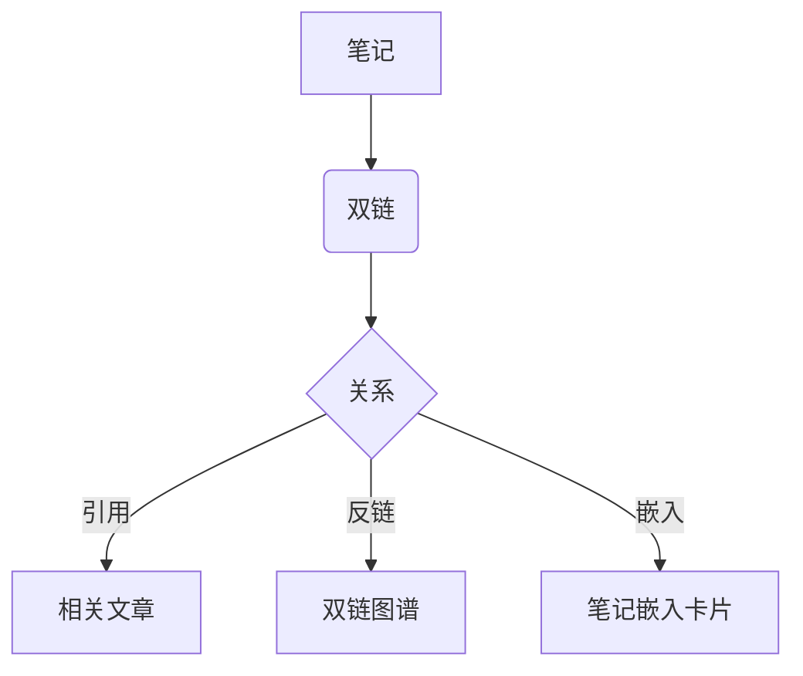

## 基础文本样式

这是一段包含 **加粗**、*斜体*、~~删除线~~ 与 `行内代码` 的文字。

外部链接：[Qwik 官网](https://qwik.dev)；内部双链指向 [[Markdown 全功能示例|本文自身（存在）]]，以及一条 [[尚未创建的笔记|缺失双链（虚线样式）]]。行内公式：$E = mc^2$。

## 多级标题

站点支持六级标题渲染：级别越深，视觉签名越轻。一级标题即文章标题（由页面渲染），正文内从二级起使用。

### 三级标题：左侧紫色竖条

三级标题正文——用于观察标题与正文的间距，以及左侧的紫色竖条装饰。

#### 四级标题：紫色文字

四级标题正文——文字改用站点主色紫，不再有竖条装饰。

##### 五级标题：石板灰文字

五级标题正文——转为灰阶文字，层级进一步弱化。

###### 六级标题：大写小灰字

六级标题正文——大写字母配合轻微字距，是视觉最轻的一级标题。

## 代码块

TypeScript（含文件名栏与第 2–3 行高亮）：

```ts filename="hello.ts" {2-3}
function greet(name: string): string {
  const msg = `Hello, ${name}!`;
  return msg;
}

console.log(greet('World'));
```

Bash：

```bash
pnpm install
pnpm build
pnpm test
```

## 数学公式

行内：$a^2 + b^2 = c^2$；独立成块：

$$
\int_{0}^{\infty} e^{-x^2}\,dx = \frac{\sqrt{\pi}}{2}
$$

## 列表

### 无序列表

- 苹果
- 香蕉
- 橙子

### 有序列表

1. 第一步
2. 第二步
3. 第三步

### 任务列表

- [x] 已完成的任务
- [ ] 未完成的任务

## 引用与 Callout

> 这是一句普通的引用。

> [!tip] 提示：这是一条 tip 类型的 Callout，左侧有彩色竖线。

> [!note] 说明：note 类型，用于补充说明。

> [!info] 信息：info 类型，用于背景知识。

> [!warning] 警告：warning 类型，需要注意。

> [!danger] 危险：danger 类型，严禁操作。

> [!quote] 引用：quote 类型，常用于引述他人观点。

## 表格

| 语言 | 类型 | 用途 |
| --- | --- | --- |
| Go | 静态 | 后端 / 合约 |
| TypeScript | 动态 | 前端 / 工具 |

## 图片与嵌入

普通图片（方案 A：相对路径，构建期重写为 raw 绝对 URL，站点零配置显示）：


矢量图（同目录 svg，验证 SVG 渲染；尖括号包裹是推荐写法，路径含空格/特殊字符时必用）：


内联 data URI（不重写、不校验，作为对照）：


笔记嵌入卡片（语法 `![[笔记标题]]`）：

![[Qwik 与 SSR 笔记]]

交互式代码示例（StackBlitz 嵌入）：

![[stackblitz|https://stackblitz.com/edit/qwik-starter?embed=1&file=src%2Froot.tsx]]

## 脚注

这句话带一个脚注[^1]，用于演示脚注上下标跳转。

[^1]: 脚注内容：这里是补充说明文字。

## 流程图（Mermaid）

下面用 Mermaid 语法画一个笔记关系流程图（运行时懒加载渲染）：



---

<p class="md-note">这是一段内嵌 HTML（已清洗），用于演示原始 HTML 节点。</p>
