本文是 **Mermaid 渲染能力测试页**：每个小节给出该图种的**语法关键字**（即 ` ```mermaid ` 代码块的第一行）与一个最小可渲染示例，用于验证当前站点能否正确渲染。

渲染机制：站点在文章详情页**运行时懒加载 Mermaid**（避免拖慢首屏），主题跟随站点明暗切换，未对图种做任何白名单限制——**Mermaid 支持的类型即可渲染**。若某图种解析失败，页面会在该位置显示「Mermaid 渲染失败」提示。

---

## 一、稳定图种

### 1. 流程图 Flowchart

关键字：`flowchart` 或 `graph`

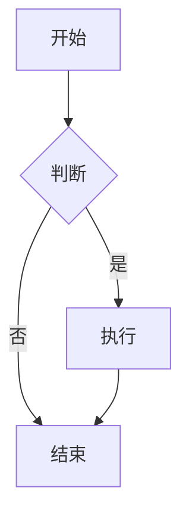
文档：[流程图 官方语法](https://mermaid.js.org/syntax/flowchart.html)
示例：[流程图 在线示例](https://mermaid.live/edit#pako:eJxFjE0KgkAYhq8yfGu9gIsg9Qa1ynHxoeMPqBPTDBEqtCxqEQTRJiKIXEUHqOtoHSMUrOXzvD85eNxnYECQ8LkXoZBkbNOMkKFTv5Z1tXGJrg-Imdera3O4l21ktqpojo-CWE6zrj6Xrfv39e5WENt5P_fN6dx5q7uwQYNQxD4YUiimQcpEii1C3pYoyIiljIJBKPgsQJVICjQrQQNUko8WmddP1dRHyewYQ4FpL6eYTTj_oeAqjMAIMJmx8gujg1U-)

#### 更多 mermaid.live 示例

#### Basic Flowchart

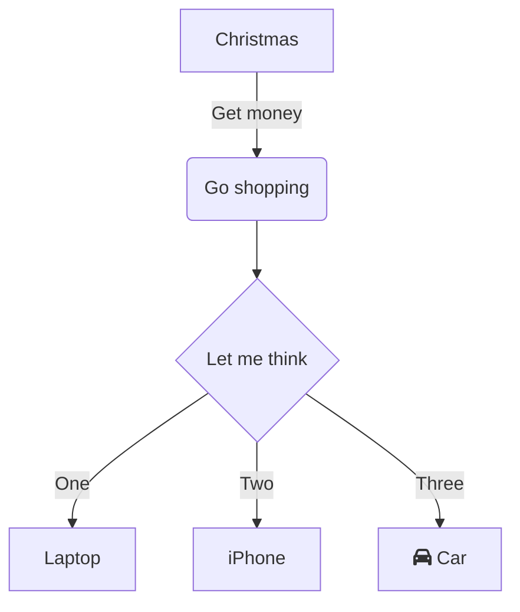
示例：[mermaid.live 在线示例](https://mermaid.live/edit#pako:eJxVi0FqwzAQRa8yzKoF-wJaFBq7zSbQQrOq5cVgjyxRSyNkmRBs3724IaVd_v_eW7CTnlGhGeXSWUoZzrUOAADPTWWTm7KnqYWyfFqPnMFL4OsKh4ejwGQlRheGx5t_2CWoltOuMWTrwtd2Q9VP_xZ4hbo5UcwS27_kfJEVXhr3biXwf2IT8wqvjSFlqOwoQUWpxQKH5HpUOc1coOfkaZ-47LHGbNmzRgUaezY0j1mjDhsWSHOWj2vo7ukce8pcOxoS-fsZKXyK_M4k82BRGRon3r4Bj81j2Q==)

#### Online Checkout Flow

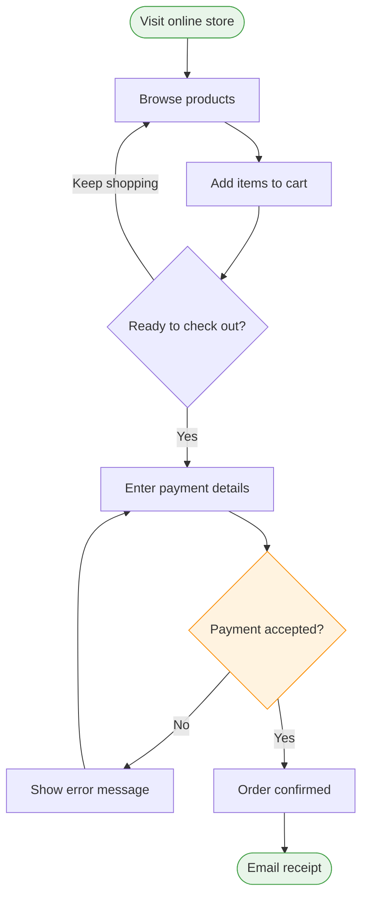
示例：[mermaid.live 在线示例](https://mermaid.live/edit#pako:eJyNkUFr3DAQhf_KoFwS2MBCUpr60NBmcyq0S7YEGnsPE2lki8iSGY1ZzO7-92LLDqW99CTezDfvDaOj0tGQKpT18aAbZIGfmyoAAOwEWS7LZ5ecQAzeBYIkkWl_BdfXn-Erx0OiMj_QcTS9lrTPw3N15B6QpfxiDDihNoFE0Mgyc2NzojaknaHjE6EZJqYh_Qaxl_tzJjMwsqdvRB2kJnadC_VpzvqH-kXpBFscyscgxNDh0FIQMCTo_LLnFocp_hm9M8ftzKDW1AmZJXvqTqbf4wmeSHgod008ADFHhpZSwppmy6k9mW5x-Ht-WuohBuu4LX-wIQadFZnlJFnnq8RAl-Vji84DkybXyf6qChlMMnjK3wTWeV9c0J39QJ9WSTi-UXFxe4Pr249_wqPf_7J56Qxba29o_Q7b1zu9XquVqtkZVQj3tFItcYujVMfRplLSUEuVKqBShiz2XipVhbNaKewl7oagl9G-Myi0cVgztkuxw_AS47vk2NeNKiz6ROffDmjndQ==)

#### CI/CD Pipeline with Subgraphs

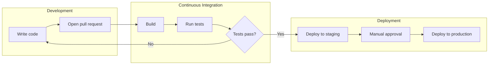
示例：[mermaid.live 在线示例](https://mermaid.live/edit#pako:eJx9UctqwzAQ_JVF5-QHfGhpEyiFPoJTKK2cw9ba2AJZq0qrlJDk34vtpJgcqoNgdnZ2Z6SDqtmQKtTW8U_dYhR4KisPAJDyVxMxtGBop5e0I8ehIy-bke7Pgg3p92iFoB-zgfn8Blalfg3kIWTnINJ3pnTRkDeVv5peW71gL9ZnzgkevVATUSz7yZ77bJ3Rwz3ueKMkuswehJKkSWdPDB0PKHToUYKAKd2e_nFg9JKC4_1VurVgQ2cKhCEJNtY3o4O7ECLvSD-jz-gAB4huIj93jG8S2Uwmhcgm15OQE1urclAMYcdKH6WvHT8oHUdXV8QLH4e_UDPVRGtUITHTTHUUO-yhOvSCSklLHVWqgEoZ2mJ2UqnKn9RMYRZe7319keZgUGhpsYnYXYoB_SfzH4ycm1YVW3SJTr9ZFcC_)

#### Expanded Node Shapes

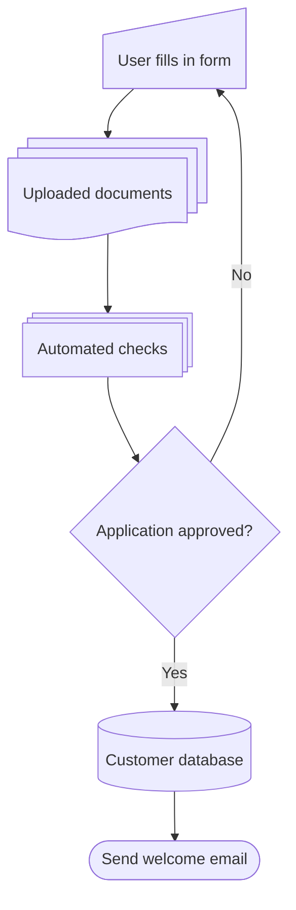
示例：[mermaid.live 在线示例](https://mermaid.live/edit#pako:eJxtkD1uwzAMha9CaE4u4KE_idGp6JJ2aOGFkehYqCQKEtUgSHL3wnZTq0BHku8j-d5ZaTakGtU7PuoBk8Br2wUAgCdO_uEMecBIDXgMBd3ahlhkBQ735Bro1FumBL11LoMN0HPynYLrvKBlnZcFhnWuwegYDZmxXzwFyQu4HUh_LmRMf9HHIuxRyIAehRXYkrbZcqiuWvQ1GqOzGsVyAIwx8ReZ-4rfLKQ-uQrclizsKYFBwT1mWqBnEqG0gFnQ2FJf3VEwcCSn2ROQR-tmeskZ1uu7Ka8luak1JVGFMut-XP71PI4u75Qv0G7-mbzwZbp0Mzptml9XK3VI1qhGUqGV8pQ8jqU6j-JOyUCeOjU6MdRjcdKpLlzVSmER3p2CvqElGhRqLR4S-lszYvhg_i0Tl8Ogmh5dpus3mE7R1Q==)
### 2. 时序图 Sequence Diagram

关键字：`sequenceDiagram`

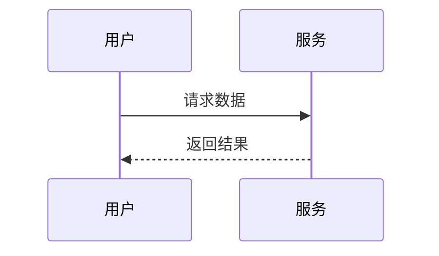
文档：[时序图 官方语法](https://mermaid.js.org/syntax/sequenceDiagram.html)
示例：[时序图 在线示例](https://mermaid.live/edit#pako:eJxdzy0OwkAQBeCrbEa3F1hRxQ1wZM2kHdpN6G5ZdgUhGBQhqQIUTRMcih9VgeA0XTgGaZoikO-b98SsINYJAYcFzR2pmEYSU4O5UIwVaKyMZYHKsvfh4rfNv_qqbHfnTvt7GEU9cfa5Nf6x8ce7L69dofcwjKK-ytnndWhP9fu593UFAaRGJsCtcRRATibHLsKq2wqwGeUkgDMBCU3RzawAodYQADqrx0sVD1NXJGiHLwYsUE20_kWjXZoBn-JsQesvIcttUA)

#### 更多 mermaid.live 示例

#### Basic Sequence

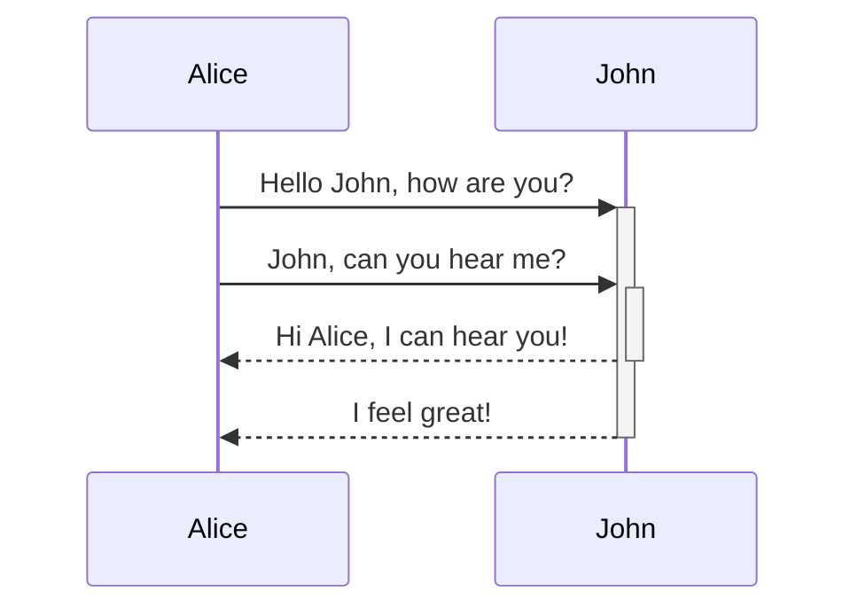
示例：[mermaid.live 在线示例](https://mermaid.live/edit#pako:eJxtkLFuwzAMRH-F4Vr7BzS4CNAh6dqt0ELIZ8uAJKaKhMII8u-BnLpTNt7dewtv7HQEG77ipyI5fCwyZ4k2EREdw-LQD8Pbp_pk6IQQlNrdkddfkgxatb6_hJ-Yk9QQ8pBMEX9o2_p-GPrNMXRannZH583Y6FXr4TV-pgkINGdIOXDHc15GNiVXdByRo7TItyZbLh4Rlg1ZHjFJDcWyTXfuWGrRrzW5Xa2XUcr-gL28SPpW_Y9Z6-zZTBKuuD8AtYxm7A==)

#### Online Payment Flow

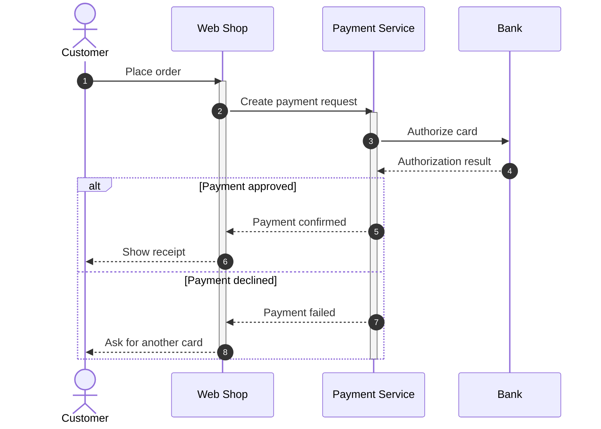
示例：[mermaid.live 在线示例](https://mermaid.live/edit#pako:eJyFUttqwzAM_RXh5-YH_BDoug8I9GEw8qLaSmMaXybbHVnpvw-3cRdW2N6ko6NzJKGLUF6TkCLSRyan6NXgkdH2DgAAc_Iu2wPxkqvkGXY5Jm8rFpCTUSagS7AffQCM8EaHW_zM6HAuhA5nS6WB-GwUPfNe0J16d8erX9O2RVRCN6Ei8KxXc5kzJlqZlqhp2w5nCTumUgyLKZdVY_rV2uF8Rzqcm7YtA0jY5jR6Nl8EClnf66XSVOlKwGS8A6aYpyo8pceaGAL7My0C1eRnn4WmvBsM2zXvtkbTtvUGsiCfwKTIhMWJpkgPDU1qMu5fqwHN9LfPNp5g8AzofBqJVwcgtwSanq-3woqm2IgjGy1k4kwbYYktllRcCr0XaSRLvZDQC00DluuJ3l3FRpTf289O1dYcNKb6nhUM6N69f6Ts83EUcsAp0vUb0jf0LA==)

#### Food Delivery with Parallel Actions

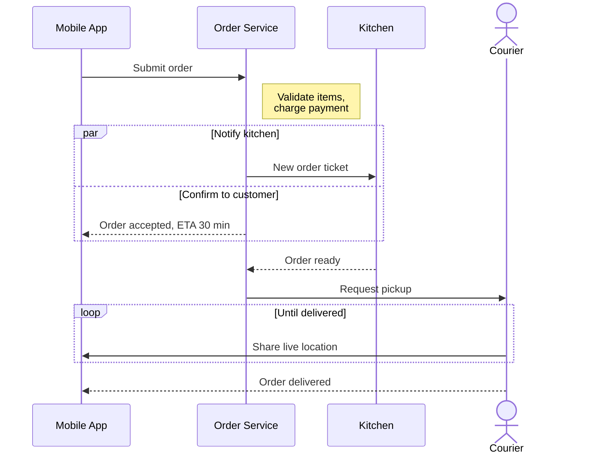
示例：[mermaid.live 在线示例](https://mermaid.live/edit#pako:eJxtkk1v2zAMhv8KoXOCDdjNGAwE3Q7BsC5oth0GXxiJtolYH6WpDkHR_z4olrOv3kTxfclHpJ6NjY5MY2Z6zBQsfWAcBH0XAAASirLlhEFhlxLgDJ_jiScq0SuSw75IvogjgSPJE1v6X_WJ1Y4UlgRajQJ3MQuTdPVyl9K2bXeHfQPHfPKsEEvJJXkflUB4GBViD1fRd5zYoRKwkp8370_yprUjykCQ8OIp6I2i2Lm_wPlPiGvPw37btpWtgXv6uTQFZXumWgCDg7sYehYPGsHmWaNfwdYqBT2lpo4BraWk5Dbw8esO3r0Fz7UrBbccatPt-ubFKITuUudxZatDauChrGpWSGzPua5hijHBt6A8gaOJn0jI_caq1pXsOKIQFBVM0aJy_BdpNfz9lltlszGDsDONSqaN8SQeS2iei70zOpKnzjTQGUc95kk704UXszGYNR4vwa7WnMri6qdbLxOGHzHeQol5GE3T4zTTyy9k8uK0)
### 3. 类图 Class Diagram

关键字：`classDiagram`

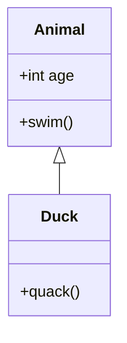
文档：[类图 官方语法](https://mermaid.js.org/syntax/classDiagram.html)
示例：[类图 在线示例](https://mermaid.live/edit#pako:eJxVzk0KwjAUBOCrhLdqMb1AcCP0Bu4km0fymobmp-YHkdq7S8CKLudjBmYDFTWBAOUw59GiSehlYOwSrEfHzq9hYGNVy48JdrKhMDT0j_lhfdc3a4Mm94pq6XrgYJLVIEqqxMFT8tgibK0soczkSYJgEjRNWF2RIMMOHLCWeH0GdUzrqrHQ5-aBK4ZbjN-YYjUziAldpv0NzllKGg)

#### 更多 mermaid.live 示例

#### Basic Class Inheritance

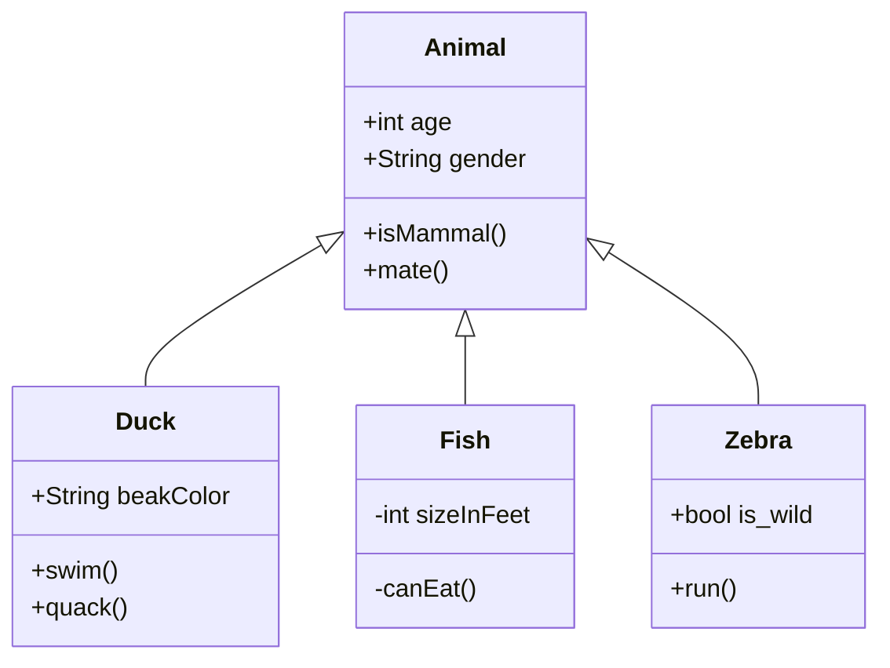
示例：[mermaid.live 在线示例](https://mermaid.live/edit#pako:eJxtkc1OwzAQhF9ltSdQmxeIuCBKJQ499VZZQht761jxT_GPKih9d5RATGk5zjea0Xh9QhkUY4vSUkorQzqSEx4A4NEbRxYePpsGVkUOt3RtUn9Ld9xF-oNbWBifgTRf422OxmvQ7BXHS3OMpA05R_bu_spwlHmG0-xp3ukbQC3tmIanYEOsRjoaNwcBFm-F5DDr82Xf-LDa14zbk_ngF79mzhVL8s-U_81PJ_gd1IVgwaTXo7Gqwlh8zeISdTQK2xwLL9FxdDRKnDoE5p4dC2xBoOI9FZsFCj_GqOSwffdyjpaDosw__zjDA_ldCFXGUHSP7Z5s4vMXXQKejA==)

#### E-commerce Domain Model

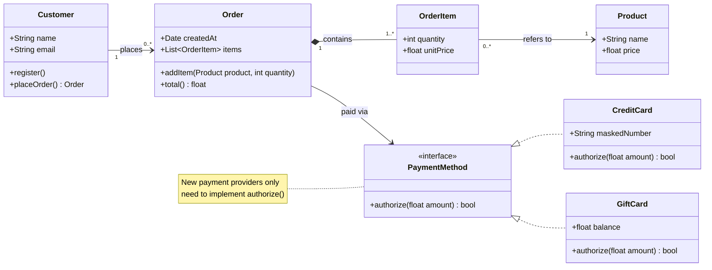
示例：[mermaid.live 在线示例](https://mermaid.live/edit#pako:eJydVE1v2zAM_SuETkmXBNvVCAIMKTAM6LpivQ26MBadENOHJ1Mdsi797YOtOlXWBMPmi6zHx8cHkvajqoMhVanaYtddM24jOu0BAAxHqoWDh5svGRk4sE6dBEcRHjPaP2_uJbLfgkdHr1FyyLaAI225E4qTaQG2Fmv6HE0Pw3Dm4KGsPeAnha9RCOpIKGTeSxG44U6eBv5HIfcELOS6Io7G9IHJXQwm1QJtPmfAXuB7Qi8s-9KgBEE7mUJjA8olb73kib9SrYAHEUie5S5yTWfkRl9_73LWai_p4N6Rl08ku2BKteWSvVBssKbVqmxMkl2I_JMmWRhdSF6msAnBntFfRzIsa4zmnFWH3Tcyt8ltxnn-T40P3LyukDM3aNHX9K_a-eW4ylq90wrm8xVo9XaxuNLqedUqGPbyeXEylslX83n_VpCH2VdQBy_IvkwZIkflXKbXGGdcQaSGYgcSctbp0Ja_FouizxcpY5tKs32xU2oFLbKBB8axDT4IQRPiH0StbukHtBnrv48HNr3J4O1ee09kQAKway0NjJfGT7VSM7WNbFQlMdFMOYoO-6saRqiV7MiRVhVoZajBZEUr7Q9qpjBJuN_7ekxNrUGh51_TCLbov4ZwvMaQtjtVNWg7OvwGpnuFEg==)
### 4. 状态图 State Diagram

关键字：`stateDiagram-v2`

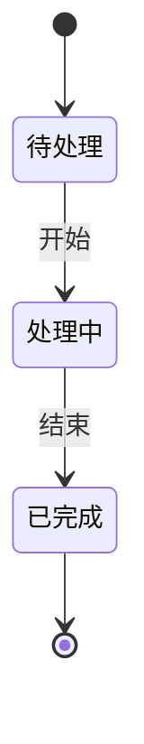
文档：[状态图 官方语法](https://mermaid.js.org/syntax/stateDiagram.html)
示例：[状态图 在线示例](https://mermaid.live/edit#pako:eJyrVkrOT0lVslIqLkksSXXJTEwvSszVLTOKyVNQiNaKVdDVtVN4uq_16ZKW5xPaQIJwDkQKzHyyY62ClcLTPQ1Pl3eD1cBFwWq2b3q6rudZxwQFK4Xnuyc_mzsfrAYuClITrRWrpKOUXpSZomRVUlSaqqOUm1qUmwjiKlWDlMcolWSk5qbGKFkpxCilpKYlluaUxCjF5NUq6SgllpbkB1fmJcO0lhakIPwCEyxIzIvKz4dzi_JL0zOUrNISc4pTawHHh2st)

#### 更多 mermaid.live 示例

#### Basic State Diagram

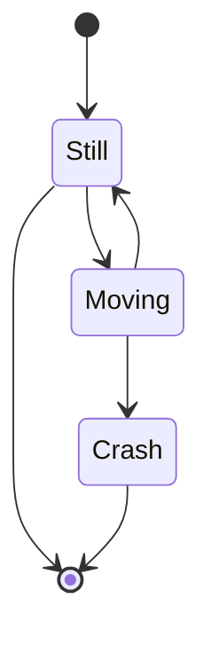
示例：[mermaid.live 在线示例](https://mermaid.live/edit#pako:eJxdzz0LgzAQBuC_Em4UXTpm6NKundxqHA5zxkA-JCaCiP-9aLAtbu_7cHdwK3ReEnCYIkZ6alQBbTXfhGOMsaZoWVXdWR21MZmOeGBTtFd6-Vk7lTXn6_qfPgJOQ9YjnkehBBW0BB5DohIsBYt7hXUfFhAHsiSAMwGSekwmChBugxIwRV8vrjtX0yh_T504ont7_63BJzUA79FMtH0AVYtVQg==)

#### Order Lifecycle with Composite States

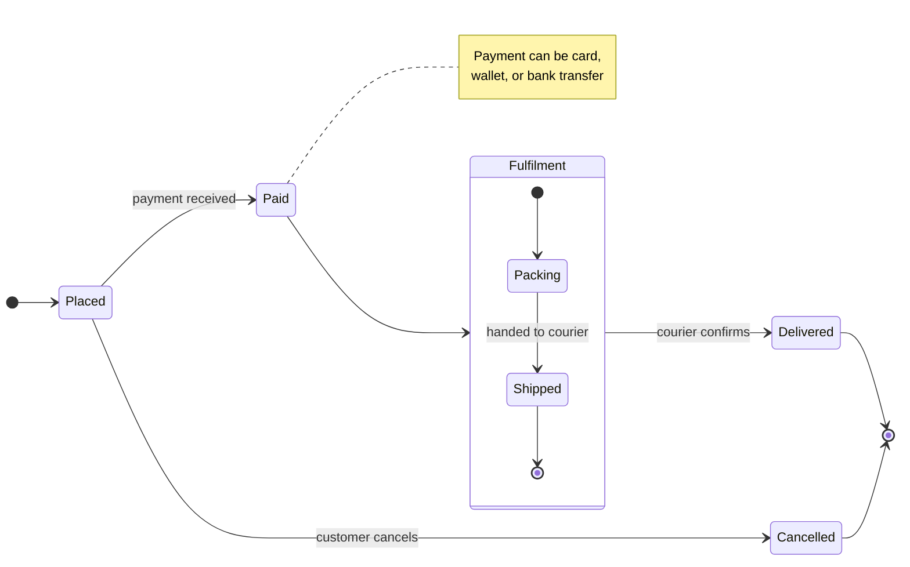
示例：[mermaid.live 在线示例](https://mermaid.live/edit#pako:eJxtkjGPwjAMhf-K5RGV5cYOtxy66YbTsUEZTOK2EalTuQknhPjvpzaUgnRb8r3nF9vKFU2wjCUOkSJvHDVK3fr8VgkAgHXKJrog8PWTyX51gPX6Hb49GbaZ5XPG5CyU0NOlY4mgbNid__F9kBj2nkezSUMMHSuYCQ5385g0Wj-Tr50f4yrJ0tTqE4dr5i_9kTk5aRbhDiZx27q-n95uSSxbiAFMSOpYl4LZNBbsV4cs3OYenl4fDRv27sya58lJYILUTrv7PIvjJXBZxANnQUJkUNe0EUI9beN5lrxeQwJHBkNqi0X9Je85FhAUjiQniEoy1PNoLHbKxgIbdRbLqIkL7Fg7Gq84LbPC2HLHFZZQoeWako8VVnLDAinFsL2ImUtTb5evM8OeZBfC46ohNS2WNfmBb38Gj8Z9)

#### Choice and Concurrency

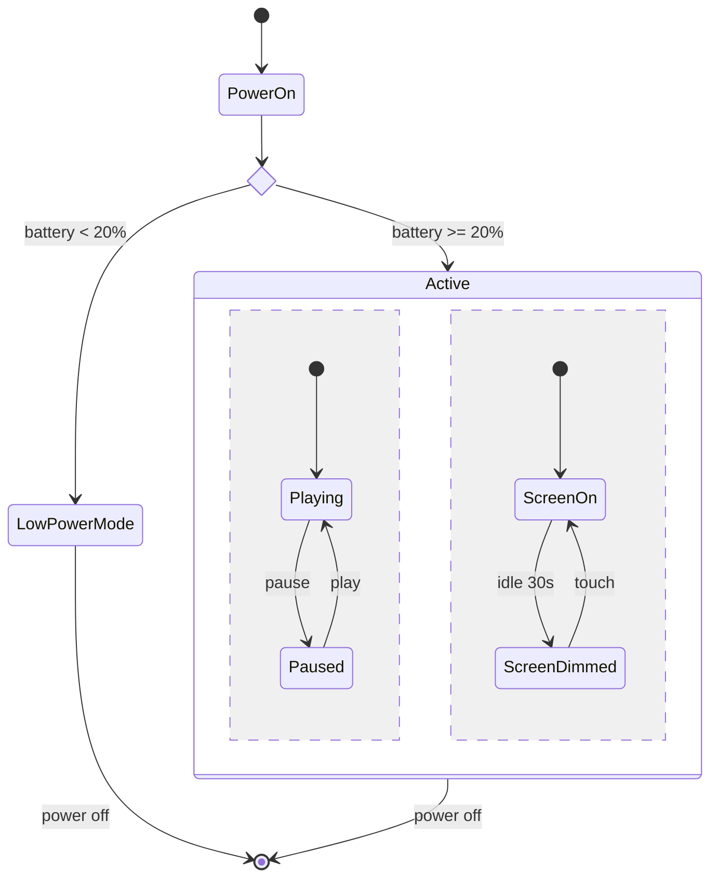
示例：[mermaid.live 在线示例](https://mermaid.live/edit#pako:eJx1kk9rxCAQxb_KMNBLSWDZ3mQbKOxxSwt7a1OK1UkiTTQY3SUs-e7FmHST_vHkvPd7Og5eUBhJyLBz3NFe8dLyJj1tcw0AMIrwwZ0j27-LisQn7HaiMkpQlkXm9fYN0jSDZ3Mm-6SjOBWjsYpHe31igA7mPGYejSRgMwA72G5u_ss8CKdOSzq7j_iy-Qm6RG3VcM17pcurMQnR5L4jCQzasFkwUV_kA1Pz_oqk6e-7jsIS6Xk6Yc3Kwt6rphnvVLImuNt0P-kJWB4IDJzxooroML99Nc7Ah0YYtEEDUxSRmmbzh48JllZJZM56SrAh2_BQ4jjHHF1FDeXIIEdJBfe1yzHXAybIvTPHXos56lt5_Viz2HL9Ysx3aY0vK2QFrzsavgAu1stc)
### 5. 实体关系图 ER Diagram（官方标注 experimental）

关键字：`erDiagram`

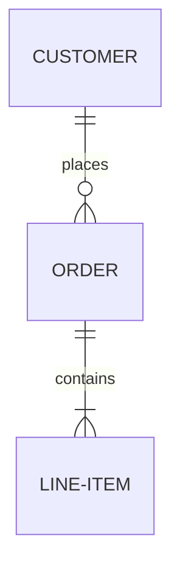
文档：[实体关系图 官方语法](https://mermaid.js.org/syntax/entityRelationshipDiagram.html)
示例：[实体关系图 在线示例](https://mermaid.live/edit#pako:eJw9js0KgzAQhF9l2bO-QK41B6FWUHspuSxx_QGTSEwORX33Elp7nG_mg9lRu55RIPtiptGTURbg9my7upINHEeeux3qppANCFgX0rylxZek-tjhXj5kXnayAgHa2UCz3TDD0c89iuAjZ2jYG0oR96QrDBMbVihAYc8DxSUoVPbEDCkG176tvtS49hT49-6CK9mXc__oXRwnFAMtG58fUB5GMQ)

#### 更多 mermaid.live 示例

#### Basic ER Schema

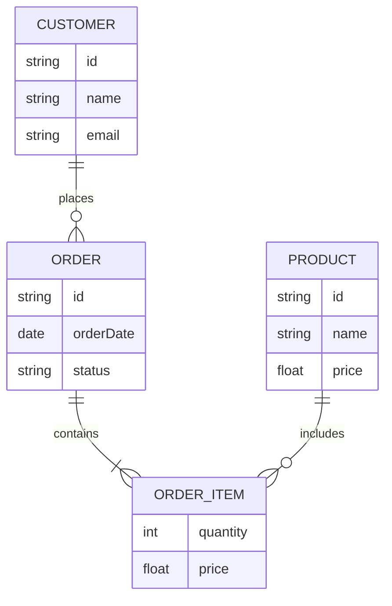
示例：[mermaid.live 在线示例](https://mermaid.live/edit#pako:eJydkkGLgzAQhf_KMOf2D-RaPeyhuNj2sgSWIRltQBM3Tg5F-98XVy0tQg-b23u8-fIyZEATLKNCjpmjOlKrPQDA4XI6F8e8hHHc78MARZnlJSjoGjLcz5nZmwLjEvj-OOdHUGCCF3J-yX2WRXY5nF9Qa9J50yS7Eh-3DrOeTi_R-Rqc3VieWt6Y3JJrZvf-XPM90ZIwhGg5ZiRbaC8kqX-hro_6R9OqCSTQRWd4W3RezBPVeYGfRF6c3N4xcId1dBaVxMQ7bDm2NEn8Y2mUK7esUYFGyxWlRjRqP41RknC6ebOOpm5ax_IdVrMj_xXCQ8aQ6iuqipqe778W5a-a)

#### Streaming Service with Keys and Comments

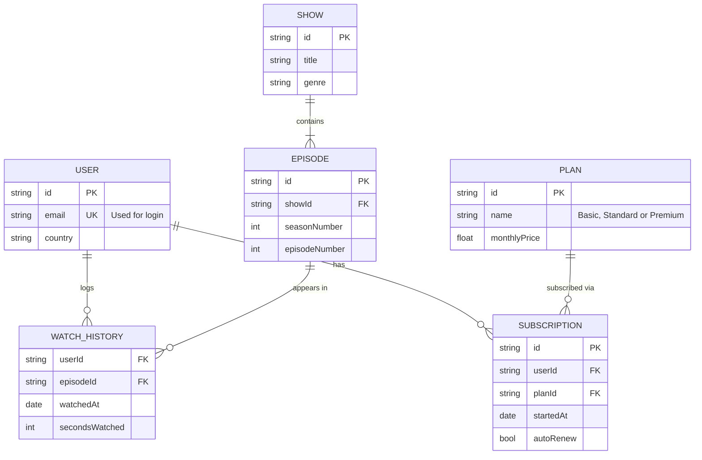
示例：[mermaid.live 在线示例](https://mermaid.live/edit#pako:eJyNU8Fq6zAQ_JVF5_QHfEvblJiWxMQJoQ9D2VgbW2BJZiU1hKT__nDstHbdQHyyZndnhh3pJHIrSUSC-FlhwagzAwCwSWcrOJ8fHuwJ0s1j-rSKk3W8XEAEJbq2J3mbLm70ZMKFnctZ7UjCp8JMjGm30_XT_GMep-vl6h0iqGzREc-SOF0-z241ZgLrmpAdKHMlTufL7aX_fPoejyC3xqMyrid-av-bz3lWpgAlIXkdoaRRVbB5hUxsHEnYW24c_ij2enMbjOdji391hvoLuVc0OOJYwsu4UldoflUkegLnkT3Jqf_Bd9ZWgMHbFRk6DExdErvXjEFNkIlHdCqfQOrRSGQJliFh0iro_ib2lUUP2hpfVseEVU7DbTTx3Cvsla9ohBZkeEh6zfleXlfaw68dKuPBETprFkHviIcVqpWzkvqlTnp4JccGbgfZcf6V5QF9Xg6zbP3l1ki3baudDTERBSspIs-BJkITa2yO4uIlE74kTZloHoukPYbKN2k1Y83NSI8mv46GuhHvHv8VrNH8s_b7yDYUpYj2WDn6-g-s40O0)
### 6. 用户旅程图 User Journey

关键字：`journey`

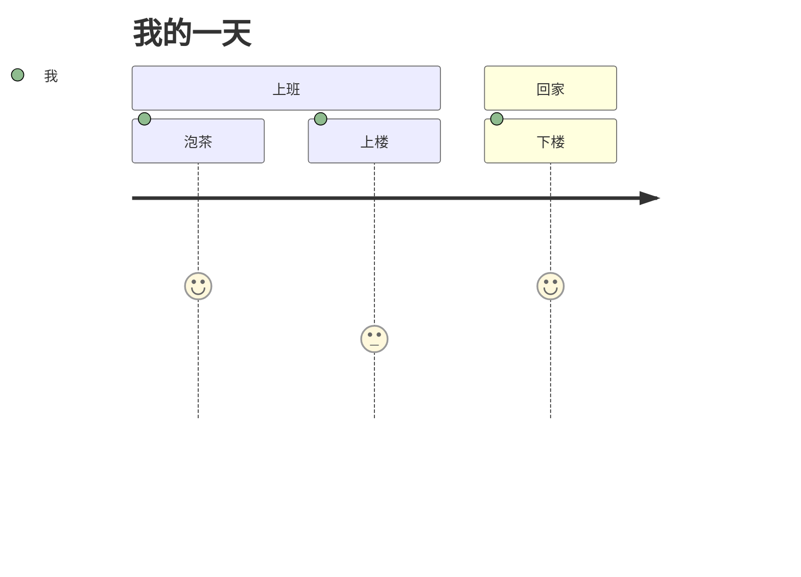
文档：[用户旅程图 官方语法](https://mermaid.js.org/syntax/userJourney.html)
示例：[用户旅程图 在线示例](https://mermaid.live/edit#pako:eJw9i7sKwjAUQH_lcudu4pLZP3CTLKG9fUibSEyGUgQHB1FBXBUEQQcHXQTp4Oe01c-QKO14DucU6KuAkOFYWS0p5xLAJCYlaJa7935RlfP6fHV2Sr5JlISqXL23N2cAmsfps3ky6DOX_11VrprLi0Gvc-1ZH471_dlW61_1P9HDSCcBMqMteZiRzoRDLFzN0cSUEUcGHAMKhU0NRy5n6KGwRg1z6bernQTC0CARkRZZKydCjpTqUCsbxchCkU5p9gVcn2Y-)

#### 更多 mermaid.live 示例

#### My Working Day

```mermaid
journey
    title My working day
    section Go to work
      Make tea: 5: Me
      Go upstairs: 3: Me
      Do work: 1: Me, Cat
    section Go home
      Go downstairs: 5: Me
      Sit down: 5: Me
```
示例：[mermaid.live 在线示例](https://mermaid.live/edit#pako:eJxljbFqw0AQRH9l2FpNCGmujcGVKnfhmkW3li7W3YrTHkYY_3uQbQUbl_MeM3OhToOQo1-tJcviMwBYtFHQLjhrOcXcI_DDzNJZ1Iy9wvSm7xxo-SQwYYcvh1Y2vFfUaTaOZXb4fDa7e9_hY6UNvtnePgZNz0tBz3nbenk5RLvJB6aG-hIDOStVGkpSEq-RLmvBkw2SxJODpyBHrqN58vlKDXE1PSy526p1Cmyyi9wXThucOP-o_seitR_IHXmc5foHv45qiw==)

#### Online Grocery Shopping

```mermaid
journey
    title Ordering groceries online
    section Browse and select
      Search for items: 6: Customer
      Compare prices: 4: Customer
      Add to basket: 7: Customer
    section Checkout
      Choose delivery slot: 5: Customer
      Pay for order: 3: Customer
    section Fulfilment
      Pick items in store: 4: Store staff
      Deliver groceries: 5: Driver
      Unpack at home: 7: Customer
```
示例：[mermaid.live 在线示例](https://mermaid.live/edit#pako:eJx1kE1rwzAMhv-K8Lm3fYFvW8quK5RdRi6arSRebSvI8kYo_e8jDenYym76eMT7vjoax56MNR9cJdPUZgAADRoJXsSThNxDL-xIAhXgHEOmBSrkNHCGJ-GvQoDZQ6FITpc1wJ5Q3AAdCwSlVCzcW2hqUU4kK9RwGlEIRgmOioXba-TRe1CGdywHUgsPf4nVSDOQO3C96DcDcyHwFMMnyQQlslq4uxbY4XR2yXNgCzf_CTzX2IWYKF8kdsEdlnAQMhRloXOE_VxBUey6Fd0uNn6eebaylXm4Mq95RHcAVBg40a-oZmN6Cd5YlUobk0gSzq05zset0YEStcZCazx1WKO2ps0nszFYlfdTdutpHT0qbQP2gmkdjpjfmC-tcO0HYzuMhU7fSDy1rg==)
### 7. 甘特图 Gantt

关键字：`gantt`

```mermaid
gantt
  dateFormat YYYY-MM-DD
  title 项目排期
  section 设计
  需求评审 :done, des1, 2026-01-01, 3d
  原型设计 :active, des2, 2026-01-04, 5d
```
文档：[甘特图 官方语法](https://mermaid.js.org/syntax/gantt.html)
示例：[甘特图 在线示例](https://mermaid.live/edit#pako:eJxNjz1qw0AQha8yTL0CSfkpthbpXKVS2GbRjmWBtGtWo0AwhhDSBVykjYnRBRRSpsltpMi3CItxSPm--d6D2WDhDKHEUltmZQGMZrpxvtEMeZ7n0WIRZVk4cMU1wbH_-nkbpt3rtD8E2lLBlbMwD9_z0Ady3D9On0_zx_M49CCNsyTAUJsISOP0OoqTKE4EXJjgjrvD-P5y6oLUBVf3Jzv9Z18KuDIosPSVQcm-I4EN-UaHiJuwo5BX1JBCCQoNLXVXs0JltyhQd-xuH2xxrnbr8GJW6dLr5gzX2t459xe968oVyqWuW9r-AhJdbTY)

#### 更多 mermaid.live 示例

#### Product Launch Plan

```mermaid
gantt
    title Product Launch Plan
    dateFormat YYYY-MM-DD
    section Planning
        Market research      :done, research, 2024-03-01, 10d
        Define requirements  :done, reqs, after research, 7d
    section Build
        Design prototype     :active, proto, after reqs, 14d
        User testing         :testing, after proto, 7d
    section Launch
        Marketing campaign   :marketing, after proto, 14d
        Release day          :milestone, after testing, 0d
```
示例：[mermaid.live 在线示例](https://mermaid.live/edit#pako:eJxdkstqwzAQRX9l0FoGJw0UvCymqwZCSxcu3gzS2Ba1JEcaFULIvxdHcV7a6Yzu4TLoKJTXJCrRo2NuHQAAGx4JdsHrpBg-MDk1wG5El8camd59sMjQNE1TbLdFXedRJMXGu_NjZ1yf6Xy2GH6JIVAkDGrIsNLekbxCCetyvSnKl6JcSViV-havqTOOINA-mUCWHMe7-D5KwI4p3Kle9WOlt2TGB2E0vYMpePZ8mCj3QcXmj2TGN-fsX23u0t-RAjBFNq5fGFQXsOQukucieZ_Pm5lFCu2EcyuAyi70yfZQ45NGwkig8QC3GtaMFPm8mhy99iq1kKIPRouKQyIpLAWL81UcZ2sreCBLraigFZo6TCO3onUnIQUm9l8Hp5ZomuZ_UBvsA9oFTuh-vL9eg0_9IKoOx0inf7mIxBE=)

#### Website Redesign with Dependencies

```mermaid
gantt
    title Website Redesign Project
    dateFormat YYYY-MM-DD
    excludes weekends

    section Discovery
        Stakeholder interviews :done, interviews, 2024-01-08, 5d
        Competitive analysis   :done, analysis, 2024-01-10, 4d

    section Design
        Wireframes             :active, wireframes, after interviews, 7d
        Visual design          :design, after wireframes, 10d
        Design sign-off        :milestone, after design, 0d

    section Development
        Frontend build         :crit, frontend, after design, 15d
        CMS integration        :cms, after wireframes, 12d
        Content migration      :content, after cms, 5d

    section Launch
        QA testing             :qa, after frontend content, 5d
        Go live                :milestone, after qa, 0d
```
示例：[mermaid.live 在线示例](https://mermaid.live/edit#pako:eJxtk01v2zAMhv8KobMMOEGLDb4NC9rLAmwLsCKDL6xEO1r1kUl0sqDofx9sx19NeTAg0u9DvpT9KlTQJApRo2cuPQAAG7YET_ScDBP8JE3J1B6-x_CH1PUdjUwPITpk2O_3-2y7zTabvkT_lG00JTgTvZDXqfR9IZFiEzxsTFLhRPHSp9vYMb7QIVhNEYxniidD5wSFDp7kLCNhna_vsnyV5Z8l3OuJ8DW4I7FhcyJAj_aSTAIYCENm0q9yCXf6ZrTO6kR9MpGqiI4SzKNA1TaScB7rErDixfQSPs3m-2VSgxauu5xIfWJQz3mrfCbvB4P2kYWqGuXOWErce-wIAy__wNuJbDg68jxxH2LwTF7Dc2OsnsZS0bCE6lp9D18tNr_dda7riF2fEeHSh7bWi1tr-QzOLNSF6vODvkPd3zj6ho1Xh4n24wswJTa-Xt7WXxxAgyEYG8ydPAaw7ffzLm6X3AJzLaSoo9Gi4NiQFI6iw_YoXltkKfhAjkpRQCk0VdhYLkXp34QU2HDYXbwapM2x_Z82BuuIbkge0f8OYTzG0NQHUVRoE739B54oJ5I=)
### 8. 饼图 Pie Chart

关键字：`pie`

```mermaid
pie title 语言占比
  "Go" : 40
  "TypeScript" : 35
  "Python" : 25
```
文档：[饼图 官方语法](https://mermaid.js.org/syntax/pie.html)
示例：[饼图 在线示例](https://mermaid.live/edit#pako:eJw9yz0KwkAQhuGrLFOnEDXN1oKtoJVsM2QnyUL2h3W2CCHgBew8gKWN5FRKjiEmxPJ9-L4OCq8JJARDgg03JMbhNT6v79vjM9yVE0LB3isQUmxXc57aQMcimsATb_KZDy3X3k20ziGDKhoNkmOiDCxFi7-Ebh5zTZYUSKFAU4mpYQXK9ZABJvbH1hXLNQWNTDuDVUS7YEB39v6f0aeqBllic6H-C5w4SQQ)

#### 更多 mermaid.live 示例

#### Basic Pie Chart

```mermaid
pie title Pets adopted by volunteers
    "Dogs" : 386
    "Cats" : 85
    "Rats" : 15
```
示例：[mermaid.live 在线示例](https://mermaid.live/edit#pako:eJw9y8sKwjAQheFXGc66GxGlZGsfQHQn2YzN9AJtUpKJUErfXYrE5f9xzoY2OIHBMgrpqJPQXTQRu7CoOHqv9AlT9ioSk_VERBZN6JMFGTrX12I31p_Vl0KPQqcLKvRxdDAas1SYJc58JLZjbKGDzGJhyMJJx3lSC-t3VOCs4bn6tlzz4lilGbmPPBdc2L9C-GcMuR9gOp6S7F92b0jo)

#### Workday Breakdown with Values

```mermaid
pie showData title Where the workday goes (minutes)
    "Focused work" : 210
    "Meetings" : 120
    "Email and chat" : 90
    "Breaks" : 45
    "Context switching" : 15
```
示例：[mermaid.live 在线示例](https://mermaid.live/edit#pako:eJw9jDFrAzEMRv-K0NTCDU1Iht7YJt06ZSgUL8JWbJOzddgy1xDy30su3I3fe3q6oRXH2OMYGWqQ6UBKoFEHhp_AhUEDwyTl4ugKXrjCS4q5KddXkwEADH6JbZXdfGUQethu3hb3zawx-zrzzXblx0RxAMoObCCd7fsqPwrT5Zns9gv8lKz8p1CnqDbE7J8v99ihL9Fhr6Vxh4lLosfE26M0qIETG-zBoOMztUENmnzHDqmpnK7ZLmkbHSkfIvlCaYEj5V-RdRZpPmB_pqHy_R85NGW9)
### 9. 四象限图 Quadrant Chart

关键字：`quadrantChart`

```mermaid
quadrantChart
  title 覆盖与深度
  x-axis 低覆盖 --> 高覆盖
  y-axis 浅 --> 深
  quadrant-1 重点投入
  quadrant-2 需推广
  quadrant-3 重评估
  quadrant-4 可优化
  A: [0.3, 0.6]
  B: [0.45, 0.23]
```
文档：[四象限图 官方语法](https://mermaid.js.org/syntax/quadrantChart.html)
示例：[四象限图 在线示例](https://mermaid.live/edit#pako:eJxVjc1Kw0AUhV_lctdJqU11kYXgzxu403RxaaZJID91OgMtpSBiFUTjSino1iK4qF1IrVR8mSRt30ImIUKW5_vO4QyxHdkMTTyXZHMKxZFLXFghgPCEz2AzvV4_PyVfcbaYp99TJfo69b0eJD9xIUHX92H7PimSagyKRvY5zl22mCtaPug7sL25X18us9vHdPxaUQ3Yvlxk8Vu6_K1wQ002s6tk9VHhTUgfZslqkt7lxwcmnNVrhgb12l5LgcMcNHcVaRgt1NDhno2m4JJpGDAekIo4VGULhcsCZqEJFtqsQ9IXFlrhCDUkKaKTQdgup7Jrk2DHHjmcghJ2KTyNov_II-m4aHbI77HRH2UykVc)

#### 更多 mermaid.live 示例

#### Product Positioning

```mermaid
quadrantChart
    title Reach and engagement of campaigns
    x-axis Low Reach --> High Reach
    y-axis Low Engagement --> High Engagement
    quadrant-1 We should expand
    quadrant-2 Need to promote
    quadrant-3 Re-evaluate
    quadrant-4 May be improved
    Campaign A: [0.3, 0.6]
    Campaign B: [0.45, 0.23]
    Campaign C: [0.57, 0.69]
    Campaign D: [0.78, 0.34]
    Campaign E: [0.40, 0.34]
    Campaign F: [0.35, 0.78]
```
示例：[mermaid.live 在线示例](https://mermaid.live/edit#pako:eJxtj8tOwzAQRX9lNOukKk1LSxZI0BaxABZlgQRhMcRTx1JsB8curar-O0rShxRYzpxzr8d7zK1gTPE7kHBk_Lwg5zMDAOCVLxlWTHkBZASwkSRZs_Fg15CTrkhJU3fyNqatquHJ_hwTcXwLj0oW3dhJu4u0vJSdzcuu0083xVfwxlAXNpQCeFuRET1hBC_MAryFylltPfd4AiuOeUNloD9sDM-0gy8GpStnN3zsnh__B3cpfAwHSQTDwfVnj923bDxp4Cjp03lLJ9M2etOni5ZOZw1Nxn267JqH_9OH7qb23ensEyOUTglMvQscoWanqRlx3-Qy9AVrzjCFDAWvKZQ-w8wcMEIK3r7uTH6KhkqQ54Ui6UiflhWZd2vPo7NBFpiuqaz58AuADrTf)

#### Eisenhower Matrix with Styled Points

```mermaid
quadrantChart
    title Task Prioritization
    x-axis Not Urgent --> Urgent
    y-axis Not Important --> Important
    quadrant-1 Do first
    quadrant-2 Schedule
    quadrant-3 Eliminate
    quadrant-4 Delegate
    Fix production outage: [0.88, 0.92] radius: 9
    Plan next quarter: [0.28, 0.85]
    Renew passport: [0.65, 0.75]
    Answer routine emails: [0.78, 0.28]
    Tidy desktop folders: [0.18, 0.12]
    classDef urgent color: #ff3300
    Book dentist appointment:::urgent: [0.72, 0.62]
```
示例：[mermaid.live 在线示例](https://mermaid.live/edit#pako:eJxd0E1v2zAMBuC_QmjXpEictU11GLAtG7DLUKzdZXMOhEU7QmTRoyg0WdH_PthKMiA3Ue9D6uPVNOzIWPMnoxOM-nmHonUEAFCvgeAZ0x4exbN49X9RPccSH-Z48Am-s8JP6SgqzOcfTssijv_Ft35gUTyhS1Xc-ez5EjYMrZd0HVTw1OzI5UBXwQq-BN_7iHqdvIcNBeouwVd_gEHY5WZ8AnBW7MjC78XNej2Dxc1DtQVB53Oy8FBaHgNGiHTQcaooycSria9vtwX9oEgvMGBK45smcXc7ivuz-BjTCwkIZ_WRgHr0IU3wfhpVrU_w2bsjOEp75QFaDo6kuOXkltXJNQFT2lALufx7w4HFwru2Xa0Wi2I-Me_BUVSfFHAY2EftKaq1tnSVC1Tj4Ltqa2amE--MVck0Mz1Jj2NpXsdxtdEd9VQbC7Vx1GIOWps6vpmZwaz8dIzNuTUPDpU2HjvB_rw5YPzFfCmFc7cztsWQ6O0fsp3QGw==)
### 10. 需求图 Requirement Diagram

关键字：`requirementDiagram`

```mermaid
requirementDiagram
  requirement login_req {
    id: 1.1
    text: user can login by email
    risk: high
    verifymethod: test
  }
```
文档：[需求图 官方语法](https://mermaid.js.org/syntax/requirementDiagram.html)
示例：[需求图 在线示例](https://mermaid.live/edit#pako:eJxNj8FqxDAMRH9F6LwU9upz_6C3YihqPLFFY3tXkUvDsv9e0nRLj-9phkE3nnoCBzZchxoqmj-rZJMaG9E_S0vP2t4MV7rtJyJNgc5P5wMcXx5orDCapB1het8IVXQ5IqbrR6CiuRz8CdN5q_DSUyDH6ru_84mzaeLgNnDiCquyI__MRvaCisiBIifMMhaPHNtek-H9ZWvTozouSRy_7zzkRdpr739ofeTCYZZlxf0brrFcRA)

#### 更多 mermaid.live 示例

#### E-Bike Braking System

```mermaid
requirementDiagram

    requirement rider_safety {
        id: 1
        text: Riders must be able to stop safely in all conditions.
        risk: high
        verifymethod: test
    }

    functionalRequirement brake_response {
        id: 1.1
        text: Brakes engage within 100 ms of lever pull.
        risk: medium
        verifymethod: test
    }

    performanceRequirement stopping_distance {
        id: 1.2
        text: Stop from 25 km/h within 4 m on dry pavement.
        risk: medium
        verifymethod: demonstration
    }

    designConstraint water_resistance {
        id: 1.3
        text: Brake electronics must be IP67 rated.
        risk: low
        verifymethod: inspection
    }

    element brake_controller {
        type: hardware
        docRef: "specs/brake-controller"
    }

    element road_test_suite {
        type: "test suite"
        docRef: "qa/road-tests"
    }

    rider_safety - contains -> brake_response
    rider_safety - contains -> stopping_distance
    brake_response - derives -> water_resistance
    brake_controller - satisfies -> brake_response
    road_test_suite - verifies -> stopping_distance
```
示例：[mermaid.live 在线示例](https://mermaid.live/edit#pako:eJyVlE1v2zAMhv8KoXPdtN0X4MMO2y67DeltMBAwFm0T0YdL0cmMIv99UNIsbtxgaG7SK758_IrKs6mjJVMaoaeBhTwF_cHYCvoqVAEAYKKAsCVZJWxIR3g-6vnHtoT781Lpj5awzIcT-CEprAlw7Qg0QtLYQ7ZwI3AAdA7qGCwrx5BuzybCaVNCx2133tuScDN60i7aEpSSHrX9CbYZQp2N0C0n2GvBDa2EUh9Dohn47Qz9Wy5IQKHFlmDH2nGA-7s78AliA462JNAPzs14PVke_DuIe5ImisdQ0xQ5p9RzaFeWk2ZxTv1wSf2Yk20kenj4BBu_6E7kH8FDDGBlhB63hwbvBLfkY0gqmMO9-AJLidvw_ahzUNihkuS4r6J_eDNwIEe1Sgxcn8fm56_PX0BQyc6QXdxd4-WQeqrfgCU3HYk6BpXoHMmUUceeSuhQ7A6Fzvs21ktqSqhMNk-Lg0dx9qjMlWYS0a7y3a_SwErzXpXJKhzUk8vrjk-4yC5FPpdmjV69yyK_J0UOCYqvF7P_3-OzuTtWXLygAiwJb-lQcnnd04pJwAUkVE4N03Wui5yK462-VMzQzI1pha0pVQa6MZ7EY16aQ76V0Y48VSbHZ6nBwWkObm9uDA4aH8dQn0qH3qLSyx_fabPH8DvGf0uJQ9uZskGXaP8Xuia5Eg==)
### 11. Git 提交图 Gitgraph

关键字：`gitGraph`

```mermaid
gitGraph
  commit
  branch develop
  checkout develop
  commit
  checkout main
  merge develop
```
文档：[Git 提交图 官方语法](https://mermaid.js.org/syntax/gitgraph.html)
示例：[Git 提交图 在线示例](https://mermaid.live/edit#pako:eJxVi0EKwzAMBL8SdM4LfC70Ab0VX1RbsU0jy6hyoYT8vbiQQG-7s7MbBIkEDlKxq2LLvk5TEOZiIz0Ua8hTpDet0n5bpvCUbn_s9M-VsdQBmDTR4cIMSUsEZ9ppBiZlHBW2oXqwTEwe3OQh0oJ9NQ--7jADdpPbp4bj2ltEo0vBpMgHbFjvImdV6SmDW3B90f4FGq1Rcw)

#### 更多 mermaid.live 示例

#### Basic Git Flow

```mermaid
gitGraph
    commit id: "a3f82c1"
    branch develop
    checkout develop
    commit id: "b7e41d9"
    commit id: "c9d52e4"
    checkout main
    merge develop id: "d4e8f3a"
    commit id: "e1b6c90"
    branch feature
    checkout feature
    commit id: "f2a8d17"
    commit id: "a8c3f54"
    checkout main
    merge feature id: "b9d7e21"
```
示例：[mermaid.live 在线示例](https://mermaid.live/edit#pako:eJyFkM1uwyAQhF8F7dmHYjv1z7lSHqC3iMsaFoxqjEUhUhXl3Ss3JkqsSD3uDPPNLheQXhH0YGw8BlxGMTPGmPTO2cis6pkArHRbSi7g5g0BZzkyRWea_LK9H0l--RR36iNlaKjmqsuUJ0926lBSffcyzaGdb5KjYCjTt5SqqdUVviQSH95l97bbWRPGFGjX8qw-UnSJreLNywZsZaUP_--80fMvdKqhkguAAkywCvoYEhXgKDhcR7isYQFxJEcC_u4kjWmKa9MVCsAU_efPLHM0LQojfVg0AV0WF5xP3t_H4JMZodc4fdP1F6lzn6w=)

#### Release and Hotfix Workflow

```mermaid
gitGraph
    commit id: "initial setup"
    branch develop
    commit id: "feat: login page"
    commit id: "feat: search"
    checkout main
    merge develop tag: "v1.0.0"
    checkout develop
    commit id: "feat: user profile"
    checkout main
    branch hotfix
    commit id: "fix: crash on load"
    checkout main
    merge hotfix tag: "v1.0.1"
    checkout develop
    cherry-pick id: "fix: crash on load"
    commit id: "feat: dark mode"
    checkout main
    merge develop tag: "v1.1.0"
```
示例：[mermaid.live 在线示例](https://mermaid.live/edit#pako:eJyFkMFqAzEMRH9F6JyG5LrnQj-gt7IX1dbaImvLaO2QEPLvZUk3UJJmjxLzNDO6oFPP2GGQ-mFUYp8BAJymJBXEd9CjZKlCI0xcW-nxpvg2yi6C5yOPWp5QA1PtYNQgGQoFXsAnoonJXLwLIruDtgqJJN9WiS3w4gWVwswe99vddvdArSVqExsU00FGfmH52y9qHeT07JicOnBGUwTNMCr51fy3W3_i71fiRzY7vxVxh3Xbx6qe7ABJ_aue_712P78WNxhMPHbVGm8wsSWaR7zMcI81cuIeZ8TzQG2ss9MVN0it6uc5uwVtxVPld6FglJZlofyleh9NW4jYDTROfP0BhTLaQQ==)

#### Highlighted Commits

```mermaid
gitGraph TB:
    commit id: "v2 groundwork"
    commit id: "schema migration" type: HIGHLIGHT
    commit id: "revert experiment" type: REVERSE
    commit id: "stabilize" tag: "v2.0.0-rc1"
```
示例：[mermaid.live 在线示例](https://mermaid.live/edit#pako:eJxtj7FuwzAMRH-F4OwGaUeNRQ07QKck6FBoYSVGFmJJBkOlTYP8e2EUyeTxDveOvCu64hkNhqid0DTA_tXYDADgSkpRIXoDFs8vEKTU7L-LHC0uJE5u4ESQYhDSWLJF0MvEBvpN179vun6_AAmfWRT4Z2KJibM-qG370W537dIhpa84xl-esxT-v1utV-sncc8WscEg0aNRqdxgYkk0S7zOXRZ14MQWZ8zzgeqo85wbNkhVy-6S3R2tkyflt0hBKN3NifJnKQ8ppYYBzYHGE9_-AMqGbfs=)
### 12. 思维导图 Mindmap

关键字：`mindmap`

```mermaid
mindmap
  root((站点))
    笔记
      双链
      标签
    工具箱
      JSON
```
文档：[思维导图 官方语法](https://mermaid.js.org/syntax/mindmap.html)
示例：[思维导图 在线示例](https://mermaid.live/edit#pako:eJw9i70KwjAUhV8l3MlCn6Czk4MO3STLpUl_oElKTAYpXQRxERx0cXNxUotOxcW3qdG3kKJ1O993zikhUoxDACKTTGBBJSFaKTMYuNPeLe6e1xlC3Hn3qq_fTEi7Wb-3j56eh5W7_Khtju2ycfWtL0fhZAw-JDpjEBhtuQ-Ca4EdQtmtKJiUC04hIBQYj9HmhgKVFfiA1qhwLqP-aguGhg8zTDSKXhYop0r9USubpBDEmM949QHoClOQ)

#### 更多 mermaid.live 示例

#### Basic Mindmap

```mermaid
mindmap
  root((mindmap))
    Origins
      Long history
      ::icon(fa fa-book)
      Popularisation
        British popular psychology author Tony Buzan
    Research
      On effectiveness<br/>and features
      On Automatic creation
        Uses
            Creative techniques
            Strategic planning
            Argument mapping
    Tools
      Pen and paper
      Mermaid
```
示例：[mermaid.live 在线示例](https://mermaid.live/edit#pako:eJxdjsFKJEEMhl8l1GkGZvHeiKDrUVFWvUhfYnW6OmxXUqZSQiu--zI707OrueX7v4T_I0QdKHQhswwZSy8ApuqbzRFst3sEcGecWOphAbhRSTBxdbVlZV3HUWUzIoz440X193ZN7rW0GY0rOqusFODK2LlOUA45lLrESWdNC2DzSQ0eVRa4au94vPpFldDitP64E6BxpOj8RkK1nr_Y2QXKACOhN6P6n3jZXDM6R4hG35o81X_qYX7-dd4InOIk_Nq-Cw9u6JQ4QplRhCV9zS8ttUzikLGUU_qoOp8e3ZPAvmzBQrbCW7KMPIRdSMZD6Nwa7UI-0i587MU--ESZ-tBBHwYasc3eh14-wy5gc31YJK6nrQzodM2YDPMKC8qz6mk1bWkK3Yhzpc8_mb-rSA==)

#### Trip Planning with Shapes and Icons

```mermaid
mindmap
  root((Summer Trip))
    Destination
      Beach town
      Mountain village
    Budget
      ::icon(fa fa-wallet)
      Flights
      Hotel
      Food and activities
    Packing
      Documents
        Passport
        Travel insurance
      reminder{{Sunscreen!}}
    Activities
      ::icon(fa fa-person-hiking)
      Hiking
      Snorkeling
      Local food tour
```
示例：[mermaid.live 在线示例](https://mermaid.live/edit#pako:eJxdkMFqw0AMRH9lu6cEkh_wrSGUHFooOKfii1jLtsiuZGRtQjH-92JSOyHHeTPa1Wj0QWr0hU_EdYK-YudUxDabMqeE6s5K_XY7Y-eOOBgxGAnfgXMHhNA5k9tKviSzAbG7UozQ4p0fct2iLZmioCC8acA1sL9BjGjbxfuI1HY2LPIkhnH1RGoHXDsIRlcywv_cN4QLcbvkjhJyQn68MieGoRe1BzkrXDE64iErcMDFUZxvgTqOZeYhKCK_TdPdfX_596VKjzoI7zual1kbneh5t5JFLxifyKcEiK6Zu5lk9TvfKtW-MM248wk1wSz9OA9U3jpMWPnCVb7GBnK0ylc8-Z2HbFL-clhGc1-D4ZGgVUgL7IF_RFapktvOFw3EAac_IZ-pOA==)
### 13. 时间线 Timeline

关键字：`timeline`

```mermaid
timeline
  title 里程碑
  2024 : 立项
  2025 : 上线
  2026 : 迭代
```
文档：[时间线 官方语法](https://mermaid.js.org/syntax/timeline.html)
示例：[时间线 在线示例](https://mermaid.live/edit#pako:eJw9y70KwjAUhuFbOZy5gxR1yOwduEmW0J62gSYpMRmkdBasi5egLoK4-zP0Zgq1dyGF1vF9-L4SIxMTMnRSUS41cQ3gpMsJ-v2xu9Xd5TRQOAvnwKC71_35NcICGLTPQ_duRlgCg2_zaD9XDDC1MkbmrKcAFVklhsRymHJ0GSniyIBjTInwuePIdYUBCu_Meqej6eqLWDhaSZFaoSYshN4Y809rfJohS0S-peoHEEZOCQ)

#### 更多 mermaid.live 示例

#### Project Timeline

```mermaid
timeline
    title History of Social Media Platform
    2002 : LinkedIn
    2004 : Facebook
         : Google
    2005 : YouTube
    2006 : Twitter
```
示例：[mermaid.live 在线示例](https://mermaid.live/edit#pako:eJxFi0FrAkEMRv9KyHkPIm0POZdqoUJBLy1ziTvZNTgzkTFDEfG_FxXX7_Ye7ztjb1GQ0DVL0iKhAAC4ehJY6tGtnsAGWFuvnGAlURm-E_tgNd_b-Ww2B4IvLXuJn2WSL0Dwwb1szfZ3eRvBwmxMMnWvQPBjbdO2T_cGBJs_dZeKHY5VI5LXJh1mqZmviOdrHdB3kiUgQcAoA7fkAUO5YIfc3Nan0j-u7RDZ5V15rJwf8sDl12zCam3cIQ2cjnL5BxQBWi8=)

#### Product Roadmap with Sections

```mermaid
timeline
    title Product Roadmap 2024
    section Q1 Foundations
        January : Team hired : Tech stack chosen
        February : MVP scoped
        March : Alpha release
    section Q2 Growth
        April : Beta program opens
        May : Mobile app : Public API
        June : v1.0 launch
```
示例：[mermaid.live 在线示例](https://mermaid.live/edit#pako:eJxdj0trQjEQhf_KYdZSVLrKzlIsLQi3D7oodzMmownNi9ykRcT_Xq7WKp3dN4ePObMnnYyQouqCeBeljwBQXfWCriTTdMVLYhM4Yz6d357yQXR1KeJ5hmVq0fBIwykb54lj47KDwptwgHVFzBG0xVBZf0LbNEi8GEtZl19l9d5h0CmLucQrLtpCYeGzZRTxwoP86zLHQ0nf1V6sRS7OQ-FOKiOXtC0ckLJcV13x8WZaOy_gnKHQtbV3Govu8eqjFgUKX7ObKTy3qC1NaFucIVVLkwkFKYFHpP1o9VStBOlJoScjG26-9tTHA02IW02vu6jPasuGq9w7Hvudl5njR0p_WFLbWlIb9oMcfgB3MIq9)
### 14. C4 架构图

关键字：`C4Context`（另有 `C4Container` / `C4Component` / `C4Dynamic` / `C4Deployment`）

```mermaid
C4Context
  title 系统上下文
  Person(user, "访客")
  System(site, "guoxin.space", "个人主页")
  Rel(user, site, "浏览")
```
文档：[C4 架构图 官方语法](https://mermaid.js.org/syntax/c4.html)
示例：[C4 架构图 在线示例](https://mermaid.live/edit#pako:eJw9jLFKA0EURX9leVUCi1WqbeMHiOnkNY_dl83Azswy8wYSQmpFCztb0UawSCOBJVv4M2MS_8IMZC3vOZy7htJWDAVMJ1NrhJeCJstEScPZ8as_9q-xe4zd0-HlPokbdt6aUfDs8gzhtP3-2b4jjJObrbywHnklnFwd7FKZK99SyQiJxO4z7vex63_fdpfmlpvL2ZAdds-njweEMeRQO1VBIS5wDpqdpjRhnUIEWbBmhOJ8XPGcQiMIaDaQAwWxs5UphzS0FQlfK6od6QG2ZO6s_Z_OhnoBxZwaz5s_RtZruA)

#### 更多 mermaid.live 示例

#### Internet Banking System Context

```mermaid
C4Context
    title System Context diagram for Internet Banking System
    Enterprise_Boundary(b0, "BankBoundary0") {
        Person(customerA, "Banking Customer A", "A customer of the bank, with personal bank accounts.")
        Person(customerB, "Banking Customer B")
        Person_Ext(customerC, "Banking Customer C", "desc")

        Person(customerD, "Banking Customer D", "A customer of the bank, <br/> with personal bank accounts.")

        System(SystemAA, "Internet Banking System", "Allows customers to view information about their bank accounts, and make payments.")

        Enterprise_Boundary(b1, "BankBoundary") {
            SystemDb_Ext(SystemE, "Mainframe Banking System", "Stores all of the core banking information about customers, accounts, transactions, etc.")

            System_Boundary(b2, "BankBoundary2") {
                System(SystemA, "Banking System A")
                System(SystemB, "Banking System B", "A system of the bank, with personal bank accounts. next line.")
            }

            System_Ext(SystemC, "E-mail system", "The internal Microsoft Exchange e-mail system.")
            SystemDb(SystemD, "Banking System D Database", "A system of the bank, with personal bank accounts.")

            Boundary(b3, "BankBoundary3", "boundary") {
                SystemQueue(SystemF, "Banking System F Queue", "A system of the bank.")
                SystemQueue_Ext(SystemG, "Banking System G Queue", "A system of the bank, with personal bank accounts.")
            }
        }
    }

    BiRel(customerA, SystemAA, "Uses")
    BiRel(SystemAA, SystemE, "Uses")
    Rel(SystemAA, SystemC, "Sends e-mails", "SMTP")
    Rel(SystemC, customerA, "Sends e-mails to")
```
示例：[mermaid.live 在线示例](https://mermaid.live/edit#pako:eJydVVFvmzAQ_isnPzUS67p2T9E0KYS02kOkbuleKqTqgCOxAnZkH2ujqv99AkMgxFm38QK27_N3n-878ypSnZGYivnnuVZMLxwrAACWXBCs9paphHYFMolrgyXk2sA3xWQUMYSotlKt21iHXtSLOyMtPYW6Uhma_UVyFUAs6uhu6ioWE3h1iPq5J2O1ukgry7okM-vi693n7STMYlHPz6ALA50DbwgSVNsAniVvYNdshEUzB5imulJsL2MxOUsWeslCD-Rp8cIH2NwLm7scM7Jps8FZ1sgLj_4s8UtiPn59X2hP6ipz4V6z5ljPVc8RF4V-tgd2C6zhl6RnkCrXpkSWWgEmuuI6K2mO2QNAlUGJW4Id7kvyJOS1x6exPUbu6JVESVMDN1jUsCVKlRssyatnxdqQBSyK7iBTbdxp1qGnqg7Kg4EqNqgspnWYDYA4HavqExyouh6ruvbIOi3S0BdtE86OvOiFhR5Y2JnJuvFfdwuouuULqejyhPntjO6-LE1jLD6UKIuW2eXxsCGQjfmwgKVMjbY6Z1i8pBtUawIaQk6JOwO0LJFHcAQRMiZo6X-Ve-raF_RmXNAbR5Ocd22f-PeKKmpzv_XkfgtNxPnET09ktPmgBHcegrv3CP7hBm2NMPo8WCOUP6gYXubD--enJXvYzEX2y4PGPorzRTU-W5HKbGsd2_b88uHeA5wHcPR7OUIC61hMRCDWRmZiyqaiQJRkSqyHoqlqLHhDJcVi2lzwOVYFxyJWbyIQWLFe7VXaQatdhkyR-2l2kztUj1ofhkZX642Y5lhYevsNzltvbg==)

#### Internet Banking Container Diagram

```mermaid
C4Container
    title Container diagram for Internet Banking System

    Person(customer, "Banking Customer", "A customer of the bank, with personal bank accounts")
    System_Ext(email_system, "E-Mail System", "The internal Microsoft Exchange system")

    Container_Boundary(c1, "Internet Banking") {
        Container(web_app, "Web Application", "JavaScript, React", "Delivers the static content and the SPA")
        Container(spa, "Single-Page App", "JavaScript, React", "Provides all banking functionality via the browser")
        Container(mobile_app, "Mobile App", "C#, Xamarin", "Provides a subset of banking functionality")
        ContainerDb(database, "Database", "SQL Database", "Stores user registration, hashed auth credentials, access logs")
        Container(backend_api, "API Application", "Java, Docker", "Provides banking functionality via JSON/HTTPS API")
    }

    Rel(customer, web_app, "Uses", "HTTPS")
    Rel(customer, spa, "Uses", "HTTPS")
    Rel(customer, mobile_app, "Uses")
    Rel(web_app, spa, "Delivers")
    Rel(spa, backend_api, "Makes API calls to", "JSON/HTTPS")
    Rel(mobile_app, backend_api, "Makes API calls to", "JSON/HTTPS")
    Rel(backend_api, database, "Reads from and writes to", "JDBC")
    Rel(email_system, customer, "Sends e-mails to")
    Rel(backend_api, email_system, "Sends e-mails using", "SMTP")
```
示例：[mermaid.live 在线示例](https://mermaid.live/edit#pako:eJylVMGK2zAQ_ZVBvSTgpRR6yi2bBLpL07rrlJZiCGN5YovIkpHGyYZl_71Yjt04ZEuhN2s07z3NzPO8CGlzEjOx-LiwhlEZcqkBAGDFmmAIQq6wcFjBzjp4MEzOEMM9mr0yBSQnz1SlpoPG5Lw1E9l4thW5CFLRJy7OsVS00Tn0OWB3wCVBhmYfwVFxCXVgQR1igFLaxrBPxbQT6SS3q2eeUIVKb30ItLSruzUq3T8qKG1KAhVejRrWSjrr7Y5h9SxLNAWBP-dO-xqGwrf3tjE5utNEfmiZrmtPxRReOswINzlStsW6bjE_KIN5XWslkZU13ZMe8YCJdKrmCJ4IJXfhJWl1IOdDOzwjKwnSGibDgCYP4SSeD30Yi_oaW5JEmULTXYwFtcJ_FYydPaicPKDuet3OadcY2T4VteITHBR203H26Nvh3dSubKY09TWvw-mP-uJdBD-xQqfMtS74JvPErQdu6t_WW2aTHBkz9BT6dv7uyJNvn-EqwtaRh8aTA0eF8uzCMCIo0ZeUAzZcgnSUk2GF2ket58h70Lbwb5ScodyTybdYq-Dn-OH2nCNYWrnvbT9U_na3H5OvX95_2mziBObxw6D-2tvzifTF_3Vhte-efKcS0ANyDDjb5N-Sx3PtMBeJg_iZtDfwKCncXXVrjXvybXkgUWsPbM8NG2ofUVw-4_-YRuhLDz0R5h52zlbhVzs6xXTBtrxfjHjGe-dy3SVkcg901yZ0BG_JX--uMbLxYcOEi_UmTsVURKJwKhczdg1FoiJXYXsUYQelgkuqKBUzSEVOO2w0pyI1ryIS2LBNTkb20KbOkWnZrfU-WKP5Ze1wdLYpSjHbofb0-huW9gqk)
### 15. 信息图 Info

关键字：`info`

```mermaid
info
  showInfo
```
文档：[信息图 官方语法](https://github.com/mermaid-js/mermaid/tree/develop/packages/mermaid/src/diagrams/info) （官方暂无独立语法文档页，链接为其源码目录）
示例：[信息图 在线示例](https://mermaid.live/edit#pako:eJw9izsKwzAQBa8iXq0TqE6TOl3YZrFWH7B2jSwRgvHdgwunnGHmwGJREFA1Galze7HPU5PBI_caEUaf4tGkN74Qx1URRpEmhOAIURLPdRBIT3jwHPb66nKvc4s85FE5d2633FjfZn_sNnNBSLzucv4AfHky1g)
---

## 二、Beta / 实验性图种（关键字常带 `-beta` 后缀）

### 16. 桑基图 Sankey

关键字：`sankey-beta`

```mermaid
sankey-beta
  A,X,40
  B,X,30
  B,Y,20
```
文档：[桑基图 官方语法](https://mermaid.js.org/syntax/sankey.html)
示例：[桑基图 在线示例](https://mermaid.live/edit#pako:eJw9i7EOgjAURX-F3PmZEHXqpvEPXJB0edJHIdKWlHYghH83TcTtnJtzN3TBCBQW9h9ZT29JrH1V3aiha13oTg1dfvSicw2CjaOBSjELwUl0XBRbaTTSIE40VKVhpOc8JQ3tdxA4p_BcfXdc82w4yWNkG9kd48y-DeGvMWQ7QPU8LbJ_ATfQOEQ)

#### 更多 mermaid.live 示例

#### Monthly Budget Flow

```mermaid
sankey-beta

Salary,Budget,3000
Freelance work,Budget,1200
Budget,Rent,1300
Budget,Groceries,600
Budget,Transport,250
Budget,Fun,350
Budget,Savings,1700
```
示例：[mermaid.live 在线示例](https://mermaid.live/edit#pako:eJxNy0FrwzAMhuG_EnRWwWnoBjmO0d6XnYYvWqy6oYkcZHkjlP73UVi2HJ_347tBnwJDC5nkysvuk428eOloJF3wpYTIho1zzstRmUeSnqvvpNd1q_eP7RdvLIZ1syknTT3rwBmfNvVdSfKc1HB_-K_HIths3NHXIDFj_ewcIEQdArSmhREm1okehJuXqvJgF57YQ1t5CHymMpoHL3dAoGKpW6Rfr2UOZPw6UFSa1jiTfKT0R00lXqA905j5_gMzYGQU)

#### Job Application Funnel

```mermaid
sankey-beta

Applications,Screening,120
Screening,Rejected early,70
Screening,Phone interview,50
Phone interview,Rejected,20
Phone interview,Technical interview,30
Technical interview,Rejected late,12
Technical interview,Offer,18
Offer,Declined,4
Offer,Hired,14
```
示例：[mermaid.live 在线示例](https://mermaid.live/edit#pako:eJxtjstKxEAQRX8l1LqFJI4o2QmzcKc4rqQ2ZfdN0tqpDp2OEob5dxHJ-CC7OudWFfdINjpQQ5PoG5aLF2RhZb0dx-CtZB91MgebAPXamaouWX_wEa-wGa6ApLCY6z_hQx8VhdeM9O7xYa5K1v9ufWDqjfAJtldvJfxylyXrlj83CZJhqnp7675tkUx1w_o97WGDVzizW82dT3Cm2pGhLnlHTU4zDA1Ig3whHVmLgin3GMDUFEwOrcwhM7GeyJDMOR4WtevpPDrJ2HvpkgyrHEWfYzxjinPXU9NKmHD6BGHXkDk=)

#### Energy Flow (UK)

```mermaid
---
config:
  sankey:
    showValues: false
---
sankey-beta

Agricultural 'waste',Bio-conversion,124.729
Bio-conversion,Liquid,0.597
Bio-conversion,Losses,26.862
Bio-conversion,Solid,280.322
Bio-conversion,Gas,81.144
Biofuel imports,Liquid,35
Biomass imports,Solid,35
Coal imports,Coal,11.606
Coal reserves,Coal,63.965
Coal,Solid,75.571
District heating,Industry,10.639
District heating,Heating and cooling - commercial,22.505
District heating,Heating and cooling - homes,46.184
Electricity grid,Over generation / exports,104.453
Electricity grid,Heating and cooling - homes,113.726
Electricity grid,H2 conversion,27.14
Electricity grid,Industry,342.165
Electricity grid,Road transport,37.797
Electricity grid,Agriculture,4.412
Electricity grid,Heating and cooling - commercial,40.858
Electricity grid,Losses,56.691
Electricity grid,Rail transport,7.863
Electricity grid,Lighting & appliances - commercial,90.008
Electricity grid,Lighting & appliances - homes,93.494
Gas imports,NGas,40.719
Gas reserves,NGas,82.233
Gas,Heating and cooling - commercial,0.129
Gas,Losses,1.401
Gas,Thermal generation,151.891
Gas,Agriculture,2.096
Gas,Industry,48.58
Geothermal,Electricity grid,7.013
H2 conversion,H2,20.897
H2 conversion,Losses,6.242
H2,Road transport,20.897
Hydro,Electricity grid,6.995
Liquid,Industry,121.066
Liquid,International shipping,128.69
Liquid,Road transport,135.835
Liquid,Domestic aviation,14.458
Liquid,International aviation,206.267
Liquid,Agriculture,3.64
Liquid,National navigation,33.218
Liquid,Rail transport,4.413
Marine algae,Bio-conversion,4.375
NGas,Gas,122.952
Nuclear,Thermal generation,839.978
Oil imports,Oil,504.287
Oil reserves,Oil,107.703
Oil,Liquid,611.99
Other waste,Solid,56.587
Other waste,Bio-conversion,77.81
Pumped heat,Heating and cooling - homes,193.026
Pumped heat,Heating and cooling - commercial,70.672
Solar PV,Electricity grid,59.901
Solar Thermal,Heating and cooling - homes,19.263
Solar,Solar Thermal,19.263
Solar,Solar PV,59.901
Solid,Agriculture,0.882
Solid,Thermal generation,400.12
Solid,Industry,46.477
Thermal generation,Electricity grid,525.531
Thermal generation,Losses,787.129
Thermal generation,District heating,79.329
Tidal,Electricity grid,9.452
UK land based bioenergy,Bio-conversion,182.01
Wave,Electricity grid,19.013
Wind,Electricity grid,289.366
```
示例：[mermaid.live 在线示例](https://mermaid.live/edit#pako:eJyNVtuO2zYQ_RVCD82LPOVF4sVvbbfYFE2zi267AQq-cCWuTVQmXV2cGEH-vaAky15LyebBsMgzZ2Y4PDPS56QIpU3WyWq10r4I_tlt1toj1Bj_rz32jwg12_Dx0VSdbdbo2VSN1b63H4xWT7Y12mv_06Z2RVe1XW0q9OajaVr7Jv3ZhVUR_MHWjQs-JTQDQZX2V_vv3H-dK1MMuRJzMDSNbVLKQXI6Qx9C5cqUSgyMztFb06SSAMmyHnrubIXcbh_qtjkFZXkP7UzTTNDgNCK_BHNmxEVKCHDMR6S2ja0PdoQ4A8VH0uhD5JALov2Na9raFS3aWtM6v0l_82XXtPUxJRg4UwsWb4d_ZHyJihCq-LxCRdjtbF04U6WUQo7z72Zuw842acaByEz7XytbRJZrj2hTuzK9O9gabay3tWld8OhHZD8NxyY4gyxnC5xvBSKEgaB8iUXRxRVRAWQpn6lALKNAYllnJn8GU6K2Nr6JiaZMgIj6mdmdpWnTDDJCv_soF9XOMMhcLjBHfeYcuCJLWRpXXWQpQPKlWr5zm22fwQ_I7PeVM76wzcsUFAaMF1P4Cne4CcUgU5n2t-as8PexMzIMgqgBmJTcI5ICZaxHXq8MBkIHL6daEMgwGXb-2tp6Z6oLZaUkJyDViF_eDQWs-LA93X4mIVb91oZ28JTOTi8AE6b9S1m9pSnFIKMeXgJjihxoRiN2raKJdSzrMA_GQalc-3F4nLuYEsCcXwCtrX1_XlOhZuv2-9iZhErgarK6Ck1YDpKdvd_E62tdgczBjaWLnSi_EmWyopgD5WIyu6wxA55NwPsT1ZuD2wxkxoCSc4gr9cb2Ydr_YWrnLTLVxtjrIZ8BE7n2vY7ij1AKKqfav--Kypp6SRKSKVBCan_nzuP2zlVpjjOgUgzApNGIECxAYNYjp1nOCQGltL-LWkH9O2icwzmHvHdzgVzlLQRIov19t9vbsp-l355vigGO8-11wkWvCAxcUO0fQmVqdP84F1iuQMXmGSzGWr2SCdA4UnpG-pK3hN0_Xga50gcGKekJWLipDMd2Pxmc25RDJoT2C4z5CWkOOSOLxmN3CimGobJgMnvdCQWst3Xl0nhQkEX1_f07qmL1nkxjS_TkQvS4Oc4-USSFWJkP5mDnvogaZs0H58s5SqUCxnmSJnGZrNu6s2myiyeIy-Rz_KDSSbu1O6uTNdJJaZ9NV7U60f5Lkiama8PD0RcnarcvTWtvnNnUZnfa3Bv_TwjTsg7dZpus-y-zL_8D7YFcQA==)
### 17. 区块图 Block

关键字：`block`（基础写法；`block-beta` 为同义别名）

```mermaid
block
  columns 2
  web["Web 前端"] api["API 服务"]
  db[("数据库")] cache["缓存"]
```
文档：[区块图 官方语法](https://mermaid.js.org/syntax/block.html)
示例：[区块图 在线示例](https://mermaid.live/edit#pako:eJw9zLFqwzAYBOBXETe14Kmjt0KXbIUMhfr38Fv6Y5taklEkSgl5gAY8hUKHLplDm86lr2PnNYqHdPyOu9tAeyPIUXVeP5FTSvsuWbdWNzOepSoID1Kp8XU4H0-EUnHfFoTb-4WaPoZxdyCUc9VUxRVhevuehq_xZ0-4LpVm3UhBOP_ux893QokMdWgN8hiSZLASLM_EZr4gxEasEHJFMLLi1EUCuS0ycIp--eL0ZZp6w1HuWq4D20vYs3v0_p_Bp7pBvuJuLds_zkpXUw)

#### 更多 mermaid.live 示例

#### Three-Tier Web Architecture

```mermaid
block-beta
  columns 3
  user(("User")):3
  space:3
  ui["Web UI"] api["API Server"] db[("Database")]

  user --> ui
  ui --> api
  api --> db

  style user fill:#ffe0b2,stroke:#fb8c00
  style db fill:#bbdefb,stroke:#1e88e5
```
示例：[mermaid.live 在线示例](https://mermaid.live/edit#pako:eJxFjE1rwzAQRP-K2FxscMBtKRgdCoFcciuEUGjWh5W1ckxky-ijEEL-e7Fdp7d5w5u5Q-M0gwRlXXPdKo6EgxCNs6kfgnibIAX2WYZwCuwR8lzObRip4SWm7ozwxUqcDgi1oHHi3edBHNn_TJtaaHXOEPYUSVFghLzGYf0W2-2HSN3yNAONM9G4oFaLHOLN8jIxnbVyYwyX6rUI0bsry41RVVOW_6ZWf55Smo16ei9cVfwOBbS-0yCjT1xAz76nCeE-PSDEC_eMIAWCZkPJRgQcHlAApeiOt6FZp2nUFHnfUeupX8uRhm_nnuhdai8gDdnAj1-7RXpT)

#### Block Arrows and Nested Blocks

```mermaid
block-beta
columns 1
  db(("DB"))
  blockArrowId6<["&nbsp;&nbsp;&nbsp;"]>(down)
  block:ID
    A
    B["A wide one in the middle"]
    C
  end
  space
  D
  ID --> D
  C --> D
  style B fill:#969,stroke:#333,stroke-width:4px
```
示例：[mermaid.live 在线示例](https://mermaid.live/edit#pako:eJxNjMFqwzAQRH9l2UBJwD4Ul0DUErDjS869NZuDbK1tEVkysowbQv69KGmaXnbeLDNzwdopRoGVcfUprThIsrUzU29HeCULoKrlkrAsCFer6G_B3Hs379X640D4YqtxeP9_CY_bpXKzfRbEvowMkN-lOBDmMGvF4CyDthA6hl4rZZjweA_torBVUcZB1hzhtrMvIU23d949cQxnw1BAo40Ri816k4zBuxOLRZZlv5zOWoVOvA3fmGDrtUIR_MQJ9ux7GS1e4hZh6LhnQgGEihs5mUBI9ooJyim4z7OtH9VpUDJwqWXrZf94DtJ-OfdnvZvaDkUjzcjXH1vRd_8=)
### 18. 数据包图 Packet

关键字：`packet-beta`

```mermaid
packet-beta
  0-15: "源端口"
  16-31: "目的端口"
```
文档：[数据包图 官方语法](https://mermaid.js.org/syntax/packet.html)
示例：[数据包图 在线示例](https://mermaid.live/edit#pako:eJw9jDsOwjAQBa8SvTqRiBAUrrkBHXKzxJuPwHFk1gWK0tFDDSUlEvTcB3IN5CKUM0_zehTOMBQ6KnYs2ZaFdJsksyxfqETj-76Mj9fnfNeIOl9m8zz68fYcr6dpQorKNwZKfOAUlr2liOhjpCE1W9aIoeGSwl7i3YAUFMStj20xpaEzJLxqqPJkJ9lRu3Huj96FqoYqaX_g4QcjeEak)

#### 更多 mermaid.live 示例

#### TCP Packet

```mermaid
---
title: "TCP Packet"
---
packet
0-15: "Source Port"
16-31: "Destination Port"
32-63: "Sequence Number"
64-95: "Acknowledgment Number"
96-99: "Data Offset"
100-105: "Reserved"
106: "URG"
107: "ACK"
108: "PSH"
109: "RST"
110: "SYN"
111: "FIN"
112-127: "Window"
128-143: "Checksum"
144-159: "Urgent Pointer"
160-191: "(Options and Padding)"
192-255: "Data (variable length)"
```
示例：[mermaid.live 在线示例](https://mermaid.live/edit#pako:eJxNkN1rwjAUxf-VkCcFA02tnfVtKPtgoMUPxkZfYnNtg23i0kQZ4v8-crvJHn_nnnu4515paSTQGWWMFdop18CMFHQ7z0kuyiO4ghYaZ6cedcT4JFg2xtsSSG4senjKxjzoC-ic0sIpo-_DcczSMS7BlwddAln6dg82zNKEZRj4WB61uTQgqxa0--fIUpZlGC2cIKvDoevP4lHEeIS7a-jAnkH2chqk3fq5pwcMn7_1NA2Ub156wtj1ZovEIzzxY9kTtnl6_aWY8RiT3pWW5oJiPGU8wV7zGspj51uUk4TxCSbvbBWq5EZp13fhacR4htGD1Sk8qSNCS5ILKZWuhujJYhZPJvfGg7OwSuwbIA3oytXDgtIRraySdOashxFtwbYiIL0WmpCCuhpaKGiIkHAQvsGH3eiICu_M5luXf6v-JIWDhRKVFe2feBL605g7WuOrms4Ooung9gPmta3F)

#### UDP Packet with Relative Bits

```mermaid
packet
title UDP Packet
+16: "Source Port"
+16: "Destination Port"
+16: "Length"
+16: "Checksum"
64-95: "Data (variable length)"
```
示例：[mermaid.live 在线示例](https://mermaid.live/edit#pako:eJxdzU8LgkAQBfCvssypyA5BCXnNYwdBusRepnXUpf0j62wQ4ncPJSU6vt_w3gygfEWQQYfqSSwdazYkbnkhiq_sDmkmJJQ-BkWi8IElrJpTz9oha-_-T1dyDbc_cGlJPftoJ0qP-_NpHkBGsXlh0PgwJMxc2kqABJqgK8g4RErAUrA4RRikE0ICt2RJwjRRUY3RzK9HSAAj-_Lt1FKNXYVMucYmoF2wQ3f3fo3Bx6aFrEbT0_gBtQNbig==)
### 19. 看板 Kanban

关键字：`kanban`

```mermaid
kanban
  待办
    任务一
    任务二
  进行中
    任务三
```
文档：[看板 官方语法](https://mermaid.js.org/syntax/kanban.html)
示例：[看板 在线示例](https://mermaid.live/edit#pako:eJxVyz8KwjAYBfCrhG_uCTJ7AzfJ8tl8_YNNUmIySCm4OFh6A0HoAdyLBb1MCj2GZKjQ7f0e7zWQGknA4YT6iFpoxubPbe6eMTEWpmnuhjBeN3z3kcv3sQx9GF_b6R0SyG0pgTvrKQFFVmEkNHEowBWkSABnAiRl6CsnQOgWEkDvzP6i0_Xqa4mOdiXmFtVa1qgPxvxpjc8L4BlWZ2p_DfdTrg)

#### 更多 mermaid.live 示例

#### Mermaid Sprint Board

```mermaid
---
config:
  kanban:
    ticketBaseUrl: 'https://github.com/mermaid-js/mermaid/issues/#TICKET#'
---
kanban
  todo[Todo]
    docs[Create documentation]
    blog[Write blog post about the new diagram]@{ priority: 'Low' }
  inProgress[In progress]
    renderer[Improve renderer for edge cases]@{ assigned: 'knsv', priority: 'High' }
  readyForTest[Ready for test]
    parserTests[Create parsing tests]@{ ticket: 2038, assigned: 'K.Sveidqvist', priority: 'High' }
  done[Done]
    grammar[Design grammar]@{ assigned: 'knsv' }
    longTitle[Title of diagram is more than 100 chars when user duplicates diagram with 100 char]@{ ticket: 2036, priority: 'Very High' }
    dbFunction[Update DB function]@{ ticket: 2037, assigned: 'knsv', priority: 'High' }
```
示例：[mermaid.live 在线示例](https://mermaid.live/edit#pako:eJyNUsFu2zAM_RVCPfiSNNkGbINPQ5sVC7rDsKYbMLsHxaJlLbboUVSCIOi_D3KcICs2YBfhkSLf0yN1UBUZVLmaTqelr8jXzualB9hov9Z-gADiqg3KjQ74yG0OWSPSh3w2s06auL6uqJt1yJ12ZvoznODMhRAxzK5Wy9v7j6urrPSDyJE5EQsZKlZk6OkoY6gKxS2jFkw4duhFiyM_3q9bssV3doIDhJ6CgF5TFJAGweMOjNOWdff04QA9O2In-xyyz7TL4DmROP-FyTKGUCw99CMe-Rm9QUYull3PtMVzAmpiQGMRKh0wJHYdgrMeTQ7ZxodtNrnU--RsMwoyarO_I15hkOJrCgYywSCjaq854HB_Np9SztuhalA7LiCH1_M37yeX2vfXD1t05tfWBfnnGwx5LBbkcVRME-o0FwtMPKfwb66O_QAtebty0mIxnED1adLgAnTECNJoD6_mc6gazQF2DXqIARlM7FtXacFw7tk5ac61L_y9_cPFN-Q9XFgBMOu76Kv0K4rH3qRpLW6gHlMvuN5N_mtPaqIsO6Ny4YgTNf5flatDkiyVNNhhqXIolcFax1ZKVfrUpqPQw95Xp9Y4vGhxtHlK9tr_IDqHTNE2Kq91G_D5N_RBNeU=)

#### Personal Task Board

```mermaid
kanban
  Todo
    [Buy groceries]
    [Book dentist appointment]
  [In progress]
    [Plan weekend trip]
  Done
    [Pay electricity bill]
    [Renew gym membership]
```
示例：[mermaid.live 在线示例](https://mermaid.live/edit#pako:eJw9i7FuwzAMRH-F4Jwv8Fhk6Va0nRploC1GFiyRAk0hMIL8e-EAznS4e_ceOGlkHHAhGUmCAPxq1D0BLh99g2Q6sWVer8eoukBk8bw6UGuaxSuLv_jlU6CZJuP1LXwVErgzLywR3HJ7gbMKHwfagAtPbnnKvsGYSznkbxa-Q9oqVK4j2zrndsUTJssRB7fOJ6xslfaKj90K6DNXDjhAwMg36sUDBnniCam7_mwyHWpvkZzPmZJRPcZG8qf6rqY9zTjcqKz8_Acxy2jj)
### 20. 架构图 Architecture

关键字：`architecture-beta`

```mermaid
architecture-beta
  group api(cloud)[API]
  service web(internet)[Web] in api
  service db(database)[DB] in api
```
文档：[架构图 官方语法](https://mermaid.js.org/syntax/architecture.html)
示例：[架构图 在线示例](https://mermaid.live/edit#pako:eJxNizGKwzAQRa8iprLBuYC7LGnSBVIEYrkYST-2wJbMeJQQQu6-uPCy5fv_vQ_5HEAtsfgxKrwWwcFB2SZjBsllMbzEyk-5hLo7Xs79dqyQZ_QwL7gqJoUkaN3d4HoT0xb8l4KrAis7XlF3p59doYYGiYFalYKGZsjMG9Jniy3piBmWWmMp4MFlUks2fakhLpqv7-T3tCyBFafIg_C8jwune85_KLkMI7UPnlZ8fwE1SFVa)

#### 更多 mermaid.live 示例

#### Basic System Architecture

```mermaid
architecture-beta
    group api(cloud)[API]

    service db(database)[Database] in api
    service disk1(disk)[Storage] in api
    service disk2(disk)[Storage] in api
    service server(server)[Server] in api

    db:L -- R:server
    disk1:T -- B:server
    disk2:T -- B:db
```
示例：[mermaid.live 在线示例](https://mermaid.live/edit#pako:eJyNjjFrwzAQhf-KuMkGe2hGbS1ZCh1K3alWhpN0kUVtyZylQAj570V13EILpcu9e-99B3cBEy2BBGQz-EQmZaZWU0IVhBDCccyzwNlXZozZ1v398-NBhbVciE_ekLC6sphQ40J1v79tB-FDOfyB-uX9riqz7rsUGd0f4O4_YFHiapW67z71G11hq-WTaFvxIlfulpZn5GspHn4Vu62wGhpw7C3IxJkamIgnLBYuBVeQBppIgRQKLB0xj0mBCldoAHOK3TmY7TTPFhPtPTrGaQtnDG8xflmO2Q0gjzgudP0AMAWLhQ==)

#### Web App with Frontend and Backend Groups

```mermaid
architecture-beta
    group frontend(cloud)[Frontend]
    group backend(cloud)[Backend]

    service web(internet)[Website] in frontend
    service mobile(internet)[Mobile App] in frontend
    service api(server)[API Server] in backend
    service auth(server)[Auth Service] in backend
    service db(database)[Database] in backend
    service files(disk)[File Storage] in backend

    web:R --> L:api
    mobile:R --> L:api
    api:R --> L:auth
    api:B --> T:db
    db:R -- L:files
```
示例：[mermaid.live 在线示例](https://mermaid.live/edit#pako:eJx9kMtqwzAQRX9FzMqG5Ae0KCSEQCGF0hQKtbMYSRNbxJaEPGooIf9ebOfVlHQ393CPNNIBtDcEEjDq2jJpTpGmihhLJ4QQVfQpiG30jsmZTDc-mbxYnvLmtqRQ72468zFuSjeWOopfVpPYk8qsY4qOOC8-SHWWaSOsu9zyu996ZRu6UV4GIGYh_GNhsFk_U8yL2euzWA_zIJz2vOsnrq9C4nowrKbHilGZQUaFHeXF4jQ9rm9tQ11mbLfLi2X_gDX7iNWdMTp7UvJNTKdPYiUx2BGOH_GXY7BXmLi-0vlA36VRIzPjqWIlh2VgAlW0BiTHRBNoKbbYRzj09RK4ppZKkKIEQ1tMDZdQuiNMABP79bfTZzUFg0wLi1XE9gwDuk_vLzH6VNUgt9h0dPwBY9rVZQ==)

#### Load Balancing with Junctions

```mermaid
architecture-beta
    service user(internet)[User]
    service lb(server)[Load Balancer]
    service app1(server)[App Server 1]
    service app2(server)[App Server 2]
    junction fanout

    user:R -- L:lb
    lb:R -- L:fanout
    app1:B -- T:fanout
    app2:T -- B:fanout
```
示例：[mermaid.live 在线示例](https://mermaid.live/edit#pako:eJxtzsFqwzAMgOFXETq1kByao28LO_a0dpfVOyiOkng4tlHswSh99-G1KWzdTfr4BTqjCT2jQhIz2cQmZeG640TaAwAsLJ_WMOSFZWN9YvGctqfXheX9d-G6TRlZtqd9oB5acuTNQ0Yx7u7hU4xw-Jlh99g1_3XNrfvI3iQbPAzkQ07aX7n8qV6grmGvXHc1162ytkXLI6otfvzrjToWb2-OFY5ie1RJMlc4s8xUVjyXC41p4pk1KtDY80DZJY3aX7BCyikcvrxZT3PsKfGzpVFoXjGSfwvhvkrI44RqILfw5RsfNooT)
### 21. XY 图表

关键字：`xychart-beta`

```mermaid
xychart-beta
  title "Sales Revenue"
  x-axis [jan, feb, mar, apr]
  y-axis "Amount" 0 --> 100
  bar [30, 50, 70, 60]
  line [25, 45, 65, 55]
```
文档：[XY 图表 官方语法](https://mermaid.js.org/syntax/xyChart.html)
示例：[XY 图表 在线示例](https://mermaid.live/edit#pako:eJw9jktqxDAQBa_S9LoNykcT8CIQyAkyu1izaNttW0EfI0vBZpi7ByVMlvWKgnfFIY6CLe7HsHDKTS-ZTQDINjsBg2d2ssGHfEsoYrCqveHdbtB9cSCYpCfwnAh4TZeqjz9t8M3HErJBUNA0r_CgVNU9J-ieFIFWBC-K4KR-M2eDQPeoCZ41wUkTaH1BwjnZEducihB6SZ4r4rUmBvMiXgy2YHCUiYvL9eINCbnkeD7CcE_LOnKWd8tzYn8fVw6fMf5jimVesJ3YbXL7AY1YWTM)

#### 更多 mermaid.live 示例

#### Sales Revenue

```mermaid
xychart-beta
    title "Sales Revenue"
    x-axis [jan, feb, mar, apr, may, jun, jul, aug, sep, oct, nov, dec]
    y-axis "Revenue (in $)" 4000 --> 11000
    bar [5000, 6000, 7500, 8200, 9500, 10500, 11000, 10200, 9200, 8500, 7000, 6000]
    line [5000, 6000, 7500, 8200, 9500, 10500, 11000, 10200, 9200, 8500, 7000, 6000]
```
示例：[mermaid.live 在线示例](https://mermaid.live/edit#pako:eJytkMFugzAMhl_FsnbYJCOFaV07DjvtCdbbmh0MuEAFCQpJBar67lNI2yfY5Yv__PFvKxesbC1Y4LxULTufleJZGwAA3_leQOOee5ngW85igmhM5pzx3E1wOLEhOEpJMLAj4NHFaiE4BRPRE3BoCCYZCWzlCYw9E9RS_aagJQVpvA2A587A04tGeFNKQZZ9Qp4rpdLrkh0cNkopgveV203k7jXyY61zlY5cJZWslbvV2T7abyv0nZH_TEXCxnU1Ft4FIRzEDRwlXuI8jb6VQTQWoLGWI4fex1-9IiEHb_eLqe6tYazZy1fHjePhfjmy-bH2IZ0NTYvFkftJrn_qaH9H)

#### Coffee Sales with Data Labels

```mermaid
---
config:
  xyChart:
    showDataLabel: true
---
xychart-beta
    title "Cups sold per day"
    x-axis [Espresso, Latte, "Cold Brew", Mocha, Tea]
    y-axis "Cups" 0 --> 120
    bar [95, 110, 68, 45, 30]
```
示例：[mermaid.live 在线示例](https://mermaid.live/edit#pako:eJw9jrtuwzAMRX-F4CwBdtsUrYYOSbqlUzs1ysBY9AOwJUMPxEaQfy8UId14yXOIe8XGGUaFUkptG2fboVPaAizrricf7zNA6N1lT5EOdOZRQfSJtb0ry9pkTp45UmHjEEcGjbs0BwhuNDCzB0OrxgIskpYhwPEzzJ5DcAIOFCOL7GR86_miUcCXa3oS8MN0KuJaxPJaI1Qg5QfUT1U5n8nD8X0joK4rAa9vAl42Ap6rEwrs_GBQ5d4CJ_YT5YjXLGqMPU-sUYFGwy2lMeaqNxRIKbrv1TYPNc2GIu8H6jxNj-VM9te5_-hd6npULY2Bb38RuHAd)

#### Sign-ups vs Churn

```mermaid
---
config:
  themeVariables:
    xyChart:
      plotColorPalette: '#2563eb, #dc2626'
---
xychart-beta
    title "Sign-ups vs churned users"
    x-axis [Q1, Q2, Q3, Q4]
    y-axis "Users" 0 --> 500
    line [120, 260, 380, 470]
    line [40, 60, 90, 110]
```
示例：[mermaid.live 在线示例](https://mermaid.live/edit#pako:eJxNkMtuwjAQRX9lNCzY2JITIC1ZdEM_oBFqF8UsTDIklhw78qMiQvx7FQJVl_cenZnRXLF2DWGJnHNpa2fPui2lBYgd9fSlvFYnQ-FeAVzGXad8fCSAwbi4c8b5D2UoRiphucg3xYpODBZNnRd5sZT2Pvoy1pPKTxTVrEcdDYHEvW4tT0OAnwB1l7ylBlIgHyQ-tnJ10QEOVcagyhlUKwbV-jjDcYYSP2cFBHD-BhshZm60JThkuWCQF4LB6lUwWL-I43-8FgwmuBUMskwckWHrdYNl9IkY9uR7NUW8TpbE-3MkliCxobNKJk633pChStHtR1s_1TQ0KtK7Vq1X_bMclP127i96l9oOy7MygW6__Kh7Ew==)
### 22. 雷达图 Radar

关键字：`radar-beta`

```mermaid
radar-beta
  axis m["Math"], s["Science"], e["English"]
  axis h["History"], g["Geography"], a["Art"]
  curve a["Alice"]{85, 90, 80, 70, 75, 90}
  curve b["Bob"]{70, 75, 85, 80, 90, 85}
  max 100
  min 0
```
文档：[雷达图 官方语法](https://mermaid.js.org/syntax/radar.html)
示例：[雷达图 在线示例](https://mermaid.live/edit#pako:eJxFjMFOwzAMhl8l8jlI5TAxegOBxoXTbsQc3NZLIzVJ5SZoU9V3R8nYOFjy__v7vEIfB4YWhAaSh44TYVCKzm5R3iB8UhoRvrVaDMKxdxx6rpkNwnuwk1vK_e6MBuHDLSnKpWLWIBw4WqF5vDZkEF4k_Ul9lh--dpOrr9f9TqvnRqt9o9VTmZq3f7ozCK-xK-ztXpzCV29XWU9n9dg0dXVBNaDBihugTZJZg2fxVCKsBUFII3tGaBXCwCfKU0LAsIEGyikeL6G_qXkeKPGbIyvkb-VM4SvGe5SY7QjtiaaFt1_B3HBH)

#### 更多 mermaid.live 示例

#### Student Grades

```mermaid
---
title: "Grades"
---
radar-beta
  axis m["Math"], s["Science"], e["English"]
  axis h["History"], g["Geography"], a["Art"]
  curve a["Alice"]{85, 90, 80, 70, 75, 90}
  curve b["Bob"]{70, 75, 85, 80, 90, 85}

  max 100
  min 0

```
示例：[mermaid.live 在线示例](https://mermaid.live/edit#pako:eJxFkD1rwzAQhv-KuFkGdwhNvbW0JEunbNV1OFsXW2BJRh8lwfi_FylNOgj0vvc8N9wKg9cMHTRNgy6ZNHMnEA6BNEcEdLUPpCk0PSdCJwRdTBRWIXxSmhC-pYgK4TQYdgPXzArhw42ziWX-cCaFcDQx-XCt2KgQDuzHQMt0a0ghvIb0Jw05_PCtm01dve53Ury0UuxbKZ7Lq3n7p3uF8Ob7wt7nxSl89XYbukJbuointq1f40SLDiSMwWjoUsgswXKwVCKsBUJIE1tGKOfRfKY8p3KfDSRQTv50dcNdzYumxO-GxkD2Xi7kvrx_xODzOEF3pjny9gsuoXsV)

#### Framework Comparison with Polygon Grid

```mermaid
radar-beta
  title Frontend Framework Comparison
  axis perf["Performance"], dx["Dev Experience"], eco["Ecosystem"]
  axis learn["Easy to Learn"], docs["Documentation"]

  curve react["React"]{4, 4, 5, 3, 4}
  curve vue["Vue"]{4, 5, 4, 4, 5}
  curve svelte["Svelte"]{5, 5, 3, 4, 4}

  graticule polygon
  max 5
  min 0
```
示例：[mermaid.live 在线示例](https://mermaid.live/edit#pako:eJxNkDFPw0AMhf-K5TlISDRLVtpODIhKDOQ6mIuTnsidI-cuJKr639GltDD5Pft7b_AZrTSMFSo1pA-fHMkEgOhiz7BXCZFDA3slz9-iX_AsfiB1o4SM0exGGFjb2uArayvqKVg2eCygmWuDW55gNw-sjm97tlIb3FkZlzGyN3i8N_VMGvKRxgWiwEv21zKxY64TmzyHSNFJWJM5a5NODMpkY23wLU-Dx_OmgE0BZQFPBWwuf-CUuDb4nvgXKlcui3_QOHEfM3dYRUbLe9m1L8OdUnQ29QyD9Et3_YqnGcpVuACPWGCnrsEqauICPaunbPGcEYPxxJ4NVmCw4ZZSHw2acMECKUU5LMHeomloKPLWUafkb8uBwofI3aqk7oRVS_3Ilx8hF6Av)
### 23. 矩形树图 Treemap

关键字：`treemap-beta`

```mermaid
treemap-beta
  "前端" : 40
  "后端" : 35
  "运维" : 25
```
文档：[矩形树图 官方语法](https://mermaid.js.org/syntax/treemap.html)
示例：[矩形树图 在线示例](https://mermaid.live/edit#pako:eJw9y7sNwjAUheFVrFMHCQFpXLMBHXJziW8eUmxHxi5QlAEoQNmDgoaOgmlQGANBCOX_6ZwWmdMMieCZDTWzHQdSVgiF5_E0XK4KQorV_Ef9eaJlOtLr0Q_325cWKRIUvtKQwUdOYNgb-iTacRxKNqwghYLmnGIdFJTtkIBicJuDzaZrbDQFXldUeDITNmS3zv3Tu1iUkDnVe-7eWmtHSg)

#### 更多 mermaid.live 示例

#### Monthly Household Budget

```mermaid
---
config:
  treemap:
    valueFormat: '$0,0'
---
treemap-beta
"Monthly Budget"
    "Housing"
        "Rent": 1400
        "Utilities": 220
        "Internet": 60
    "Food"
        "Groceries": 480
        "Dining out": 180
    "Transport"
        "Car payment": 320
        "Fuel": 140
    "Savings"
        "Emergency fund": 300
        "Retirement": 400
```
示例：[mermaid.live 在线示例](https://mermaid.live/edit#pako:eJxVj0FrwzAMhf-KEYNeEsi6MkqOW9dth13a7TJ80WLFNcRycORCKP3vI2kylpv0pPfp6QJVMAQl5HmuuQpcO1tqVkoikcd2rJU6Y5NoH6JHKdXqrsiKlebRMu3lPySoWcNHYDk1vXpKxpJouPk1vIXUObazcBMPxKKhVPebovivf4lrnDjqhuF6vZi9s1BkGn2PxYzfh2CW7NcYKooTY7NdMHaOHVsV0u369g_zGZG7NkRZsp4xqhZ7P8V9WCbaJ2qmL2bOEc-ObbekvHiKlrjqVZ3YjKDl2wcSF2m-sikKyMBGZ6CUmCgDT9Hj0MJlsGmQE3kadjUYqjE1Y-4rZIBJwrHnaram1qDQzqGN6GexRf4O4a-NIdkTlDU2HV1_AfKlnxM=)

#### Disk Usage with Styling

```mermaid
treemap-beta
"Storage Used"
    "Media":::warning
        "Videos": 120
        "Photos": 80
        "Music": 25
    "Documents"
        "Work": 35
        "Personal": 15
    "Apps": 60
    "System": 40

classDef warning fill:#f96,stroke:#333;
```
示例：[mermaid.live 在线示例](https://mermaid.live/edit#pako:eJxVj81qwzAQhF9FbK4upHETWuVU8DVQMG2h6LK11raIfoy0ooSQdy-K69Ac55vdmd0zdEETSOBI5HB6-CZG5RW0HCIOJN4TaQXKCyGEggNpgwqklD8YvfHDbMzmh9EUkgIpHjfr_8bbGHg2nu_4ISfTFbzZLgVN6LIjz2npnPFniMcyWG_vcimm4NFeK28Rr9N07dqtF9KeEpMr7GmtvPKdxZQa6sXfE6I31spV_7KrEsdwJLmq63oPFQzRaJAcM1XgKDosEs4lWAGP5KikKtDUY7Zcjr5ABZg5tCffLat50sjUGBwiugVO6L9CuMkY8jCC7NEmuvwCKKZ8Fw==)
### 24. 用例图 Use Case

关键字：`usecase-beta`

```mermaid
usecase-beta
direction LR
actor Reader
Browse("Browse article")
Reader --> Browse
```
文档：[用例图 官方语法](https://mermaid.js.org/syntax/usecase.html)
示例：[用例图 在线示例](https://mermaid.live/edit#pako:eJw9i7EKwkAQRH_lmEoh-YEUFmJppZ1ss95tkoNkTzZ7iAT_XSRoN2_ezIpYkqBDXSTyIu1dnElTNomei4bzhZSjFwsX4SRGerTyXGRH2EJg8xwnIexJt01o20PYLBoMlhM6tyoNZrGZv4iVNASCjzILoQuEJD3XyQmkbzTg6uX60vi71kdil1PmwXj-lQ_WWyl_tFKHEV3P0yLvDwaTTIo)
---


#### 更多 mermaid.live 示例

#### Basic Use Cases

```mermaid
usecase-beta
actor User("User")
actor Admin("Administrator")
Login("Log in")
ViewProfile("View profile")
ManageUsers("Manage users")
ViewReports("View reports")
User --> Login
User --> ViewProfile
Admin --> ManageUsers
Admin --> ViewReports
```
示例：[mermaid.live 在线示例](https://mermaid.live/edit#pako:eJxNjkFqxDAMRa9itEohuUAWhYEup1BapouijRorHkNiBdmmDMPcvdghg1fi_c_n6Q6TWIYRcuSJIg-_nAgDTUnUXCJrh1AOwsuRnuzqQ4dQr49JKcnen8XV5izO-FCjb89_HyqzX7hDKGS2HWv9ToEcF0HsEHYyueBz_cmbaIrHWnesddmZYXg1VdxwY8VQ_6xxY2vjxgI9OPUWxqSZe1hZVyoIdwzGIKQrr4wwGgTLM-UlIWB4QA-Uk3zdwnRM82Yp8Zsnp7Qe4UbhR-SJKtldYZxpifz4B2kKiV8=)

#### System Boundaries

```mermaid
usecase-beta
actor Customer("Customer")
actor SupportAgent("Support agent")
systemBoundary "E-commerce System"
  BrowseProducts("Browse products")
  PlaceOrder("Place order")
  TrackOrder("Track order")
end
systemBoundary "Admin Panel"
  ProcessOrders("Process orders")
  HandleReturns("Handle returns")
end
Admin_Panel@{ type: package }
Customer --> BrowseProducts
Customer --> PlaceOrder
Customer --> TrackOrder
SupportAgent --> ProcessOrders
SupportAgent --> HandleReturns
```
示例：[mermaid.live 在线示例](https://mermaid.live/edit#pako:eJxtkcFqwzAQRH9l2VMK8Q_4UJq0hd5imp6KoGyljRNiSWYlUUzIvxfLVpOG3Px2pNHM-oTaG8YaU2BNgatvjqQc6egFnlOI3rIsFJZPhQ9F3aa-9xJXLbu4UDgj0Mj5WBhCZLv2yRmSARS-Vtpby6IZtllTqBzAWvxP4Ea8STqGhcJpAP08yWYATUeaN2JyngzgR5rlDyF9LHKGK5mduZNnZezBQUOOuylJI15zCNllDDLzZFRyvJEzHb9zTOLGQxODTIPLc9n9K7s_nSAOPdfQkz5Sy3BWrmwUqurxZgU34qX4jXCprNz135huXXe5o_-rgUts5WCwjpJ4iZbF0oh4GhsrjHu2rLAGhYZ3lLo4LuyMS6QU_XZwulxNvaHILwdqhWwZ9uQ-vf9D8andY72jLvD5FzXp5Zg=)

#### Actor Collaboration

```mermaid
usecase-beta
actor Developer("Developer")
actor Reviewer("Reviewer")
actor Manager("Release manager")
WriteCode("Write code")
ReviewCode("Review code")
ApproveRelease("Approve release")
Developer --> WriteCode
Reviewer --> ReviewCode
Manager --> ApproveRelease
Developer -- "collaborates with" --> Reviewer
Manager --> Developer
```
示例：[mermaid.live 在线示例](https://mermaid.live/edit#pako:eJxVjsFqw0AMRH9l0SkF-wd8KJTm2kt7KARdFHtiG9a7Rt51KCH_XrJeO_FtNE-a0Y1q34AqihNqmVCeEYSd1MGrOWKG9SP0wLRppreVf2PucU14lS_0S5y0GVrIBDMsTtr51T7g0zc4MCVtHo8ktGRltgxP-DGO6mfkyANTNowuTlranjVl-W62qjU6-88edvnZ5O8r9mmGqfbWytmrBEzm2oeO6SUOug_bjqmgVvuGqqARBQ3QQR4j3dgZwxQ6DGCqDFODi0QbmNjdqSCJwf_8uXo9jWMjAcdeWpVhNUdxJ--3UX1sO6ouYifc_wFRLqqT)
## 三、本版本内置但尚未稳定文档化的图种

以下图种已包含在当前 Mermaid 构建中（可从其 `detectType` 登记表确认）。其中 **Venn / Tree View / Cynefin / Event Modeling / Ishikawa / Wardley / Railroad** 七个已在「四、mermaid.live 额外图种」中补充可运行示例（均经 Mermaid 12.0.0 验证渲染）；**Swimlane / Agent Flow** 暂未在 mermaid.live 示例中出现，故仍不演示。

| 图种 | 探测到的关键字 |
| --- | --- |
| Venn（韦恩图） | `venn-beta` |
| Tree View（树视图） | `treeView-beta` |
| Swimlane（泳道） | `swimlane-beta` |
| Cynefin | `cynefin-beta` |
| Agent Flow | `agentflow-beta` |
| Event Modeling | `eventmodeling` |
| Ishikawa（鱼骨图） | 未公开 |
| Wardley（沃德利地图） | 未公开 |
| Railroad（铁路图） | 未公开 |

> 说明：Beta 图种的语法在后续 Mermaid 版本中可能调整；若某图种在本页显示为「渲染失败」，通常意味着当前版本语法与示例不一致，而非站点限制。

## 四、mermaid.live 额外图种（本页补充演示）

> 以下图种原属「三、未稳定文档化」清单；现依据 mermaid.live 的 Sample Diagrams 补充可运行示例，均已在 Mermaid 12.0.0 下验证渲染。Swimlane / Agent Flow 暂未在 mermaid.live 示例中出现，故未演示。

### 25. Ishikawa 鱼骨图

关键字：`ishikawa-beta`

文档：[Ishikawa 鱼骨图 官方语法](https://mermaid.js.org/syntax/ishikawa.html)

#### Ishikawa Diagram

```mermaid

ishikawa-beta
    Blurry Photo
    Process
        Out of focus
        Shutter speed too slow
        Protective film not removed
        Beautification filter applied
    User
        Shaky hands
    Equipment
        LENS
            Inappropriate lens
            Damaged lens
            Dirty lens
        SENSOR
            Damaged sensor
            Dirty sensor
    Environment
        Subject moved too quickly
        Too dark

```
示例：[mermaid.live 在线示例](https://mermaid.live/edit#pako:eJxtkEFvwjAMhf-KlTP7Az0iepg0AVq3y9SLadw2axsHxwFViP8-FcYKE7699768WD6Zii2ZzJTexdZ1eMSXHSmWHgBg2SeREbYtK1-drXBFMV7FNJukwDXUXKU7t2iTKgnEQGRBmSH2fJzzrbBSpe5AULt-AM8KQgMfyM7QkjCpq12F6thP4FSJIfTuhn1GkvtfsRuhRW9_V8n3yYWBvM7MW74uZjXNq8cQhIM4VIKefHzMVzhgQ_ZZ4kTHf36Rr4vN-_OGSD6yPOu4T3J_cML-ce0i7b6pUric6HLQfXJV148z8sEMFqUrvVmYRpw1mUqihRlIBpykOU10abSlgUqTQWks1Zh6LU3pz2ZhMCkXo69uT1OwqLRy2AgONzOg_2L-k8KpaU1WYx_p_APNGbcH)

#### Late Food Delivery Root Causes

```mermaid

ishikawa-beta
    Late Food Delivery
    Process
        Orders batched too long
        Kitchen queue not prioritized
    People
        Not enough drivers on shift
        New cook still in training
    Equipment
        Oven capacity too small
        Delivery bags lose heat
    Environment
        Heavy rain
        Road construction on main route
    Measurement
        No alert when prep time exceeds target

```
示例：[mermaid.live 在线示例](https://mermaid.live/edit#pako:eJxVUctuGzEM_BVCZ-cHfE6KAm2TIr0Ve6Gl8S4RLbmhKDtukH8vtrHrRLcZzYOUXlO2grRNg0qb5ImPfLND8KBERN85QF_MCt2iygF-eud_umW09g7W8-AF3mjHkScUCjOqpuNV8E3WG6Xnjg5SC1pczCXkD8o5FLZUXC33FgS1Pk5UfC1vZEptkn18EOFI2eyJWkitJErhLCqX7rvnLssM_WB5OEAp88JZ4vRv1DZzrVfBZVfa8dioWgNN4HPCnR7ETT9HfgUfTrQWX7lH40LZtIX3HGK6Tj-zKLn1OO_5A9y643PavRFXeNBxfbHFsVDIDMJLBkqjYB8Rg6ZNGl1K2oZ3bNIMn3mF6XXNGlJMmDGkLQ2pYM-9xpAGfUubxD3s10nzxdqXwoFb4dF5vpAL62-z_9DXn0jbPdeGt79t27rU)

### 26. Event Modeling 事件建模图

关键字：`eventmodeling`

文档：[Event Modeling 事件建模图 官方语法](https://mermaid.js.org/syntax/eventmodeling.html)

#### Shopping Cart Story

```mermaid
eventmodeling

tf 01 ui ShopUI
tf 02 cmd AddItemToCart
tf 03 evt ItemAdded
tf 04 rmo CartView ->> 03
tf 05 ui CheckoutUI
tf 06 cmd PlaceOrder
tf 07 evt OrderPlaced
tf 08 rmo OrderStatus ->> 07

```
示例：[mermaid.live 在线示例](https://mermaid.live/edit#pako:eJw9jEFPwzAMRv-K5XORBgOGepg0jctOm1TggHKxareNaJIqc4bQtP-OmlCO33v2u2IbWLBGuYhXF1hG63vjjdcOVveQLDRDmN4PBTxA6xh2zAcV9xb2FLWINchFYaY7ZuECHyG6APPRh5VvuNtuYbUu6mku7wdpv0LSpf6c66eRWjlGlljoJqczyOov_pLjGTdKms6lvzEeK-yjZaw1JqnQSXQ0T7waD2BQB3FisAaDLB2lUQ0af8MKKWlofny7vKaJSeXVUh_JLXAi_xnC_4wh9QPWHY1nuf0C4lpxMw==)

#### Cross-System Flow with Data

```mermaid
eventmodeling

tf 01 ui CartUI
tf 02 cmd AddItem [[AddItem01]]
tf 03 evt ItemAdded [[ItemAdded]]

rf 04 evt Warehouse.StockChanged
tf 05 pcr StockProcessor
tf 06 cmd UpdateAvailability
tf 07 evt Shop.AvailabilityUpdated

data AddItem01 {
  sku: 'SHIRT-M'
  quantity: 2
}

data ItemAdded {
  sku: string
  quantity: number
}

```
示例：[mermaid.live 在线示例](https://mermaid.live/edit#pako:eJxNUEtrwkAQ_ivDXLxYUfuC3MQe6qFQmkqh2R7G7CRZzO6mm1lBxP9ektTobeZ7zeOEudeMCfKBnVivuTauVE45KWC-gGhgTUG2mwFYQm41rLTeCFvIsv9qvvj5GQT3wAeBDltpzRqybKw7iXKhgPlDL_qiwJWPLc9S8fl-XZErWQ8xj9DkAXr8Pfic29aHgXnqN9g2moRXBzI17Uxt5Diwz31yWvlmdksOct3N1yQE49pwUg6g3ccEJunr5uPz7m3SIb-RnBg5JrBU7jz6rnddfa2E_mO3JhftjkPvxCmWwWhMJESeouVgqWuxT1AoFVtWmIBCzQXFWhQqd8YpUhSfHl1-scb-iBdDZSB7ARty396PbfCxrDApqG75_Adg7aYY)

### 27. Venn 维恩图

关键字：`venn-beta`

文档：[Venn 维恩图 官方语法](https://mermaid.js.org/syntax/venn.html)

#### Product Sweet Spot

```mermaid
venn-beta
    title "Finding the Product Sweet Spot"
    set Desirable
    set Feasible
    set Viable
    union Desirable,Feasible["Worth prototyping"]
    union Feasible,Viable["Cheap to run"]
    union Desirable,Viable["Hard to build"]
    union Desirable,Feasible,Viable["Sweet spot"]
```
示例：[mermaid.live 在线示例](https://mermaid.live/edit#pako:eJx1kM1qw0AMhF9F6Oy-gK8NoceCoYVmc5C9ii2wV8uuNiWEvHtxjOP-0OMM38wgXbFTz1jjmUN4atnIBQAAExsZHO4leAk92MDwmtSXzqD5ZDZooprDhc5ssOMsidqRN2vPlOWH8yYbUYJo2GLVSh8cvmuyAWJSU7tECb3D4_fQilZL38Hh88AUwRRSCb_gbeFBv1DyM9wWGf2_-N-V5fJ8v_yIFfZJPNaWClc4cZpolnid6xzawBM7rMGh5xOV8f6uG1ZIxbS5hG6NlujJeCfUJ5pWM1L4UH3IpKUfsD7RmPn2BXvoleQ=)

#### Team Skill Overlap with Sizes and Styles

```mermaid
venn-beta
    title "Where our teams overlap"
    set FE["Frontend"]:18
        text fe1["React"]
        text fe2["CSS"]
    set BE["Backend"]:22
        text be1["Databases"]
        text be2["APIs"]
    union FE,BE["Full-stack"]:8
        text fs1["TypeScript"]
    style FE fill:skyblue
    style BE fill:lightgreen
```
示例：[mermaid.live 在线示例](https://mermaid.live/edit#pako:eJxlkE1rwzAMhv-K0Dk9tKeR27o2sNtYBoPVPSiJkpg6drDlslD634fTj431KD16HwmdsHYNY45HtnZRsZCyAACixTAo_OzZM7joQZiGAO7I3tCo8DIWWKDY7hQW3llh2yjc58unC5w9_C3Q8nKn8J2pFoX7B7jaKXwpyztK0nWSrqk-XJ2r1b9YNTs3JFRR4PDorWbv89vrL4tWOwvFNpvtRTRmEYTqQ1rwcHNI_o9p5LL2evw9PMhkGIottNqYPBymykT-i9ZXZHTXS-eZLWbYed1gLj5yhgP7gVKJp5RTKD0PrDAHhQ23FI2k_54xQ4riysnWt2gcGxLeaOo8DbfmSPbLuXvpXex6zFsygc8_e4aYlA==)

### 28. Tree View 树形视图

关键字：`treeView-beta`

#### Project File Structure

```mermaid
treeView-beta
            my-project/
                src/
                    components/
                        Button.tsx
                        Header.tsx
                    App.tsx
                    index.js
                .gitignore
                package.json
                README.md
```
示例：[mermaid.live 在线示例](https://mermaid.live/edit#pako:eJx1i7FuAjEQRH8FbX04_XVEIKVJk0gpIjeLvRhfsNdarxUQ4t-RC6JEl3vdzJu5gmNPMIIK0Uek7_WeFG1e_SJd1kV4IqdPf0Wnivun7ThOhTNlrQuDznNT5Wy0npc3L4SeZHmzKWVZxuzpbKY6tyZEjSGz0NwVdF8YyEyV89y-7Tbb151JHgYIEj2MKo0GSCQJe4RrP1nQIyWyMK4seDpgO6kFm28wADbl90t2j2srHpW2EYNgepQF8yfzTxRu4QjjAU-VbneLUXP3)

#### Shared Drive with Quoted Names

```mermaid
treeView-beta
            "Team Drive"
                "Quarterly Reports"
                    "Q1 Review.pdf"
                    "Q2 Review.pdf"
                "Brand Assets"
                    "logo.svg"
                    "style guide.md"
                "Meeting Notes"
```
示例：[mermaid.live 在线示例](https://mermaid.live/edit#pako:eJyFjcFqwzAQRH9F7Nk1tEffUnJtoUnpIeiyjcaKwJLMauVgQv69mDalhTTd2-y8mTnRPjtQRyrAW8Dx7h3KNpkfZ-kVHM1awgRLv71P_6WyKGSYzQZjFi3XsC_03mwwBRzb0fU3sId_MEuPwsmZVSm4tTdkn9sy-b-JovMA42twaKO7vvUEaEjePGdFsUQNeQmOOpWKhiIk8iLptIQt6QERljpjyaHnOuhSe6aGuGrezml_idbRsWId2AvHy3PktMv5W0qu_kBdz0PB-QN4IXcC)

#### Annotations

```mermaid
---
config:
  treeView:
    showIcons: true
---
treeView-beta
            src/
                App.tsx :::highlight icon(logos:react) ## main component
                index.js ## entry point
                styles.css icon(none)
            data/
                model.bin icon(logos:mysql)
            .env ## environment variables
            Dockerfile
            package.json
```
示例：[mermaid.live 在线示例](https://mermaid.live/edit#pako:eJxtkEFvwjAMhf9KFC5Dot09t0lcdp60A8rFpG4aSOwucYEK8d-ngjqtG769p-_ZT75qxw1qo6uqsuSY2uCNJaUkI34GPN-FUqXj87tjKkZJHtDSnZ-hao8CD3Cekt3r0pnmre9rKRdljOmC72LwnajgmF4iey4mIzhZq9VKJQikHKeeCUn-bwrU4KU-lIlFkjyqnsMzsMgYsdSulMchYsL1EmtA4EnZxA3Geh_od8M0lq_4J18jnR49TiEzJSRRJ8gB9hHLEt2yO2JuQ8Sl34M7gsf6UJj0RvscGm2mT290wpxgkvo6ZayWDhNabZTVDbYwRLHa0k1vNAzCHyO5OTr0DQhuA_gMaTZ7oB3zj8w8-E6bFmLB2zcVO57N)

#### File-Type Icons via Config Maps

```mermaid
---
config:
  treeView:
    showIcons: true
    defaultIconPack: material-icon-theme
    filenameIcons:
      Dockerfile: docker
    extensionIcons:
      .ts: typescript
      .tsx: react-ts
      .txt: none
---
treeView-beta
            my-project/
                src/
                    App.tsx
                    utils.ts
                Dockerfile
                notes.txt
                README.md
```
示例：[mermaid.live 在线示例](https://mermaid.live/edit#pako:eJxtkcFuwyAMhl8F-Vy6O7dK7WGHSdMm7TBxYcRJ2YKNwFFbVX33iaRZVrU-4e832D8-g-cGwYDW2pJnakNnLCklGfEj4GFMlCp7Pjx7pmKU5AEn2GDrhl4qf3X-x6joBHNwvQ6eScse47WyDT2Sizg9MTGltux_MFfNqGY8TwoeBakEptvytdTup4TF55DkHz4aldF50VIWehSjiAktjd5mQ_oLxc1VU8STTpm_0cvTrTA6z_4BrbFJqfZ-LA4S-rJe5llicX2vEQuWOvq99LbbbF9269jACrocGjB1ESuImKOrKZzrJQvTt4NRFq4LsmDpAitwg_D7ifx8dUiNE9wG12UXZ5gcfTL_pZmHbg-mdX3Byy_16aYn)

#### Unicode Icons in Filenames

```mermaid
treeView-beta
            🚀 rocket-app/
                📦 packages/
                    🎨 ui/
                    🛠️ utils/
                🧪 tests/
                📝 README.md
                ⚙️ config.yaml
```
示例：[mermaid.live 在线示例](https://mermaid.live/edit#pako:eJx1jE1qAkEUhK_SvPWo-9kJuswmgSykNy_db9rG6R96XhNEhJwgWbiKIZhVEnKCnCcX0CPIIAbFsXZVX1UtQAVNUAInontLj70HYpRenGi3WT-JFNSMuIcxDs7pobH6FBHVDA01HfzQef4W2V6lbx_b3xeR2dZdD7vN149gargbrt7F7Xg4uhn3nb7kf-vX9lsFX1nTn6OroQCTrIaSU6YCHCWHrYVFu5bAU3IkoRQSNFWYa5Yg_RIKwMzhbu7VcZqjRqaRRZPQHcOIfhLCv00hmymUFdYNLfdAznJT)

### 29. Wardley 地图

关键字：`wardley-beta`

文档：[Wardley 地图 官方语法](https://mermaid.js.org/syntax/wardley.html)

#### Tea Shop Value Chain

```mermaid
wardley-beta
title Tea Shop
size [1100, 800]

anchor Business [0.95, 0.63]
anchor Public [0.95, 0.78]
component Cup of Tea [0.79, 0.61] label [19, -4]
component Cup [0.73, 0.78]
component Tea [0.63, 0.81]
component Hot Water [0.52, 0.80]
component Water [0.38, 0.82]
component Kettle [0.43, 0.35] label [-57, 4]
component Power [0.1, 0.7] label [-27, 20]

Business -> Cup of Tea
Public -> Cup of Tea
Cup of Tea -> Cup
Cup of Tea -> Tea
Cup of Tea -> Hot Water
Hot Water -> Water
Hot Water -> Kettle
Kettle -> Power

evolve Kettle 0.62
evolve Power 0.89

note "Standardising power allows Kettles to evolve faster" [0.30, 0.49]
note "Hot water is obvious and well known" [0.48, 0.80]
note "A generic note appeared" [0.23, 0.33]

```
示例：[mermaid.live 在线示例](https://mermaid.live/edit#pako:eJxtUstu2zAQ_JUFz5JAyS_ZBwNteijQSwAXKFBRB1pa20TopUBSFtIg_16IkuU48ZE7s8OZId9YZWpkG9ZJW2t8jffopSCvvEb4jRJ2J9MIcuofQpGmnEeQc14KEiSpOhkL31unCJ2DgifrRQQ8Wc7KCX1u91pVN2yVl4Iqc24MIXl4ahswh3BRwZPVOqynJWi5Rw1Fuo4gnn_Z6KmzB2qjzDJgeXqH_TQe_kiPtmcsssDgd4wJneUBze7QX-j7SgqezIP8bDG5jBerCO5dPptu0EqDzRs1W0WQDf1NxcXbDz0IGiv7NP3Q1IB8Hj1gTZkF3eLH24ezIZ-gMWe8HTL0RvFi9AWvDfBkmU2zISdP8nVPJOMRBNt5SbW0tXKKjtAEitTadG7UcOANjAoH6XozLBTP-7bm63KS6i12waJyYPYXZVoHkmroUGt4IdPRsDrPpxcdV7_BEQmtqiAMZNOgtFgP9Gx4w_6jsogdrarZxtsWI3ZGe5b9kb0JAhDMn_CMgm1AsBoPstVeMEHvLGKy9Wb3StV1tW1q6fGHkkcrz9dhI-mvMdPRmvZ4YpuD1A7f_wPp-CIX)

#### Custom Evolution Stages

```mermaid
wardley-beta
title Data Evolution Pipeline
size [1100, 800]

evolution Unmodelled -> Divergent -> Convergent -> Modelled

component User Needs [0.95, 0.05]
component Data Collection [0.80, 0.15]
component Custom Analytics [0.70, 0.35]
component Standardized Reports [0.65, 0.65]
component Commodity Storage [0.60, 0.85]

User Needs -> Data Collection
Data Collection -> Custom Analytics
Custom Analytics -> Standardized Reports
Standardized Reports -> Commodity Storage

evolve Custom Analytics 0.60
evolve Standardized Reports 0.85

```
示例：[mermaid.live 在线示例](https://mermaid.live/edit#pako:eJxtkU9rAjEQxb9KyHmVSNFaD0LRHltKxUuNh3QzroFkZsnOWlbxu5eEKv47vsxvZt68HGRJFuRE_ppoPXS9H2CjkR17EHPDRrztyLfsCMWnq8E7BI2N24NYDQZKFWKs1FqjRjhzSwxkwXuwojcVc7eDWAFyEjPCC_X-j6X2kkJNmArLBqL4ALCNWKn-y7AQqq-G60skG5uR91DmjSvVH6vEDa65WdswBfGKxnfsyjzwOYNP1-CCDVoTrduDFV9QU-QMj_L20c1UCoGs404smKKpIJN57HiYs7g4ISVw7Vbjrf0UzI1TjXfee9OHNjU-NJ_DvvF5-qYd3CeTLjhXH05M12mUhayis3LCsYVCBojBJCkPGoXQkrcQQMuJ0NLCxrSetdR4lIU0LdOiw_LU2tbWMMydqaIJp8fa4DfRWUZqq62cbIxv4PgHShPuLQ==)

#### Pipeline Components

```mermaid
wardley-beta
title Kettle Evolution Pipeline
size [1100, 800]

component Kettle [0.57, 0.45]
component Power [0.10, 0.70]

Kettle -> Power

pipeline Kettle {
  component Campfire Kettle [0.35] label [-60, 35]
  component Electric Kettle [0.53] label [-60, 35]
  component Smart Kettle [0.72] label [-30, 35]
}

Campfire Kettle -> Kettle
Electric Kettle -> Kettle
Smart Kettle -> Kettle

```
示例：[mermaid.live 在线示例](https://mermaid.live/edit#pako:eJyFkDFvwjAQhf-KdXOCTFNKlYGFMnVBYmvMcCQXsGSfI-MUUZT_XrmQ4rJ0su89fe-dfYHaNQQlnNA3hs75jgIqDjoYEu8U4rH6dKYP2rFY646MZlJ81F8kqulUyky8SrlVrLh2tnNMHEawkpPZPBNy8jzbpvbanchHdyqjO7_iNyhfXP0odbe-MfCiWIh7zhJt12pPSV8x2wqDOzKiyl9kJorYnDIrQ3Xwuk53LP5hNhZ9-qj50x0oRmCICz9ulC9uN8WPxYn1Jz_RIYO91w2UwfeUgSVvMY7w8w8KwoEsKSiFgoZa7E1QoHiADLAPbnPmekT7rsFAbxr3Hu0odsgfzv2O3vX7A5QtmiMN36FetQo=)

#### GPT Tokeniser Architecture

```mermaid
wardley-beta
title GPT Tokeniser
size [1100, 800]

anchor GPT Tokeniser [0.90, 0.58]

component tokeniser [0.81, 0.58]
component encoder [0.60, 0.32] label [1, -9]
component decoder [0.60, 0.72]
component methodology [0.72, 0.53]
component training code [0.68, 0.26] label [-90, 2]
component inference code [0.65, 0.37] label [-50, -12]
component algo [0.53, 0.50] label [-15, -17]
component GPT2 [0.81, 0.65] label [-14, 27]
component GPT3 [0.81, 0.73] label [-15, 27]
component GPT4 [0.81, 0.77] label [-14, 28]
component GPT5 [0.81, 0.37] label [-10, 28]
component GPT6 [0.81, 0.17] label [-20, 28]
component GPT7 [0.81, 0.13] label [-13, 27]
component tokeniser training data [0.29, 0.34] label [-74, -32]
component special tokens [0.59, 0.26] label [-61, 15]
component UTF8 [0.17, 0.74]
component token vocabulary [0.41, 0.56] label [-25, 16]
component byte pair encoding (BPE) [0.53, 0.76] label [-27, 19]
component english text data [0.15, 0.37] label [0, 10]
component code data [0.15, 0.30] label [-31, 23]
component foreign text data [0.15, 0.23] label [-51, 18]
component python [0.35, 0.84]
component sentencepiece [0.25, 0.80] label [-49, 19]
component IDE [0.27, 0.86]
component MEGABYTE [0.53, 0.18] label [-28, 28]
component text merging rules [0.60, 0.21] label [-64, -10]
component security framework [0.67, 0.58] label [-27, 10]
component Unicode Consortium [0.06, 0.55]
component Unicode License v3 [0.13, 0.72] label [-29, 11]

GPT Tokeniser -> tokeniser

tokeniser -> methodology
methodology -> training code
methodology -> inference code
methodology -> security framework

training code -> special tokens
training code -> python

algo -> tokeniser training data
training code -> text merging rules

training code -> encoder
inference code -> decoder
encoder -> algo
decoder -> algo

algo -> token vocabulary

byte pair encoding (BPE) -> UTF8
MEGABYTE -> UTF8
UTF8 -> Unicode License v3
Unicode License v3 -> Unicode Consortium

tokeniser training data -> english text data
tokeniser training data -> code data
tokeniser training data -> foreign text data

python -> IDE
python -> sentencepiece

pipeline tokeniser {
  component tokeniser v1 [0.11]
  component tokeniser v2 [0.80]
}

pipeline methodology {
  component methodology v1 [0.20]
  component methodology v2 [0.80]
}

pipeline algo {
  component algo v1 [0.14]
  component algo v2 [0.80]
}

deaccelerator License Play [0.13, 0.78]

annotations [1, 0]
annotation 1,[0.57, 0.16] "Alternative algos in research"
annotation 2,[0.57, 0.76] "Most popular, but not the most efficient"
annotation 3,[0.20, 0.3] "Ensure balanced token vocabulary"
annotation 4,[0.60, 0.28] "Required for delimiters"
annotation 5,[0.70, 0.50] "A structured approach for achieving a goal"

note "Voting members: Adobe, Amazon, Apple, Google, Meta, Microsoft, Netflix, Salesforce" [0.04, 0.35]

```
示例：[mermaid.live 在线示例](https://mermaid.live/edit#pako:eJx9Vk2P2zYQ_SsDnVqADkTJsuQ9LOA020WBbrFINgXalQ-0NLaJUKRKUZs4wf73gvSHSMmbkyHyveFw5s2jf0SVqjG6ib4yXQs8zDZoWCkNNwLh_vEJntQXlLxDXcqOf0d4pjSOCRRxvC5lKZms9kqHSHiO3y1jAvG7rHCgSjWtkigNGB9T0AtmQKC0Cbn9hYuRJmsQbIMCnimB2TJA1zhC50mw36DZq1oJtTtYTJ64E9MAYzTjkssd2FAuUmFRyeJy7szeJgzM5RY1ygoHVuayzQdWFhOY0ZDHxE5ZdJa6TOIBTTOLzgP0_eNTMlRqkXnoOYFkAk4HcJ6GoafguQfOR5GLMTgbwP4VaXwNvBjA1AMnV8G5B_ZzTic5D-K5tKxmhll-snSZzQd-PicwS8Pidy1WnIljoM61YTlu9YISoFlA-_z0e2HBNHe1mk-TghdVsU0vmHYymx-F7UVNMgJ0ERA3B4PQMq6Pkre3-eX9492vgzpyP0BOgC5Hk7ITvNuDwW_mUgg6VmFMgMYBzwl2hPd0mFICSTghW6WR7-S1kxKvZZktXdjf9mD2Slp46uBFWLwOpbFD1HKs3BAlR5SXznw5ufgfH-4c1rWjCKv6cHe_ev_P091QRVp4VSwmCnR3alDvbAN0L7AbzCShni6snkaV7LDqNTcH2GrW4FelvzhufrK1sHkh9bPkrg-_KdkpbXjfWGq8cNTsKvRPXqHsEF7clNP0ZHfDKbZS1BluaMez22F07K7xdzyHLKVvl5blO-NkN7TAyfa0OO7swGwtLJjJK4CjhNxbY73Tv0zoA1e40-ZezeH05pRy5Oqz2_MDU8rzuzS7dR5eyvPTc1kYJeh5gt17c9xnt85gSnmR7mXFGY_9miiglFdU4SEHWYUND43TXX1kIj9FX6zjp6iJXdgcTk4wu7Xj638GHuCQvEXBJXp9_lFKgGsPwQt1s2BV_wbg-H7a4XsNgvtqHYX3t44HJPH6J5C3jnByGMV2a6es5-tre6NoNbKqQoGaGaUv3X4U7OC5QHH6LyaVYYYr-7bZJ2jtrwEl1hOdOdHFGspoJQxqyQx_OebaAZegsUOmq30ZBeRkIOeO_KA6A61qrcAJbHoDUhkwe4TG7uB2yyuO0ozipMSV0z06Nsyd7HqNsGGCyQrr6eiE9DkZzLmw_I_4X8811lZ0UKPgDTeouxEts7Q8Pv_lKqMVdEb3lektlbWtVqzauxis2nN8sXJmsFNM2EiljYRQRn8rY3cabDaouxtY1WqDBFYN-64kgVXbCiRwr9TO_j6gYQQeeKVVp7aGwF9otoJ_I_CJCey2SldYRs73564g1vcjEu00r6Mbo3skUYO6YfYzckIqI7PHBsvoBsqoxi3rhavwa0Qi1hv16SCrM7Vva2bwA2c7zZrzYsvkv0pdPrXqd_voZstEh6__A_aI-jc=)

### 30. Cynefin 框架图

关键字：`cynefin-beta`

文档：[Cynefin 框架图 官方语法](https://mermaid.js.org/syntax/cynefin.html)

#### Incident Response

```mermaid
cynefin-beta
  title Incident Response

  complex
    "Investigate root cause"
    "Run chaos experiment"

  complicated
    "Analyze performance data"
    "Expert review needed"

  clear
    "Restart service"
    "Apply known fix"

  chaotic
    "Page on-call immediately"

  confusion
    "Unknown failure mode"

  complex --> complicated : "Pattern identified"
  clear --> chaotic : "Complacency"

```
示例：[mermaid.live 在线示例](https://mermaid.live/edit#pako:eJxVUMtOxDAM_BUr590f2AMSAg7cEIgL6sUk065F4lSJs2xB_Dtqlxa4xZmHZ_zpfA5wB-cnRS-6f4Vxp0QmFkH36iVAjR5Rx6wVnc6gz2mMOM9Pos7d6wnVZGADlZyNPLeKzq34Y1PyR86VcB5RJEFtRjcr8WwIK_1aOU4foBGlzyWxelBg41_Du9nGqOAkeCcFAsJmGMFl24xqXIwqykn8n0jX4xgnetP8rtTLeRMfOZv4lfXAAyjr3nOMJCkhCBvi9Bte-1Yl6yp41h9LltgKKOWAf01xpv3-6m9rOiyLzFCUlmNLL5c6P2UuikuyhX0zq9lD_ZLE7dxQJLiDlYadSyiJ59F9zhadsyMSOjcrA3pucTn-l9s5bpafJvWrtI2BDbfCQ-G0fo6sLzlvY8ltOLpDz7Hi6xvpzsTL)

#### Product Strategy with Domain Transitions

```mermaid
cynefin-beta
  title Product Strategy

  complex
    "New market entry"
    "Pricing experiments"

  complicated
    "Competitive analysis"
    "Capacity planning"

  clear
    "Standard onboarding"
    "Invoice processing"

  chaotic
    "PR crisis response"

  complex --> complicated : "Patterns emerge"
  complicated --> clear : "Playbook written"
  clear --> chaotic : "Complacency"
  chaotic --> complex : "Stabilized"

```
示例：[mermaid.live 在线示例](https://mermaid.live/edit#pako:eJxVkMFu4zAMRH-F0Dn5gRx6aS97WRSbW-ELI00cojJlUHQbt-i_L-TE3uxN1LwZjfgdYkkIhxBnxVl0f4Jzp0QunkGvVtIUnY5u7OjnTpsWyzBmXNuRqAu_8UkD2zucoG5zF1bl1SSK9oTrCJMB6rWJW4ZEdqSVfi7DCBeXDxAr57lK_Zf1zCNH8ZnGzKqi_ZaUwbZSR2dNbImKngpbunM38Zd-FImg0UpErY8ZFy4ucev9h6JJlUqGOhat-K82rrTfPz1-gQ7Nxe4wrYQB1uP27iO0mFrbG555PpXyTp8m7tA7v-gLeeu0sG01mSM03re7ilsPXBfw6HySLF9IjQu70JukcHCbsAsDbOA2hu-W0QW_YEAXmjHhzFP25voJu8CTl-OscbVOY2LHi3BvPKyXI-tbKdtoZeov4XDmXPHzFx_szS4=)

### 31. Railroad 语法 railroad 图

关键字：`railroad-*`

文档：[Railroad 语法 railroad 图 官方语法](https://mermaid.js.org/syntax/railroad.html)

#### Expression Grammar

```mermaid
railroad-beta
    title Expression Grammar

    expression = sequence(
        nonterminal("term"),
        zeroOrMore(sequence(
            choice(terminal("+"), terminal("-")),
            nonterminal("term")
        ))
    ) ;
    term = sequence(
        nonterminal("factor"),
        zeroOrMore(sequence(
            choice(terminal("*"), terminal("/")),
            nonterminal("factor")
        ))
    ) ;
    factor = choice(
        nonterminal("number"),
        sequence(terminal("("), nonterminal("expression"), terminal(")"))
    ) ;
    number = oneOrMore(nonterminal("digit")) ;
    digit = choice(terminal("0"), terminal("1"), terminal("2"), terminal("3"), terminal("4"), terminal("5"), terminal("6"), terminal("7"), terminal("8"), terminal("9")) ;
```
示例：[mermaid.live 在线示例](https://mermaid.live/edit#pako:eJylkclOwzAQQH_FmlMCqdi3oN5AnBAHbsiXaTJJLcV2mdgSUPXfkZumSa0WkPDJfrO-ZAmFLQlyYFQNWywnM3IojRBCOOUaEo8fC6a2VdaIJ0atkaXp4jREpqKld0-moKSLhWOsccRaGWwSCeEqIc2G-BexfeFny5TsqQ6nmFtVUDLqchxaiBGYSEjHTQ8OHlLSzT0V9xtRYv0XhQoLZ_n_EkexxMmvEtvRP2h0OWLaTzykYbyeUaSx3X2Ul6zX3K0d_nnskAaHaKNukpgKa2jzkXbblapWLhT2FWswKIxST-OBZzE4j8FFDC5jcBWD6xjcxOA2Bnfd_pBBzaqE3LGnDDSxxvCEZTCT4OakSUIuJJRUoW-cBGlWkAF6Z18_TdGX-kWJjh4U1oy6hws0b9Zun2x9PYe8wqal1TfSxyfV)

#### JSON Grammar

```mermaid
railroad-beta
    title JSON Grammar

    json = nonterminal("element") ;
    element = choice(nonterminal("object"), nonterminal("array"), nonterminal("string"), nonterminal("number"), terminal("true"), terminal("false"), terminal("null")) ;
    object = sequence(terminal("{"), optional(sequence(nonterminal("member"), zeroOrMore(sequence(terminal(","), nonterminal("member"))))), terminal("}")) ;
    array = sequence(terminal("["), optional(sequence(nonterminal("element"), zeroOrMore(sequence(terminal(","), nonterminal("element"))))), terminal("]")) ;
    member = sequence(nonterminal("string"), terminal(":"), nonterminal("element")) ;
```
示例：[mermaid.live 在线示例](https://mermaid.live/edit#pako:eJydksFuwjAMhl_F8qlI3QsUcZs0adLGgduWHUxrSlASMzc5MMS7Ty2jFCjTtNz823_8Oc4eS6kYC1SyToWqhyVHMgEAINroGJ4X81d4UvKe1IRjZtNIgBkECZHV20AuM8iOPYdocALTY9mPAjMo12JLzi4Nstxw2dbnVzeRKu1G9CaqDfVIIiS_ZO0SAzVq4mttRa65EUNyzuCk5z6CwQwa_kwcSs4GxfvOLdtopRX6kksizz3RF6vM9UWUs7H78pF5end7LlAPQ87une5gvv8J87yzf3Ge7TegH0PQ4zxD0ruLHajF7x1hijnWaiss2k3n6Fk9tSHu27YG45o9GyzAYMUrSi4aNOGAOVKKstiF8mRN24oiP1qqlfxJ3FJ4E-lDlVSvseh-0OEbtnEW6Q==)

#### Expression Grammar

```mermaid
railroad-ebnf-beta
    title Expression Grammar

    expression = term ( "+" term | "-" term )* ;
    term = factor ( "*" factor | "/" factor )* ;
    factor = number | "(" expression ")" ;
    number = digit+ ;
    digit = "0" | "1" | "2" | "3" | "4" | "5" | "6" | "7" | "8" | "9" ;
```
示例：[mermaid.live 在线示例](https://mermaid.live/edit#pako:eJxNjstOxDAMRX_F8moerXgPUNQdiA9gh7xxJ24nUpNUaSKBhvl31DahrI6O7Wv7jEenBCv0rHvvWJXS2LZsJDBZAICgQy_w9jV4GUftLLx7NoY92aUva6eGIN7ABgj3hIv8AGGZZbuDl7R10hpaPgbn58SOMOuUuVp1TaVCDTaaRpbBDeH_Hwi3hHk-jdWgdKfDPpdngxoIrwnnJTeJt4l3ifeJD4mHxMfEp8Tn6SYW2HmtsAo-SoFGvOFJ8TydJQwnMUJYAaGSlmMfCMlesECOwX1822OOxkFxkFfNnWeTiwPbT-f-1LvYnbBquR_l8gsJ2Iq5)

#### Semantic Version

```mermaid
railroad-ebnf-beta
    title Semantic Version

    version = core ( "-" prerelease )? ( "+" build )? ;
    core = number "." number "." number ;
    prerelease = identifier ( "." identifier )* ;
    build = identifier ( "." identifier )* ;
    number = digit+ ;
    identifier = ( letter | digit )+ ;
    letter = "a" | "b" | "c" ;
    digit = "0" | "1" | "2" ;
```
示例：[mermaid.live 在线示例](https://mermaid.live/edit#pako:eJyNjbFqw0AMhl9FaEoap7QdXUyWvkGgQ9Ei-2Tn4HxnFF2hJHn34tgOHjp0Ev-v75Mu2CQnWKKyD5rY7aWO7b4WY4oAAOYtCByl52i-gU_Rs0-R4rT9niJU0CQV2ADhnhAGFZUgfBbYHu7tjhDq7IMbi_dJvisVxNzXokD4TPhnmPHV0Qq8k2i-9aL38yO9qrZPizT9_D8_v6zA-c7bbqlXbAUbCGImCteJgu2DmxcVEDIhXIGwnmdDuFCTNUIv8_J1nm8jhAV26h2WplkK7EV7HiNeRp3QTtILYQmETlrOwQgp3rBAzpaOP7FZ1Dw4Nvnw3Cn3Szlw_ErpETXl7oRly-Est1-bn6QC)

#### Email Address

```mermaid
railroad-abnf-beta
    title Email Address

    address = local-part "@" domain ;
    local-part = 1*( ALPHA / DIGIT / "." / "-" ) ;
    domain = label *( "." label ) ;
    label = 1*( ALPHA / DIGIT / "-" ) ;
```
示例：[mermaid.live 在线示例](https://mermaid.live/edit#pako:eJx1jE1Lw1AQRf_KZVa1JBa3kYCFihZcCLqS2UzyJumD9xFeXhZS-t-lJiluXA1n7r3nTG00ShUlsS5FMaU0oSsbzcIBALLNTvHsxTrsjUk6jhzmSGZEDRdbceUgKYPpiQkmerEBj3PxT1zjYbvB_u39dY8dDseX4yd2YLpn-r0lE-7W3WKp4aRRh-1mKc54q834n3kxUkF9soaqnCYtyGvyckU6XyVM-aRemSowGe1kcpmJw4UKkinHj-_QrtNpMJL1YKVP4tfnIOErxhumOPUnqjpxo15-ABN4a9w=)

#### Phone Number

```mermaid
railroad-abnf-beta
    title Phone Number

    phone = [ "+" country-code ] subscriber ;
    country-code = 1*DIGIT ;
    subscriber = 1*( DIGIT / "-" / " " ) ;
```
示例：[mermaid.live 在线示例](https://mermaid.live/edit#pako:eJxVjM1qwzAQhF9l2VN_bEKvDrkFSi4hkJ6a7WFlrW2BJZm1dAgh7x4U49LCwjLzzcwN22gFG1R2o0a2NZvQ1UYSUwAASC6NAqchBoFj9kaUwkKmp7eDCxC-E0Ibc0h6rcsg_MCczdyqM6KwXQr_Ajv4eNsfPg9fK_2TL-wFFroBwprw-cu9whYr7NVZbJJmqdCLei4Sb2WJMA3ihbABQisd5zERUrhjhZxTPF9Du1bzZDnJ3nGv7Fdz4vAd46_UmPsBm47HWe4P5M9g0g==)

#### Calculator Grammar

```mermaid
railroad-peg-beta
    title Calculator Grammar

    Expression <- Term (("+" / "-") Term)* ;
    Term <- Factor (("*" / "/") Factor)* ;
    Factor <- Number / "(" Expression ")" ;
    Number <- Digit+ ;
    Digit <- "0" / "1" / "2" / "3" / "4" / "5" / "6" / "7" / "8" / "9" ;
```
示例：[mermaid.live 在线示例](https://mermaid.live/edit#pako:eJxNjctOwzAQRX9lNKu-rPIsELKjwI4NrNBspsk0tRTH0cSWQFX_HTl1gNXRvT7je8TK14IFKttWPdeml8bsJDB1AADBhlbgidsqthy8wquyc6zUnd-fv3qVYbC-g9LAh6iD2YxwSQhrIDSE87GdL-DxfDE6pYEXrtJ_yV5ke53sc__nZ6808BbdTnQ0Z4T_pwnnhNNB1koDW9vYsJz6MaWa8CIPXmZeZV5n3mTeZm4y7zLvMx_SKq6wUVtjETTKCp2o4xTxmHYJw0GcEBZAWMueYxsIqTvhCjkG__7dVdNp7GsOsrXcKLup7Ln79P43qo_NAYs9t4OcfgAqKYGf)

#### Identifiers with Predicates

```mermaid
railroad-peg-beta
    title Identifiers (keywords excluded)

    Identifier <- !Keyword Letter Letter* ;
    Keyword <- "if" / "else" / "while" ;
    Letter <- "a" / "b" / "c" / "_" ;
```
示例：[mermaid.live 在线示例](https://mermaid.live/edit#pako:eJxFzE1PwzAMBuC_YnxiqBX3bkcuiN24IUuT17htRJpUrqNtmvbfUWkKp9cfj33HNjnBBpV90MSunqSvz2JMEQDAvAWBdyfRfOdFZ3j-ltslqZtBrm3ITtyO4or_GRxqePpYIRzFTLTEC-xXvG0PNRD6jhBegVDCLKW8DD4sdfHlyy_nQs4l25KnhWOFvXqHjWmWCkfRkZcW78sjQhtkFMIGCJ10nIMRUnxghZwtfd5iu53mybHJm-deedyGE8evlP5aTbkfsOk4zPL4AR9tay0=)

