本文是 **Mermaid 渲染能力测试页**：每个小节给出该图种的**语法关键字**（即 ` ```mermaid ` 代码块的第一行）与一个最小可渲染示例，用于验证当前站点能否正确渲染。

渲染机制：站点在文章详情页**运行时懒加载 Mermaid**（避免拖慢首屏），主题跟随站点明暗切换，未对图种做任何白名单限制——**Mermaid 支持的类型即可渲染**。若某图种解析失败，页面会在该位置显示「Mermaid 渲染失败」提示。

---

## 一、稳定图种

### 1. 流程图 Flowchart

关键字：`flowchart` 或 `graph`

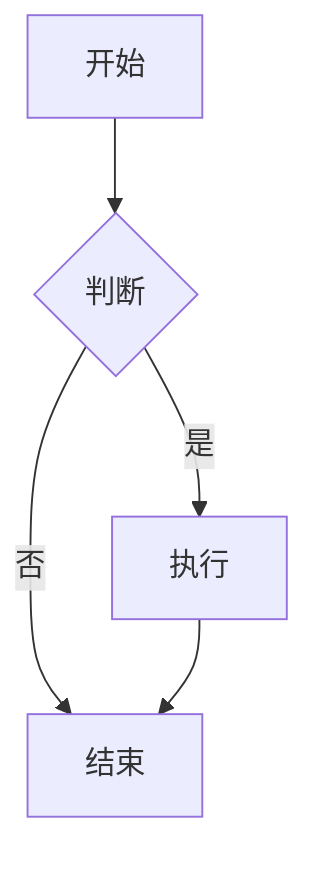

### 2. 时序图 Sequence Diagram

关键字：`sequenceDiagram`

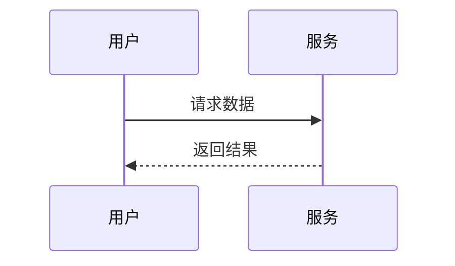

### 3. 类图 Class Diagram

关键字：`classDiagram`

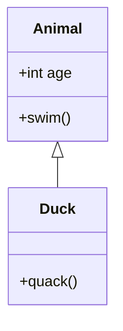

### 4. 状态图 State Diagram

关键字：`stateDiagram-v2`

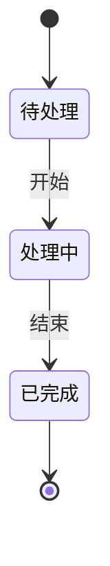

### 5. 实体关系图 ER Diagram（官方标注 experimental）

关键字：`erDiagram`

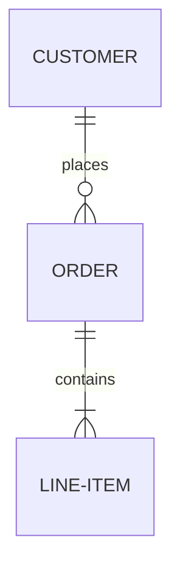

### 6. 用户旅程图 User Journey

关键字：`journey`

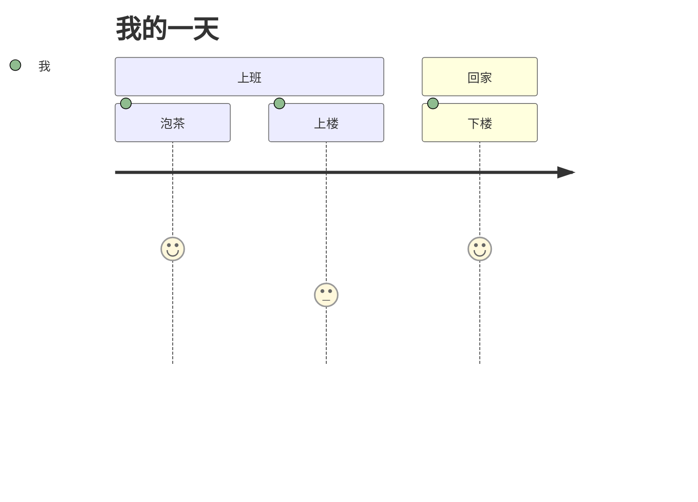

### 7. 甘特图 Gantt

关键字：`gantt`

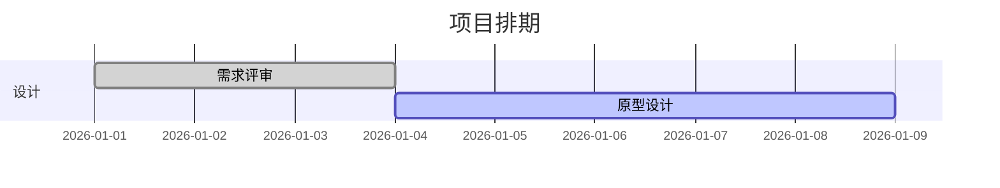

### 8. 饼图 Pie Chart

关键字：`pie`

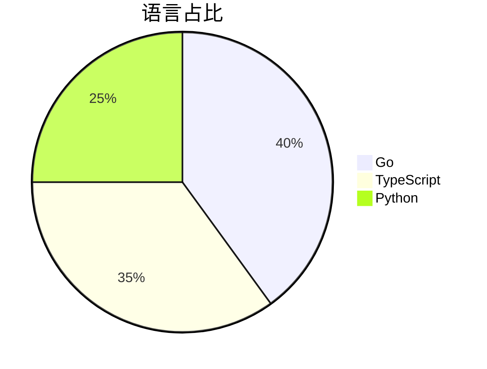

### 9. 四象限图 Quadrant Chart

关键字：`quadrantChart`

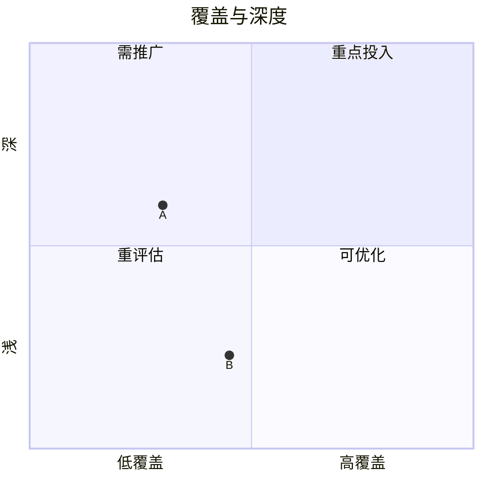

### 10. 需求图 Requirement Diagram

关键字：`requirementDiagram`

```mermaid
requirementDiagram
  requirement 登录需求 {
    id: 1.1
    text: 用户可用邮箱登录
    risk: high
    verifymethod: test
  }
```

### 11. Git 提交图 Gitgraph

关键字：`gitGraph`

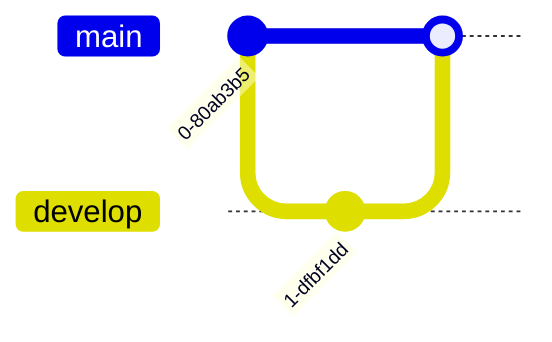

### 12. 思维导图 Mindmap

关键字：`mindmap`

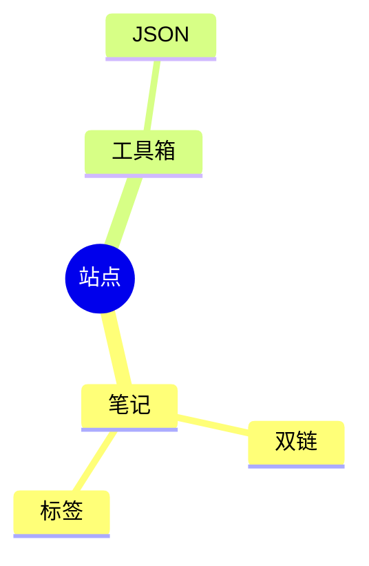

### 13. 时间线 Timeline

关键字：`timeline`

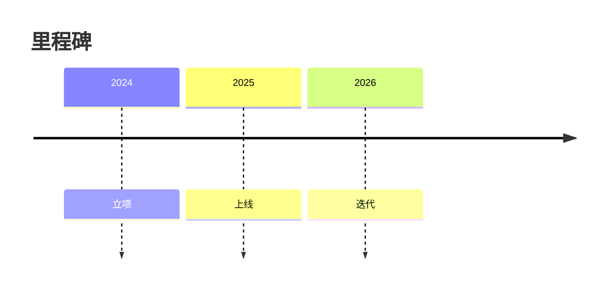

### 14. C4 架构图

关键字：`C4Context`（另有 `C4Container` / `C4Component` / `C4Dynamic` / `C4Deployment`）

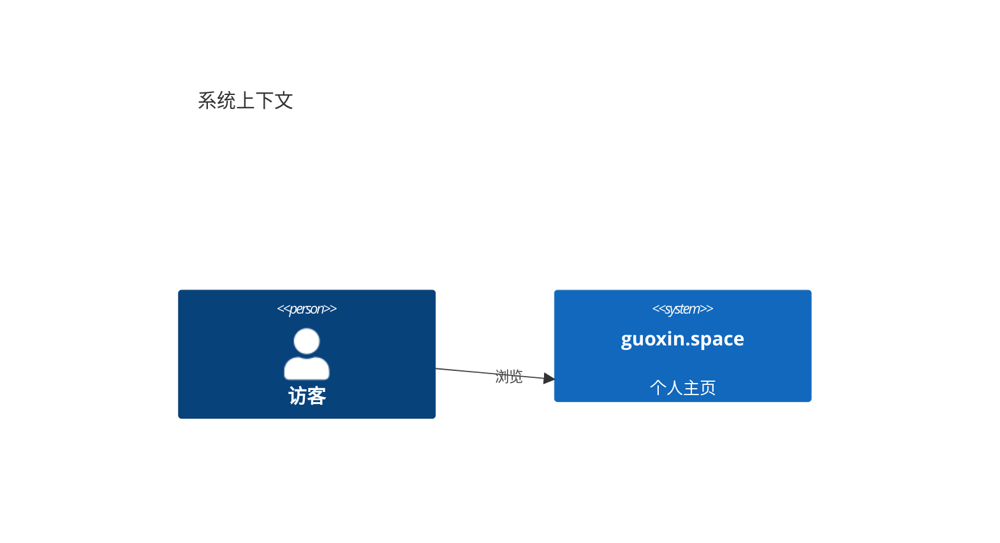

### 15. 信息图 Info

关键字：`info`

```mermaid
info
  showInfo
```

---

## 二、Beta / 实验性图种（关键字常带 `-beta` 后缀）

### 16. 桑基图 Sankey

关键字：`sankey-beta`

```mermaid
sankey-beta
  来源A,目标X,40
  来源B,目标X,30
  来源B,目标Y,20
```

### 17. 区块图 Block

关键字：`block-beta`

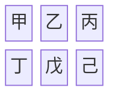

### 18. 数据包图 Packet

关键字：`packet-beta`

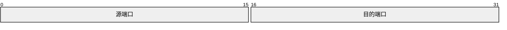

### 19. 看板 Kanban

关键字：`kanban`

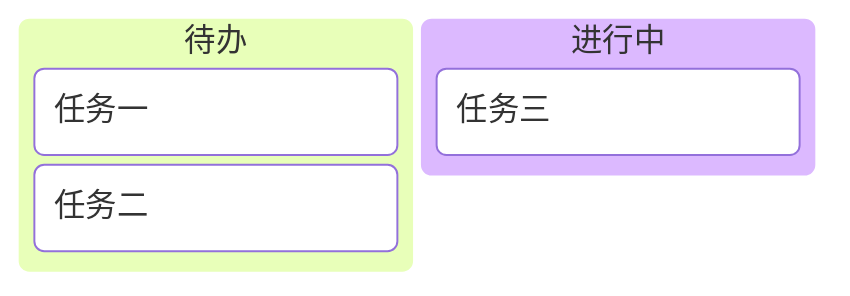

### 20. 架构图 Architecture

关键字：`architecture-beta`

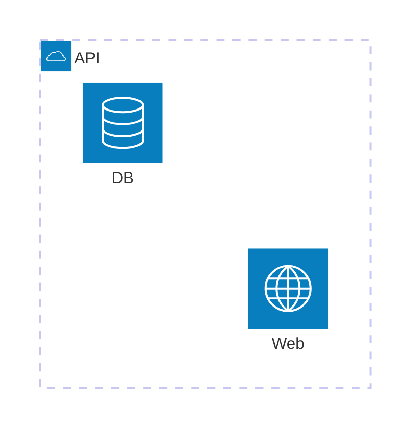

### 21. XY 图表

关键字：`xychart-beta`

```mermaid
xychart-beta
  title "销售额"
  x-axis [1月, 2月, 3月, 4月]
  y-axis "金额" 0 --> 100
  bar [30, 50, 70, 60]
  line [25, 45, 65, 55]
```

### 22. 雷达图 Radar

关键字：`radar-beta`

```mermaid
radar-beta
  title 技能
  axis 前端,后端,运维
  curve 我["我"]
  我: [8, 6, 7]
```

### 23. 矩形树图 Treemap

关键字：`treemap-beta`

```mermaid
treemap-beta
  "前端" : 40
  "后端" : 35
  "运维" : 25
```

### 24. 用例图 Use Case

关键字：`usecase-beta`

```mermaid
usecase-beta
  direction LR
  actor 读者
  浏览("浏览文章")
  读者 --> 浏览
```

---

## 三、本版本内置但尚未稳定文档化的图种

以下图种已包含在当前 Mermaid 构建中（可从其 `detectType` 登记表确认），但官方文档尚未给出稳定语法说明，**本页暂不演示**，避免给出错误示例：

| 图种 | 探测到的关键字 |
| --- | --- |
| Venn（韦恩图） | `venn-beta` |
| Tree View（树视图） | `treeView-beta` |
| Swimlane（泳道） | `swimlane-beta` |
| Cynefin | `cynefin-beta` |
| Agent Flow | `agentflow-beta` |
| Event Modeling | `eventmodeling` |
| Ishikawa（鱼骨图） | 未公开 |
| Wardley（沃德利地图） | 未公开 |
| Railroad（铁路图） | 未公开 |

> 说明：Beta 图种的语法在后续 Mermaid 版本中可能调整；若某图种在本页显示为「渲染失败」，通常意味着当前版本语法与示例不一致，而非站点限制。
