本文是 **Mermaid 渲染能力测试页**：每个小节给出该图种的**语法关键字**（即 ` ```mermaid ` 代码块的第一行）与一个最小可渲染示例，用于验证当前站点能否正确渲染。

渲染机制：站点在文章详情页**运行时懒加载 Mermaid**（避免拖慢首屏），主题跟随站点明暗切换，未对图种做任何白名单限制——**Mermaid 支持的类型即可渲染**。若某图种解析失败，页面会在该位置显示「Mermaid 渲染失败」提示。

---

## 一、稳定图种

### 1. 流程图 Flowchart

关键字：`flowchart` 或 `graph`

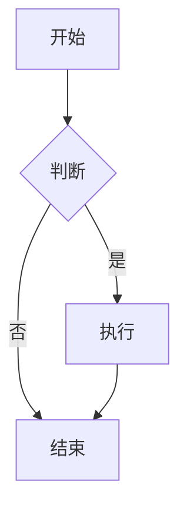
文档：[流程图 官方语法](https://mermaid.js.org/syntax/flowchart.html)
示例：[流程图 在线示例](https://mermaid.live/edit#pako:eJxFjE0KgkAYhq8yfGu9gIsg9Qa1ynHxoeMPqBPTDBEqtCxqEQTRJiKIXEUHqOtoHSMUrOXzvD85eNxnYECQ8LkXoZBkbNOMkKFTv5Z1tXGJrg-Imdera3O4l21ktqpojo-CWE6zrj6Xrfv39e5WENt5P_fN6dx5q7uwQYNQxD4YUiimQcpEii1C3pYoyIiljIJBKPgsQJVICjQrQQNUko8WmddP1dRHyewYQ4FpL6eYTTj_oeAqjMAIMJmx8gujg1U-)
### 2. 时序图 Sequence Diagram

关键字：`sequenceDiagram`

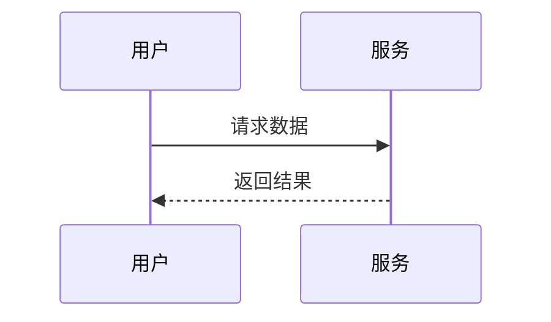
文档：[时序图 官方语法](https://mermaid.js.org/syntax/sequenceDiagram.html)
示例：[时序图 在线示例](https://mermaid.live/edit#pako:eJxdzy0OwkAQBeCrbEa3F1hRxQ1wZM2kHdpN6G5ZdgUhGBQhqQIUTRMcih9VgeA0XTgGaZoikO-b98SsINYJAYcFzR2pmEYSU4O5UIwVaKyMZYHKsvfh4rfNv_qqbHfnTvt7GEU9cfa5Nf6x8ce7L69dofcwjKK-ytnndWhP9fu593UFAaRGJsCtcRRATibHLsKq2wqwGeUkgDMBCU3RzawAodYQADqrx0sVD1NXJGiHLwYsUE20_kWjXZoBn-JsQesvIcttUA)
### 3. 类图 Class Diagram

关键字：`classDiagram`

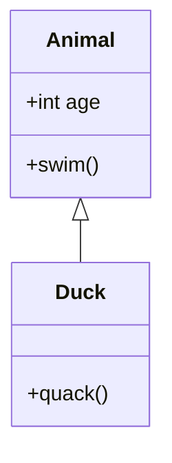
文档：[类图 官方语法](https://mermaid.js.org/syntax/classDiagram.html)
示例：[类图 在线示例](https://mermaid.live/edit#pako:eJxVzk0KwjAUBOCrhLdqMb1AcCP0Bu4km0fymobmp-YHkdq7S8CKLudjBmYDFTWBAOUw59GiSehlYOwSrEfHzq9hYGNVy48JdrKhMDT0j_lhfdc3a4Mm94pq6XrgYJLVIEqqxMFT8tgibK0soczkSYJgEjRNWF2RIMMOHLCWeH0GdUzrqrHQ5-aBK4ZbjN-YYjUziAldpv0NzllKGg)
### 4. 状态图 State Diagram

关键字：`stateDiagram-v2`

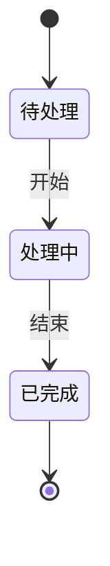
文档：[状态图 官方语法](https://mermaid.js.org/syntax/stateDiagram.html)
示例：[状态图 在线示例](https://mermaid.live/edit#pako:eJyrVkrOT0lVslIqLkksSXXJTEwvSszVLTOKyVNQiNaKVdDVtVN4uq_16ZKW5xPaQIJwDkQKzHyyY62ClcLTPQ1Pl3eD1cBFwWq2b3q6rudZxwQFK4Xnuyc_mzsfrAYuClITrRWrpKOUXpSZomRVUlSaqqOUm1qUmwjiKlWDlMcolWSk5qbGKFkpxCilpKYlluaUxCjF5NUq6SgllpbkB1fmJcO0lhakIPwCEyxIzIvKz4dzi_JL0zOUrNISc4pTawHHh2st)
### 5. 实体关系图 ER Diagram（官方标注 experimental）

关键字：`erDiagram`

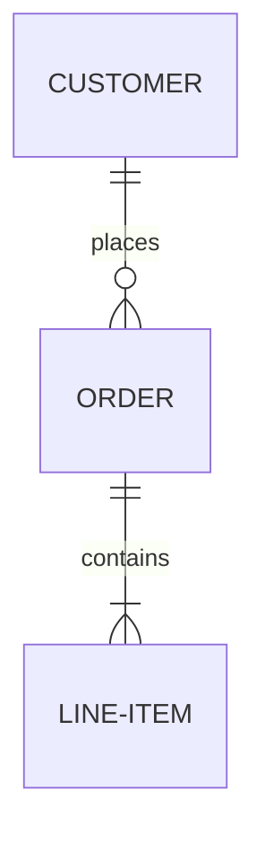
文档：[实体关系图 官方语法](https://mermaid.js.org/syntax/entityRelationshipDiagram.html)
示例：[实体关系图 在线示例](https://mermaid.live/edit#pako:eJw9js0KgzAQhF9l2bO-QK41B6FWUHspuSxx_QGTSEwORX33Elp7nG_mg9lRu55RIPtiptGTURbg9my7upINHEeeux3qppANCFgX0rylxZek-tjhXj5kXnayAgHa2UCz3TDD0c89iuAjZ2jYG0oR96QrDBMbVihAYc8DxSUoVPbEDCkG176tvtS49hT49-6CK9mXc__oXRwnFAMtG58fUB5GMQ)
### 6. 用户旅程图 User Journey

关键字：`journey`

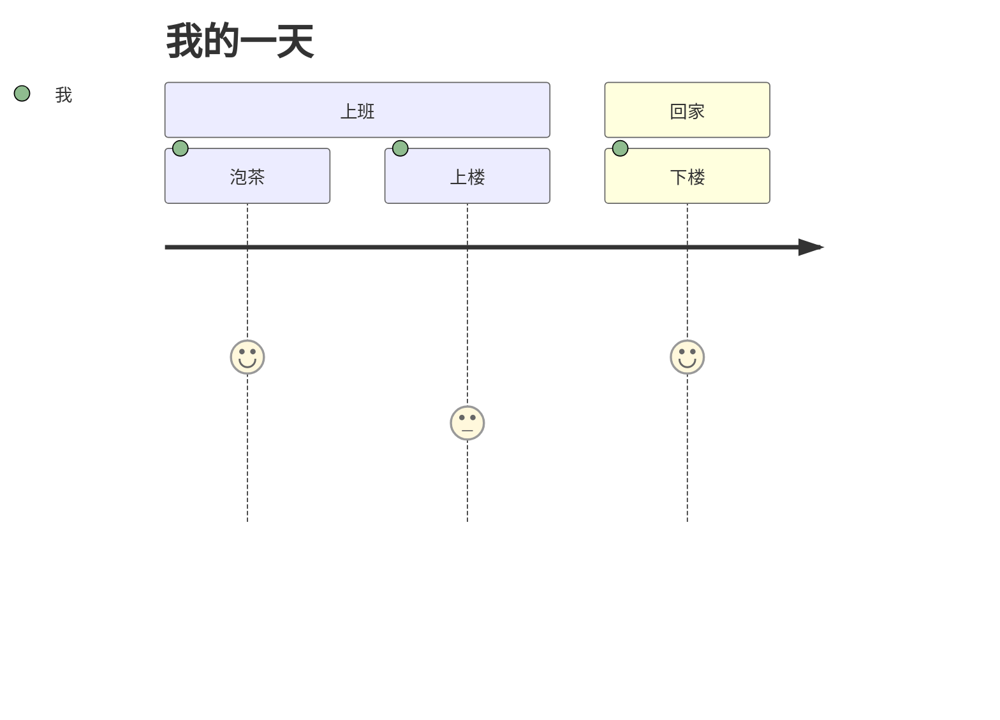
文档：[用户旅程图 官方语法](https://mermaid.js.org/syntax/userJourney.html)
示例：[用户旅程图 在线示例](https://mermaid.live/edit#pako:eJw9i7sKwjAUQH_lcudu4pLZP3CTLKG9fUibSEyGUgQHB1FBXBUEQQcHXQTp4Oe01c-QKO14DucU6KuAkOFYWS0p5xLAJCYlaJa7935RlfP6fHV2Sr5JlISqXL23N2cAmsfps3ky6DOX_11VrprLi0Gvc-1ZH471_dlW61_1P9HDSCcBMqMteZiRzoRDLFzN0cSUEUcGHAMKhU0NRy5n6KGwRg1z6bernQTC0CARkRZZKydCjpTqUCsbxchCkU5p9gVcn2Y-)
### 7. 甘特图 Gantt

关键字：`gantt`

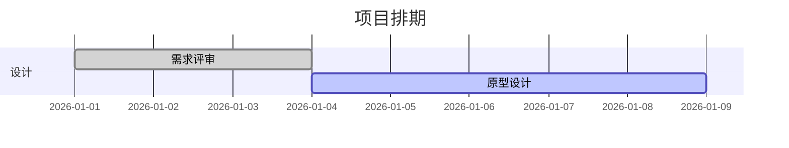
文档：[甘特图 官方语法](https://mermaid.js.org/syntax/gantt.html)
示例：[甘特图 在线示例](https://mermaid.live/edit#pako:eJxNjz1qw0AQha8yTL0CSfkpthbpXKVS2GbRjmWBtGtWo0AwhhDSBVykjYnRBRRSpsltpMi3CItxSPm--d6D2WDhDKHEUltmZQGMZrpxvtEMeZ7n0WIRZVk4cMU1wbH_-nkbpt3rtD8E2lLBlbMwD9_z0Ady3D9On0_zx_M49CCNsyTAUJsISOP0OoqTKE4EXJjgjrvD-P5y6oLUBVf3Jzv9Z18KuDIosPSVQcm-I4EN-UaHiJuwo5BX1JBCCQoNLXVXs0JltyhQd-xuH2xxrnbr8GJW6dLr5gzX2t459xe968oVyqWuW9r-AhJdbTY)
### 8. 饼图 Pie Chart

关键字：`pie`

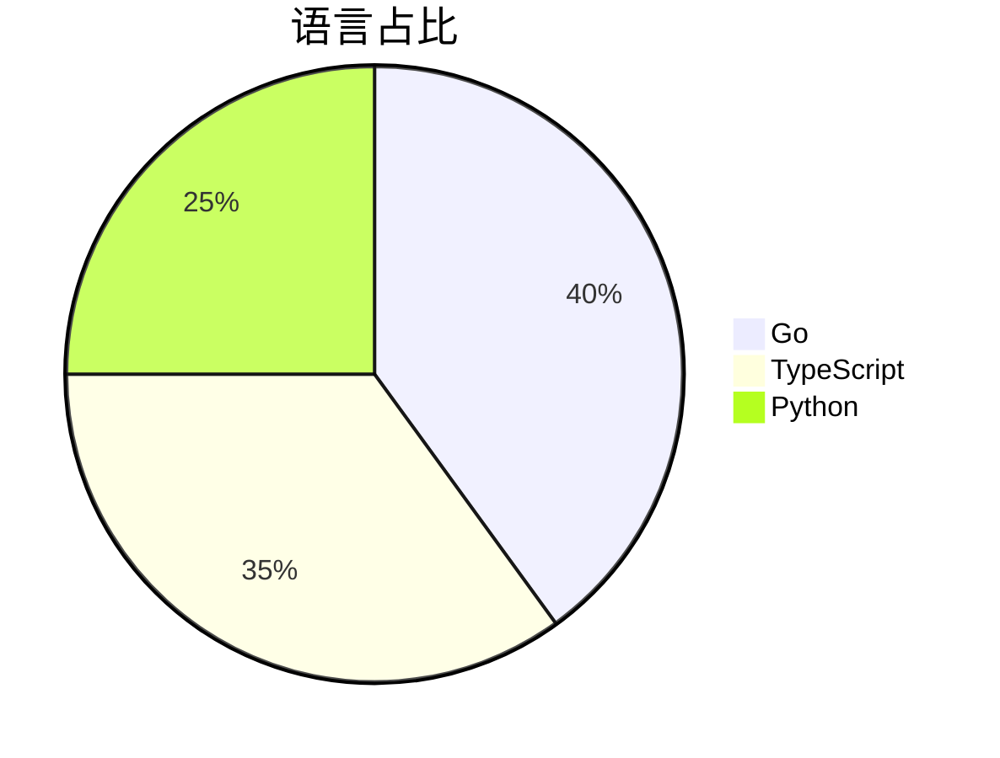
文档：[饼图 官方语法](https://mermaid.js.org/syntax/pie.html)
示例：[饼图 在线示例](https://mermaid.live/edit#pako:eJw9yz0KwkAQhuGrLFOnEDXN1oKtoJVsM2QnyUL2h3W2CCHgBew8gKWN5FRKjiEmxPJ9-L4OCq8JJARDgg03JMbhNT6v79vjM9yVE0LB3isQUmxXc57aQMcimsATb_KZDy3X3k20ziGDKhoNkmOiDCxFi7-Ebh5zTZYUSKFAU4mpYQXK9ZABJvbH1hXLNQWNTDuDVUS7YEB39v6f0aeqBllic6H-C5w4SQQ)
### 9. 四象限图 Quadrant Chart

关键字：`quadrantChart`

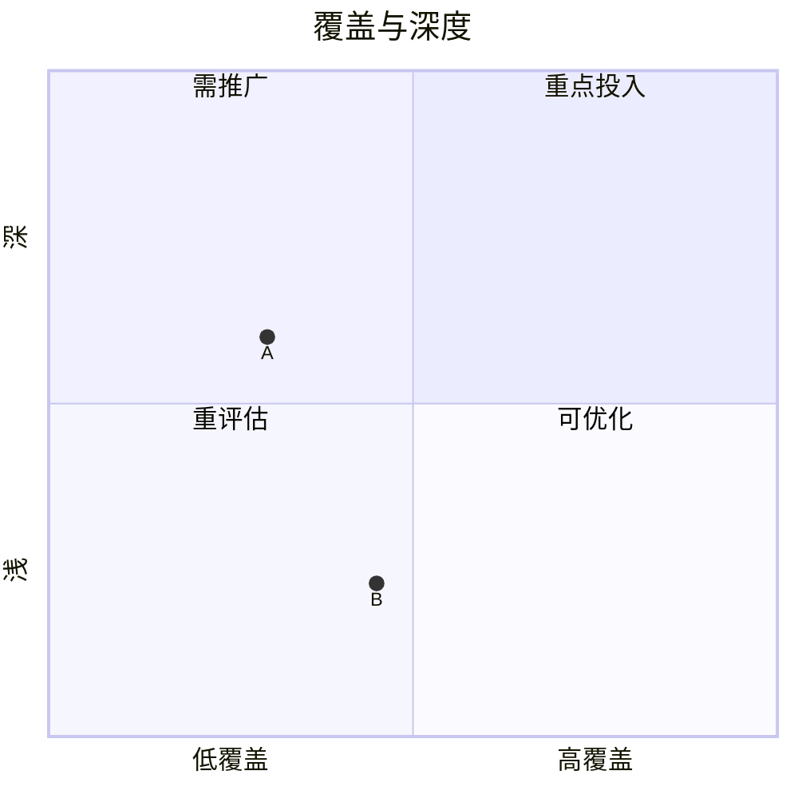
文档：[四象限图 官方语法](https://mermaid.js.org/syntax/quadrantChart.html)
示例：[四象限图 在线示例](https://mermaid.live/edit#pako:eJxVjc1Kw0AUhV_lctdJqU11kYXgzxu403RxaaZJID91OgMtpSBiFUTjSino1iK4qF1IrVR8mSRt30ImIUKW5_vO4QyxHdkMTTyXZHMKxZFLXFghgPCEz2AzvV4_PyVfcbaYp99TJfo69b0eJD9xIUHX92H7PimSagyKRvY5zl22mCtaPug7sL25X18us9vHdPxaUQ3Yvlxk8Vu6_K1wQ002s6tk9VHhTUgfZslqkt7lxwcmnNVrhgb12l5LgcMcNHcVaRgt1NDhno2m4JJpGDAekIo4VGULhcsCZqEJFtqsQ9IXFlrhCDUkKaKTQdgup7Jrk2DHHjmcghJ2KTyNov_II-m4aHbI77HRH2UykVc)
### 10. 需求图 Requirement Diagram

关键字：`requirementDiagram`

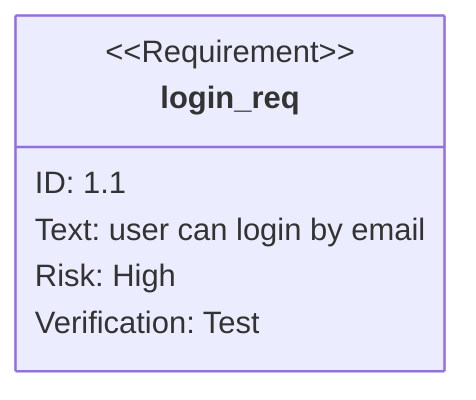
文档：[需求图 官方语法](https://mermaid.js.org/syntax/requirementDiagram.html)
示例：[需求图 在线示例](https://mermaid.live/edit#pako:eJxNj8FqxDAMRH9F6LwU9upz_6C3YihqPLFFY3tXkUvDsv9e0nRLj-9phkE3nnoCBzZchxoqmj-rZJMaG9E_S0vP2t4MV7rtJyJNgc5P5wMcXx5orDCapB1het8IVXQ5IqbrR6CiuRz8CdN5q_DSUyDH6ru_84mzaeLgNnDiCquyI__MRvaCisiBIifMMhaPHNtek-H9ZWvTozouSRy_7zzkRdpr739ofeTCYZZlxf0brrFcRA)
### 11. Git 提交图 Gitgraph

关键字：`gitGraph`

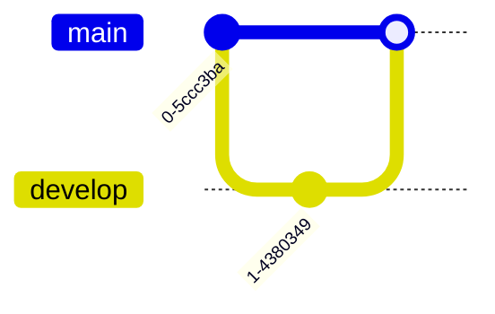
文档：[Git 提交图 官方语法](https://mermaid.js.org/syntax/gitgraph.html)
示例：[Git 提交图 在线示例](https://mermaid.live/edit#pako:eJxVi0EKwzAMBL8SdM4LfC70Ab0VX1RbsU0jy6hyoYT8vbiQQG-7s7MbBIkEDlKxq2LLvk5TEOZiIz0Ua8hTpDet0n5bpvCUbn_s9M-VsdQBmDTR4cIMSUsEZ9ppBiZlHBW2oXqwTEwe3OQh0oJ9NQ--7jADdpPbp4bj2ltEo0vBpMgHbFjvImdV6SmDW3B90f4FGq1Rcw)
### 12. 思维导图 Mindmap

关键字：`mindmap`

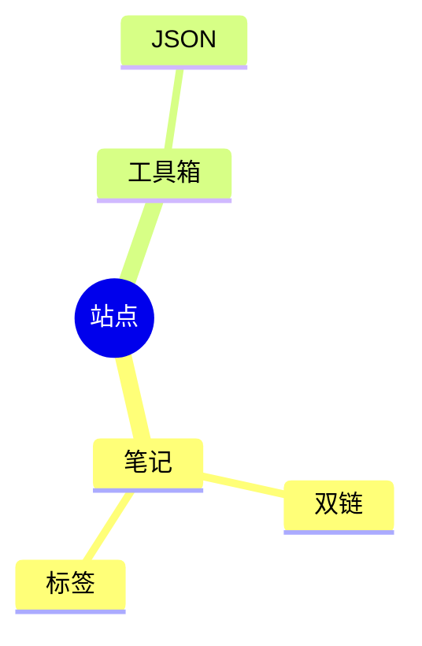
文档：[思维导图 官方语法](https://mermaid.js.org/syntax/mindmap.html)
示例：[思维导图 在线示例](https://mermaid.live/edit#pako:eJw9i70KwjAUhV8l3MlCn6Czk4MO3STLpUl_oElKTAYpXQRxERx0cXNxUotOxcW3qdG3kKJ1O993zikhUoxDACKTTGBBJSFaKTMYuNPeLe6e1xlC3Hn3qq_fTEi7Wb-3j56eh5W7_Khtju2ycfWtL0fhZAw-JDpjEBhtuQ-Ca4EdQtmtKJiUC04hIBQYj9HmhgKVFfiA1qhwLqP-aguGhg8zTDSKXhYop0r9USubpBDEmM949QHoClOQ)
### 13. 时间线 Timeline

关键字：`timeline`

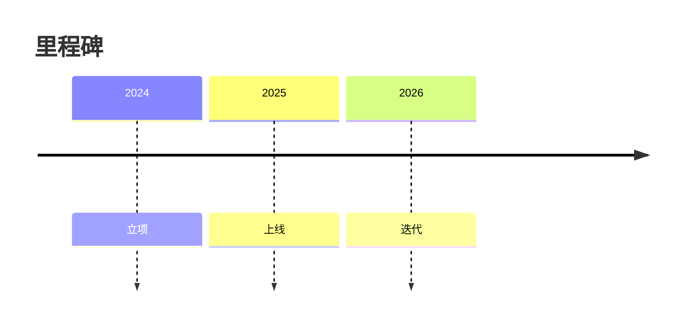
文档：[时间线 官方语法](https://mermaid.js.org/syntax/timeline.html)
示例：[时间线 在线示例](https://mermaid.live/edit#pako:eJw9y70KwjAUhuFbOZy5gxR1yOwduEmW0J62gSYpMRmkdBasi5egLoK4-zP0Zgq1dyGF1vF9-L4SIxMTMnRSUS41cQ3gpMsJ-v2xu9Xd5TRQOAvnwKC71_35NcICGLTPQ_duRlgCg2_zaD9XDDC1MkbmrKcAFVklhsRymHJ0GSniyIBjTInwuePIdYUBCu_Meqej6eqLWDhaSZFaoSYshN4Y809rfJohS0S-peoHEEZOCQ)
### 14. C4 架构图

关键字：`C4Context`（另有 `C4Container` / `C4Component` / `C4Dynamic` / `C4Deployment`）

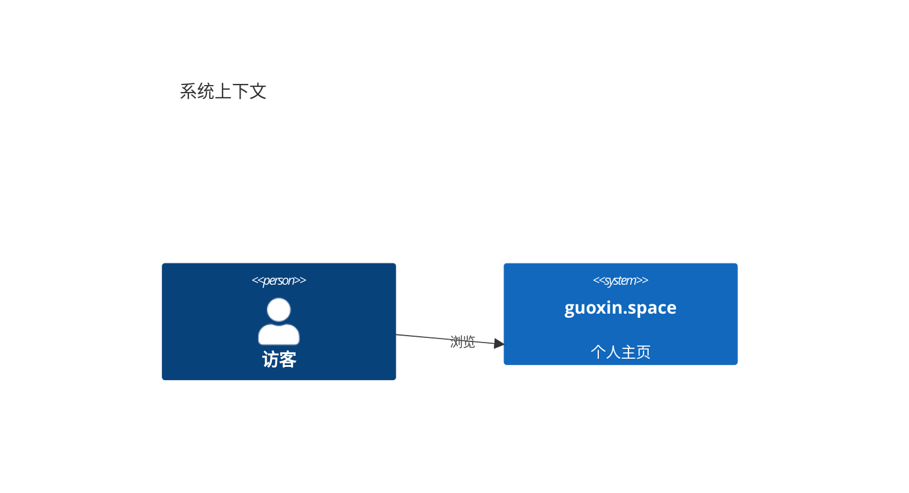
文档：[C4 架构图 官方语法](https://mermaid.js.org/syntax/c4.html)
示例：[C4 架构图 在线示例](https://mermaid.live/edit#pako:eJw9jLFKA0EURX9leVUCi1WqbeMHiOnkNY_dl83Azswy8wYSQmpFCztb0UawSCOBJVv4M2MS_8IMZC3vOZy7htJWDAVMJ1NrhJeCJstEScPZ8as_9q-xe4zd0-HlPokbdt6aUfDs8gzhtP3-2b4jjJObrbywHnklnFwd7FKZK99SyQiJxO4z7vex63_fdpfmlpvL2ZAdds-njweEMeRQO1VBIS5wDpqdpjRhnUIEWbBmhOJ8XPGcQiMIaDaQAwWxs5UphzS0FQlfK6od6QG2ZO6s_Z_OhnoBxZwaz5s_RtZruA)
### 15. 信息图 Info

关键字：`info`

```mermaid
info
  showInfo
```
文档：[信息图 官方语法](https://github.com/mermaid-js/mermaid/tree/develop/packages/mermaid/src/diagrams/info) （官方暂无独立语法文档页，链接为其源码目录）
示例：[信息图 在线示例](https://mermaid.live/edit#pako:eJw9izsKwzAQBa8iXq0TqE6TOl3YZrFWH7B2jSwRgvHdgwunnGHmwGJREFA1Galze7HPU5PBI_caEUaf4tGkN74Qx1URRpEmhOAIURLPdRBIT3jwHPb66nKvc4s85FE5d2633FjfZn_sNnNBSLzucv4AfHky1g)
---

## 二、Beta / 实验性图种（关键字常带 `-beta` 后缀）

### 16. 桑基图 Sankey

关键字：`sankey-beta`

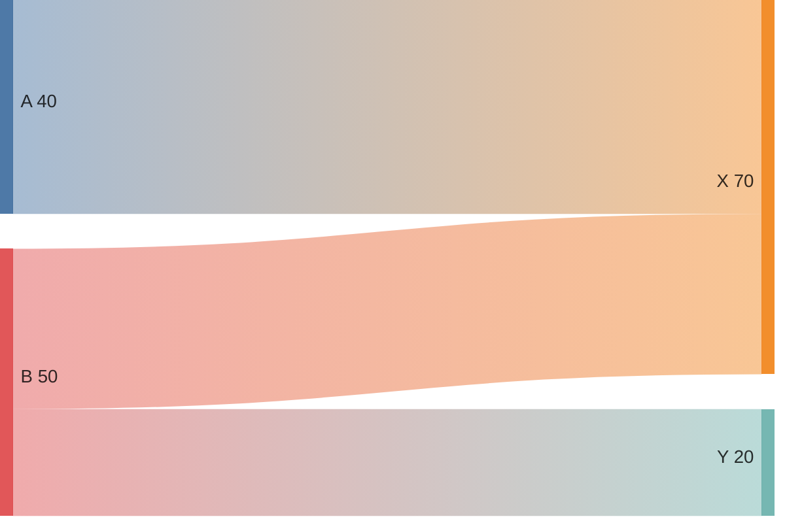
文档：[桑基图 官方语法](https://mermaid.js.org/syntax/sankey.html)
示例：[桑基图 在线示例](https://mermaid.live/edit#pako:eJw9i7EOgjAURX-F3PmZEHXqpvEPXJB0edJHIdKWlHYghH83TcTtnJtzN3TBCBQW9h9ZT29JrH1V3aiha13oTg1dfvSicw2CjaOBSjELwUl0XBRbaTTSIE40VKVhpOc8JQ3tdxA4p_BcfXdc82w4yWNkG9kd48y-DeGvMWQ7QPU8LbJ_ATfQOEQ)
### 17. 区块图 Block

关键字：`block`（基础写法；`block-beta` 为同义别名）

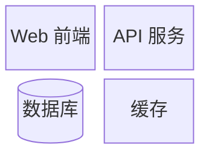
文档：[区块图 官方语法](https://mermaid.js.org/syntax/block.html)
示例：[区块图 在线示例](https://mermaid.live/edit#pako:eJw9zLFqwzAYBOBXETe14Kmjt0KXbIUMhfr38Fv6Y5taklEkSgl5gAY8hUKHLplDm86lr2PnNYqHdPyOu9tAeyPIUXVeP5FTSvsuWbdWNzOepSoID1Kp8XU4H0-EUnHfFoTb-4WaPoZxdyCUc9VUxRVhevuehq_xZ0-4LpVm3UhBOP_ux893QokMdWgN8hiSZLASLM_EZr4gxEasEHJFMLLi1EUCuS0ycIp--eL0ZZp6w1HuWq4D20vYs3v0_p_Bp7pBvuJuLds_zkpXUw)
### 18. 数据包图 Packet

关键字：`packet-beta`

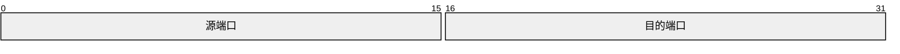
文档：[数据包图 官方语法](https://mermaid.js.org/syntax/packet.html)
示例：[数据包图 在线示例](https://mermaid.live/edit#pako:eJw9jDsOwjAQBa8SvTqRiBAUrrkBHXKzxJuPwHFk1gWK0tFDDSUlEvTcB3IN5CKUM0_zehTOMBQ6KnYs2ZaFdJsksyxfqETj-76Mj9fnfNeIOl9m8zz68fYcr6dpQorKNwZKfOAUlr2liOhjpCE1W9aIoeGSwl7i3YAUFMStj20xpaEzJLxqqPJkJ9lRu3Huj96FqoYqaX_g4QcjeEak)
### 19. 看板 Kanban

关键字：`kanban`

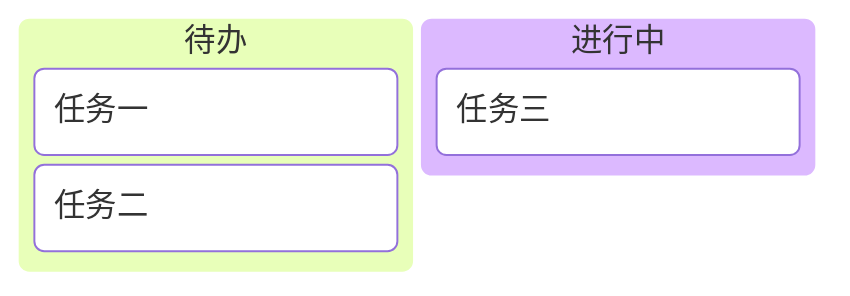
文档：[看板 官方语法](https://mermaid.js.org/syntax/kanban.html)
示例：[看板 在线示例](https://mermaid.live/edit#pako:eJxVyz8KwjAYBfCrhG_uCTJ7AzfJ8tl8_YNNUmIySCm4OFh6A0HoAdyLBb1MCj2GZKjQ7f0e7zWQGknA4YT6iFpoxubPbe6eMTEWpmnuhjBeN3z3kcv3sQx9GF_b6R0SyG0pgTvrKQFFVmEkNHEowBWkSABnAiRl6CsnQOgWEkDvzP6i0_Xqa4mOdiXmFtVa1qgPxvxpjc8L4BlWZ2p_DfdTrg)
### 20. 架构图 Architecture

关键字：`architecture-beta`

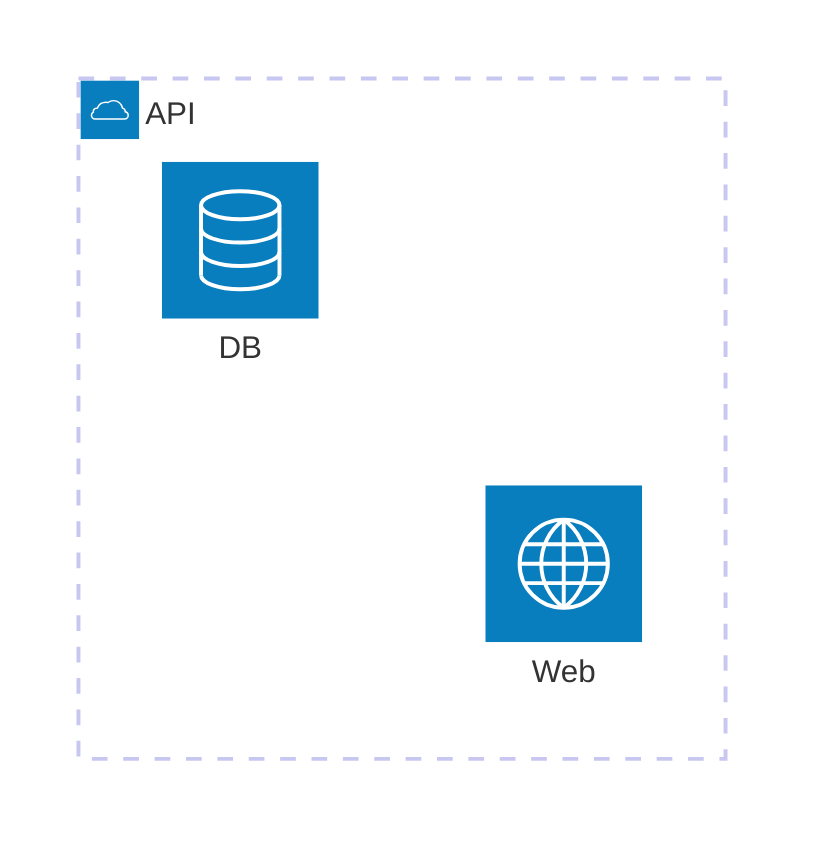
文档：[架构图 官方语法](https://mermaid.js.org/syntax/architecture.html)
示例：[架构图 在线示例](https://mermaid.live/edit#pako:eJxNizGKwzAQRa8iprLBuYC7LGnSBVIEYrkYST-2wJbMeJQQQu6-uPCy5fv_vQ_5HEAtsfgxKrwWwcFB2SZjBsllMbzEyk-5hLo7Xs79dqyQZ_QwL7gqJoUkaN3d4HoT0xb8l4KrAis7XlF3p59doYYGiYFalYKGZsjMG9Jniy3piBmWWmMp4MFlUks2fakhLpqv7-T3tCyBFafIg_C8jwune85_KLkMI7UPnlZ8fwE1SFVa)
### 21. XY 图表

关键字：`xychart-beta`

```mermaid
xychart-beta
  title "Sales Revenue"
  x-axis [jan, feb, mar, apr]
  y-axis "Amount" 0 --> 100
  bar [30, 50, 70, 60]
  line [25, 45, 65, 55]
```
文档：[XY 图表 官方语法](https://mermaid.js.org/syntax/xyChart.html)
示例：[XY 图表 在线示例](https://mermaid.live/edit#pako:eJw9jktqxDAQBa_S9LoNykcT8CIQyAkyu1izaNttW0EfI0vBZpi7ByVMlvWKgnfFIY6CLe7HsHDKTS-ZTQDINjsBg2d2ssGHfEsoYrCqveHdbtB9cSCYpCfwnAh4TZeqjz9t8M3HErJBUNA0r_CgVNU9J-ieFIFWBC-K4KR-M2eDQPeoCZ41wUkTaH1BwjnZEducihB6SZ4r4rUmBvMiXgy2YHCUiYvL9eINCbnkeD7CcE_LOnKWd8tzYn8fVw6fMf5jimVesJ3YbXL7AY1YWTM)
### 22. 雷达图 Radar

关键字：`radar-beta`

```mermaid
radar-beta
  axis m["Math"], s["Science"], e["English"]
  axis h["History"], g["Geography"], a["Art"]
  curve a["Alice"]{85, 90, 80, 70, 75, 90}
  curve b["Bob"]{70, 75, 85, 80, 90, 85}
  max 100
  min 0
```
文档：[雷达图 官方语法](https://mermaid.js.org/syntax/radar.html)
示例：[雷达图 在线示例](https://mermaid.live/edit#pako:eJxFjMFOwzAMhl8l8jlI5TAxegOBxoXTbsQc3NZLIzVJ5SZoU9V3R8nYOFjy__v7vEIfB4YWhAaSh44TYVCKzm5R3iB8UhoRvrVaDMKxdxx6rpkNwnuwk1vK_e6MBuHDLSnKpWLWIBw4WqF5vDZkEF4k_Ul9lh--dpOrr9f9TqvnRqt9o9VTmZq3f7ozCK-xK-ztXpzCV29XWU9n9dg0dXVBNaDBihugTZJZg2fxVCKsBUFII3tGaBXCwCfKU0LAsIEGyikeL6G_qXkeKPGbIyvkb-VM4SvGe5SY7QjtiaaFt1_B3HBH)
### 23. 矩形树图 Treemap

关键字：`treemap-beta`

```mermaid
treemap-beta
  "前端" : 40
  "后端" : 35
  "运维" : 25
```
文档：[矩形树图 官方语法](https://mermaid.js.org/syntax/treemap.html)
示例：[矩形树图 在线示例](https://mermaid.live/edit#pako:eJw9y7sNwjAUheFVrFMHCQFpXLMBHXJziW8eUmxHxi5QlAEoQNmDgoaOgmlQGANBCOX_6ZwWmdMMieCZDTWzHQdSVgiF5_E0XK4KQorV_Ef9eaJlOtLr0Q_325cWKRIUvtKQwUdOYNgb-iTacRxKNqwghYLmnGIdFJTtkIBicJuDzaZrbDQFXldUeDITNmS3zv3Tu1iUkDnVe-7eWmtHSg)
### 24. 用例图 Use Case

关键字：`usecase-beta`

```mermaid
usecase-beta
direction LR
actor Reader
Browse("Browse article")
Reader --> Browse
```
文档：[用例图 官方语法](https://mermaid.js.org/syntax/usecase.html)
示例：[用例图 在线示例](https://mermaid.live/edit#pako:eJw9i7EKwkAQRH_lmEoh-YEUFmJppZ1ss95tkoNkTzZ7iAT_XSRoN2_ezIpYkqBDXSTyIu1dnElTNomei4bzhZSjFwsX4SRGerTyXGRH2EJg8xwnIexJt01o20PYLBoMlhM6tyoNZrGZv4iVNASCjzILoQuEJD3XyQmkbzTg6uX60vi71kdil1PmwXj-lQ_WWyl_tFKHEV3P0yLvDwaTTIo)
---

## 三、本版本内置但尚未稳定文档化的图种

以下图种已包含在当前 Mermaid 构建中（可从其 `detectType` 登记表确认），但官方文档尚未给出稳定语法说明，**本页暂不演示**，避免给出错误示例：

| 图种 | 探测到的关键字 |
| --- | --- |
| Venn（韦恩图） | `venn-beta` |
| Tree View（树视图） | `treeView-beta` |
| Swimlane（泳道） | `swimlane-beta` |
| Cynefin | `cynefin-beta` |
| Agent Flow | `agentflow-beta` |
| Event Modeling | `eventmodeling` |
| Ishikawa（鱼骨图） | 未公开 |
| Wardley（沃德利地图） | 未公开 |
| Railroad（铁路图） | 未公开 |

> 说明：Beta 图种的语法在后续 Mermaid 版本中可能调整；若某图种在本页显示为「渲染失败」，通常意味着当前版本语法与示例不一致，而非站点限制。
