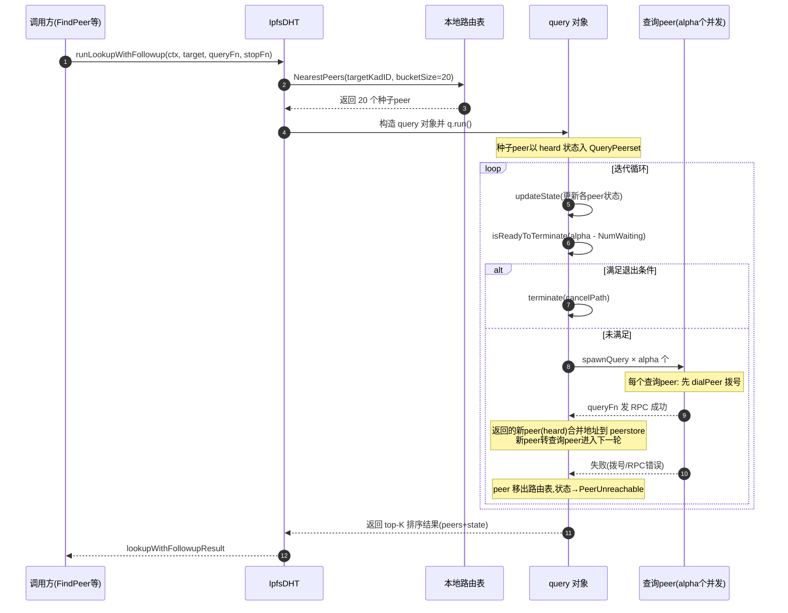

本文档由 4 篇 libp2p 相关笔记合并整理：《libp2p DHT Kademlia 迭代查询》（源码解析，核心）、《2022-01-05 libp2p 分享-明超》（ChainMaker 集成实践）、《2022-02-07 学习 libp2p》（KAD 算法速记，已补全）、《libp2p 遇到的问题》（实战排查）。

### 1. 背景基础：Kademlia 算法与 libp2p

#### 1.1 Kademlia 算法核心思想


原文速记：KAD 算法（Kademlia）其实是在 chord 上做的优化。主要是两个点：1、用二进制（32/64/128）表示一个节点的 id，两节点的 id 异或运算得到节点间的距离……

Kademlia 是 P2P 网络中经典的一致性哈希（DHT）路由算法，相对 Chord 的核心改进如下：

||||
|---|---|---|
|距离度量|顺时针环上顺时针差值|节点 ID 按位异或（XOR）|
|距离性质|单向（非对称）|对称：dist(A,B) == dist(B,A)，且满足三角不等式|
|路由表|finger table（对数级）|K 桶（K-bucket），按公共前缀长度分桶|
|节点查找|每次跳转距离减半|每轮并发查询 alpha 个节点，对数级收敛 + 高并发|
|容错|依赖 successor list|同一 K 桶存 k 个节点，单点失效不影响|


K 桶关键规则：

- 节点 ID 用二进制表示（32/64/128 bit 可选），两个 ID 异或运算的结果即节点间"距离"，距离越小越"近"；
- 路由表按公共前缀（XOR 距离的最高位）划分成一组 K 桶（默认每桶最多 k 个节点）；
- 查找目标 key 时，从最近的桶开始，每次取距离最近的 alpha 个节点并发查询，迭代逼近目标；
- 桶中节点按最近活跃时间排序，旧节点被淘汰（LRU），保持路由表新鲜度。

#### 1.2 libp2p 简介

libp2p 是一个模块化的 P2P 网络协议栈（IPFS 团队发起），提供传输层抽象、身份（Peer ID）、连接管理、流多路复用、节点发现（DHT / mDNS / Gossip）等能力。Go 生态的核心实现为 go-libp2p，其协议接口定义在 go-libp2p-core（第 3 章中 ChainMaker 的国密改造正是围绕这一层展开）。

#### 1.3 关键概念速查表

||||
|---|---|---|
|bucketSize（k）|20|K 桶大小，路由表中每桶最大节点数，也是种子 peer 数量|
|alpha|10|每轮并发查询的节点数（并发度）|
|beta|3|终止条件：查到 beta 个最近节点即认为查询完成|
|PeerHeard|-|已听说但未查询的节点（初始状态）|
|PeerWaiting|-|已发起查询、等待结果中的节点|
|PeerQueried|-|查询成功的节点（终态）|
|PeerUnreachable|-|拨号/RPC 失败的节点（终态，移出路由表）|
|LastUsefulAt|-|路由表中节点"最近有用"时间，用于 MVP 记录与淘汰|


### 2. DHT 迭代查询源码解析（核心）

#### 2.1 迭代查询概述

query 是整个 DHT 的核心，这里称之为迭代查询。DHT routing 中几乎所有方法都调用它，如 FindPeer、FindProviders、GetValue、PutValue、Provide。理解 query 是理解整个 DHT 的关键。

入口函数：runLookupWithFollowup(ctx, target, queryFn, stopFn) —— 使用指定查询函数在目标上执行查找，并在上下文被取消或停止函数返回 true 时停止。

参数说明：

||||
|---|---|---|
|ctx|context.Context|上下文|
|target|string|要查询的目标，可以是 peerid、multihash 等类型的 key|
|queryFn|queryFn|查询方法参数：func(context.Context, peer.ID) ([]*peer.AddrInfo, error)|
|stopFn|stopFn|停止函数，查询到符合条件的 peerid 时返回 true|


返回值：

```go
type lookupWithFollowupResult struct {
	peers []peer.ID            // 获得排名前 20 个（DHT K 桶大小）
	state []qpeerset.PeerState // peers 对应的状态

	// indicates that neither the lookup nor the followup has been prematurely terminated by an external condition such
	// as context cancellation or the stop function being called.
	// 查询和后续操作都没有被外部条件（例如：上下文取消或调用的停止函数）提前终止。
	completed bool
}
```

#### 2.2 总体流程（7 步）

- 首先根据 key 值，从本地路由表中获取最近的 k（默认 20）个节点作为种子 peer；
- 再从种子 peer 截取 alpha（默认 10）个 peer，这 alpha 个 peer 称之为查询 peer；
- 每个查询 peer 启动一个 task，发起 rpc 查询请求，发起 rpc 查询请求前会先拨号。每个 task 执行有快有慢，最后会等待所有 task 都执行完。就算把这些查询 peer 都查完可能也不满足循环退出条件（例如：10 个 peer 中 8 个离线、1 个 rpc 查询失败、只有 1 个查询成功，那么需要根据这个查询成功的 peer 去迭代查询）；
- 查询 peer 在某些类型（如 GET_VALUE、GET_PROVIDERS、FIND_NODE）rpc 请求中会把离它最近的 peer 作为响应消息发回（也可以通过 GetClosestPeers 获取最近的节点），这些离查询 peer 最近的 peer 称之为新 peer；
- 一个 peer 可能有多个地址，新 peer 可能已经在本地 peerstore 中，但本地 peerstore 的地址和查询到的新地址可能不一致（本地可能不是最新的），合并它们将这些已知的地址都加入本地 peerstore（下次迭代查询发起 rpc 查询前会先拨号，拨号需要地址）；
- 将这些新 peer 发回到 chan，这时新 peer 转换成查询 peer，准备第二次查询。最外面的循环里首先会对查询 peer 的状态进行更新，再对状态为 PeerHeard 的新 peer 继续启动 task，发起 rpc 查询请求。依次反复直到满足退出条件，整个迭代查询结束；
- 将排序后的结果返回。


迭代查询退出条件（3 个）：

|||
|---|---|
|stopFn|调用者通过闭包传入，如 GetClosestPeers 始终返回 false|
|isLookupTermination|查到了 beta（默认 3）个 peer|
|isStarvationTermination|没有 peer 可查（饥饿）|


#### 2.3 时序图


原始配图：watermark,type_ZmFuZ3poZW5naGVpdGk,...t_70.png（CSDN 博文截图）

配图内容描述：该图为 DHT Kademlia 迭代查询的时序图，展示了一次完整 lookup 的调用链：调用方 → runLookupWithFollowup → runQuery → query.run（内部循环：updateState → isReadyToTerminate → spawnQuery 迭代）→ 对每个查询 peer 先 dialPeer 拨号、再 queryFn 发 RPC → 收到新 peer 后合并地址、继续下一轮迭代 → 满足退出条件（beta 个已查询 / 无 peer 可查 / stopFn）后 terminate → 排序返回 top-K 结果。

以下用 Mermaid 重绘等价时序：



#### 2.4 重要数据结构

```go
// query represents a single DHT query.
// query 结构用于表示单个 DHT 查询
type query struct {
	// unique identifier for the lookup instance
	// 每个查询的唯一标识
	id uuid.UUID

	// target key for the lookup
	// 要查找的目标 key
	key string

	// the query context.
	// 上下文
	ctx context.Context

	// 当前 dht 对象
	dht *IpfsDHT

	// 查询设置中的种子节点
	seedPeers []peer.ID

	// peerTimes contains the duration of each successful query to a peer
	// 查询耗费的时间（成功的查询）
	peerTimes map[peer.ID]time.Duration

	// queryPeers is the set of peers known by this query and their respective states.
	// 查询已知的一组 peer 及其各自的状态
	queryPeers *qpeerset.QueryPeerset

	// terminated is set when the first worker thread encounters the termination condition.
	// 当第一个 Worker 符合终止条件时（stopFn 返回 false），则终止
	terminated bool

	// waitGroup ensures lookup does not end until all query goroutines complete.
	// 确保在所有查询协程完成之前查找不会结束
	waitGroup sync.WaitGroup

	// the function that will be used to query a single peer.
	// 将用于查询单个 peer 的函数
	queryFn queryFn

	// stopFn is used to determine if we should stop the WHOLE disjoint query.
	// 用于确定是否应停止整个查询
	stopFn stopFn
}
```

```go
// QueryPeerset 维护 Kademlia 异步查找的状态。查找状态是一组 peer，每个 peer 都标记有一个 peer 状态（queryPeerState）。
type QueryPeerset struct {
	// 正在搜索的 key
	key ks.Key

	// 所有已知的 peers
	all []queryPeerState

	// 如果所有 peer 已排序，则 sorted 为 true
	sorted bool
}
```

```go
// queryPeerState：单个 peer 的查询状态
type queryPeerState struct {
	id         peer.ID
	// 距 referredBy 的距离，用于排序
	distance   *big.Int
	state      PeerState
	referredBy peer.ID
}
```

```go
// queryUpdate：查询结果（传递到 chan），每个查询都有一个结果，会调用 updateState 更新
type queryUpdate struct {
	cause       peer.ID
	queried     []peer.ID
	heard       []peer.ID
	unreachable []peer.ID

	queryDuration time.Duration
}
```

#### 2.5 主要函数解析

#### runLookupWithFollowup

runLookupWithFollowup 是整个迭代查询的入口。

- 调用 runQuery 启动迭代查询任务；
- 从 runQuery 返回结果中将状态为 PeerHeard、PeerWaiting 的 peer 筛选出来。可能经过了几轮迭代查询后迭代退出条件已经满足，但已经收到了新的 peer，还没来得及调用 spawnQuery 发起任务，此时就会存在 PeerHeard 状态的 peer。


这里的过滤 PeerWaiting 的 peer 应该是多余的。可能已经启动了 spawnQuery 还没查询完，但退出迭代条件已经满足。例如：10 个 query，有 3 个 query 已经查询成功，但其他 7 个 query 还没查询完，这时调用了 terminate 取消了 context，那么这 7 个 PeerWaiting 的 peer 状态就会变为 PeerUnreachable 或 PeerQueried。执行 runQuery 后不会再存在 PeerWaiting 状态的 peer，因为 run 中有执行 waitGroup.Wait 方法会等待所有查询结果，查询要么成功要么失败，就算取消 context 整个 queryPeer 方法也会照样执行（始终会将 queryUpdate 消息发回 chan）。

- 如果没有状态为 PeerHeard、PeerWaiting 的 peer，则说明查询已经结束；
- 如果 ctx 出错或 stopFn 条件满足也说明查询结束；
- 对状态为 PeerHeard、PeerWaiting 的 peer 再做一次查询（启动协程，调用 queryFn），收尾工作，前面做到一半的工作不能不做完；
- 从 chan doneCh 查询结果，有几个 peer 接收几次；
- 如果 stopFn 满足条件或 ctx 完成则退出 doneCh 循环；
- 如果 completed 仍为 false，则将 chan doneCh 的消息取完（阻塞等待查询完成）。

```go
func (dht *IpfsDHT) runLookupWithFollowup(ctx context.Context, target string, queryFn queryFn, stopFn stopFn) (*lookupWithFollowupResult, error) {
	// run the query
	lookupRes, err := dht.runQuery(ctx, target, queryFn, stopFn)
	if err != nil {
		return nil, err
	}

	queryPeers := make([]peer.ID, 0, len(lookupRes.peers))
	for i, p := range lookupRes.peers {
		if state := lookupRes.state[i]; state == qpeerset.PeerHeard || state == qpeerset.PeerWaiting {
			queryPeers = append(queryPeers, p)
		}
	}

	if len(queryPeers) == 0 {
		return lookupRes, nil
	}

	// return if the lookup has been externally stopped
	if ctx.Err() != nil || stopFn() {
		lookupRes.completed = false
		return lookupRes, nil
	}

	doneCh := make(chan struct{}, len(queryPeers))
	followUpCtx, cancelFollowUp := context.WithCancel(ctx)
	defer cancelFollowUp()
	for _, p := range queryPeers {
		qp := p
		go func() {
			_, _ = queryFn(followUpCtx, qp)
			doneCh <- struct{}{}
		}()
	}

	// wait for all queries to complete before returning, aborting ongoing queries if we've been externally stopped
	followupsCompleted := 0
processFollowUp:
	for i := 0; i < len(queryPeers); i++ {
		select {
		case <-doneCh:
			followupsCompleted++
			if stopFn() {
				cancelFollowUp()
				if i < len(queryPeers)-1 {
					lookupRes.completed = false
				}
				break processFollowUp
			}
		case <-ctx.Done():
			lookupRes.completed = false
			cancelFollowUp()
			break processFollowUp
		}
	}

	if !lookupRes.completed {
		for i := followupsCompleted; i < len(queryPeers); i++ {
			<-doneCh
		}
	}

	return lookupRes, nil
}
```

#### runQuery

- 调用 dht.routingTable.NearestPeers 获取 key 最近的 20 个 peer 作为种子 peer（也就是从本地路由表获取最近的 peer）；
- 根据 key 和 20 个 seedpeer 构建 query；
- 调用 query.run 等待结果（用 waitGroup 等待所有查询完成）；
- 更新最有价值的 peer；
- 构造查询结果并返回。

```go
func (dht *IpfsDHT) runQuery(ctx context.Context, target string, queryFn queryFn, stopFn stopFn) (*lookupWithFollowupResult, error) {
	// pick the K closest peers to the key in our Routing table.
	targetKadID := kb.ConvertKey(target)
	seedPeers := dht.routingTable.NearestPeers(targetKadID, dht.bucketSize)
	if len(seedPeers) == 0 {
		......
		return nil, kb.ErrLookupFailure
	}

	q := &query{
		id:         uuid.New(),
		key:        target,
		ctx:        ctx,
		dht:        dht,
		queryPeers: qpeerset.NewQueryPeerset(target),
		seedPeers:  seedPeers,
		peerTimes:  make(map[peer.ID]time.Duration),
		terminated: false,
		queryFn:    queryFn,
		stopFn:     stopFn,
	}

	// run the query
	q.run()

	if ctx.Err() == nil {
		q.recordValuablePeers()
	}

	res := q.constructLookupResult(targetKadID)
	return res, nil
}
```

#### run

- 启动 loop 循环前，将 20 个 seedpeer 放进了 queryUpdate 的 heard 集合中；
- 启动 loop，监听 queryUpdate，发现有更新消息，调用 updateState 更新 peer 状态；
- 进入 loop 后，首先进入 case update 分支，将 seedpeer 加入 queryPeers 集合（QueryPeerset）中，此时 seedpeer 的状态还是 heard；
- 紧接着计算启动的 query 任务数量：maxNumQueriesToSpawn = alpha - q.queryPeers.NumWaiting()，alpha 默认为 10，第一次循环进来 waiting 数量为 0，maxNumQueriesToSpawn 的值此时为 10；
- 调用 isReadyToTerminate 检查查询是否需要终止、生成新的 peer 集合。依次判断 stopFn/isStarvationTermination/isLookupTermination 条件是否满足，如果满足则直接退出 isReadyToTerminate，如果不满足退出条件则根据传入的 maxNumQueriesToSpawn 值，从 queryPeers 集合中取出状态为 PeerHeard 的节点（第一次循环进来 queryPeers 里有 20 个 seedpeer，那么这里只截取了前 10 个）；
- 根据 isReadyToTerminate 的返回结果决定是否需要调用 terminate 方法终止迭代查询。如果 ready 为 true，则退出 run 方法（唯一的退出 run 出口），如果没有终止，则循环 qPeers 调用 spawnQuery 发起查询（qPeers 是上一步从 queryPeers 集合中截取的若干条记录）；
- waitGroup 等待所有 spawnQuery 任务完成。

```go
func (q *query) run() {
	pathCtx, cancelPath := context.WithCancel(q.ctx)
	defer cancelPath()

	alpha := q.dht.alpha

	ch := make(chan *queryUpdate, alpha)
	ch <- &queryUpdate{cause: q.dht.self, heard: q.seedPeers}

	// return only once all outstanding queries have completed.
	defer q.waitGroup.Wait()
	for {
		var cause peer.ID
		select {
		case update := <-ch:
			q.updateState(pathCtx, update)
			cause = update.cause
		case <-pathCtx.Done():
			q.terminate(pathCtx, cancelPath, LookupCancelled)
		}

		// calculate the maximum number of queries we could be spawning.
		// Note: NumWaiting will be updated in spawnQuery
		maxNumQueriesToSpawn := alpha - q.queryPeers.NumWaiting()

		// termination is triggered on end-of-lookup conditions or starvation of unused peers
		// it also returns the peers we should query next for a maximum of `maxNumQueriesToSpawn` peers.
		ready, reason, qPeers := q.isReadyToTerminate(pathCtx, maxNumQueriesToSpawn)
		if ready {
			q.terminate(pathCtx, cancelPath, reason)
		}

		if q.terminated {
			return
		}

		// try spawning the queries, if there are no available peers to query then we won't spawn them
		for _, p := range qPeers {
			q.spawnQuery(pathCtx, cause, p, ch)
		}
	}
}
```

#### recordValuablePeers

如果没出错，则调用 recordValuablePeers 记录最有价值的 peer：

- 对种子节点 peerTimes 做一个排序，获取到最小的查询花费时间，将这个设置为 MVP 时间；
- 如果所有 seedpeer 的 peerTimes 时间 < MVP 时间 * 2，则认为这个节点标记为有价值的（即更新路由表中该节点的 LastUsefulAt 字段）。


虽然只能计算 peer 之间的逻辑距离，但这个机制也能优化节点之间的查询性能。k 桶中查询延迟小的 peer，LastUsefulAt 时间较新。

```go
func (q *query) recordPeerIsValuable(p peer.ID) {
	if !q.dht.routingTable.UpdateLastUsefulAt(p, time.Now()) {
		// not in routing table
		return
	}
}
```

```go
func (q *query) recordValuablePeers() {
	mvpDuration := time.Duration(math.MaxInt64)
	for _, p := range q.seedPeers {
		if queryTime, ok := q.peerTimes[p]; ok && queryTime < mvpDuration {
			mvpDuration = queryTime
		}
	}
	for _, p := range q.seedPeers {
		if queryTime, ok := q.peerTimes[p]; ok && queryTime < mvpDuration*2 {
			q.recordPeerIsValuable(p)
		}
	}
}
```

#### constructLookupResult

- 设置 completed 为 true，如果 isLookupTermination、isStarvationTermination 都返回 false，则置 completed 为 false；
- 通过 queryPeers.GetClosestNInStates 获取 20 个 peer，它们的状态可能是 PeerHeard、PeerWaiting、PeerQueried；
- 调用 kb.SortClosestPeers 排序（这里貌似是多余的，上一步不是已经排序了？）；
- 返回 lookupWithFollowupResult，里面的 peers、state 字段是个数组，各个 peer 的状态根据数组下标从 state 里获取。

```go
func (q *query) constructLookupResult(target kb.ID) *lookupWithFollowupResult {
	// determine if the query terminated early
	completed := true

	if !(q.isLookupTermination() || q.isStarvationTermination()) {
		completed = false
	}

	// extract the top K not unreachable peers
	var peers []peer.ID
	peerState := make(map[peer.ID]qpeerset.PeerState)
	qp := q.queryPeers.GetClosestNInStates(q.dht.bucketSize, qpeerset.PeerHeard, qpeerset.PeerWaiting, qpeerset.PeerQueried)
	for _, p := range qp {
		state := q.queryPeers.GetState(p)
		peerState[p] = state
		peers = append(peers, p)
	}

	// 下面四行代码感觉是多余。qp 总数就是 20，再截取 20。GetClosestNInStates 已经对 peer 排序了下面又排序。
	sortedPeers := kb.SortClosestPeers(peers, target)
	if len(sortedPeers) > q.dht.bucketSize {
		sortedPeers = sortedPeers[:q.dht.bucketSize]
	}

	res := &lookupWithFollowupResult{
		peers:     sortedPeers,
		state:     make([]qpeerset.PeerState, len(sortedPeers)),
		completed: completed,
	}

	for i, p := range sortedPeers {
		res.state[i] = peerState[p]
	}

	return res
}
```

#### spawnQuery

- 将被查询的 peer 状态设置为 PeerWaiting；
- waitGroup 计数加 1；
- 启动一个协程调用 queryPeer。

```go
func (q *query) spawnQuery(ctx context.Context, cause peer.ID, queryPeer peer.ID, ch chan<- *queryUpdate) {
	......
	q.queryPeers.SetState(queryPeer, qpeerset.PeerWaiting)
	q.waitGroup.Add(1)
	go q.queryPeer(ctx, ch, queryPeer)
}
```

#### queryPeer

- 记录一个查询开始时间 startQuery；
- 调用 dht.dialPeer 对该 peer 拨号，如果拨号失败则将该 peer 从路由表移除并发送一个 queryUpdate 消息，将该 peerid 填入 queryUpdate 的 unreachable 集合，这个 peer 的状态将由 PeerWaiting 变为 PeerUnreachable；
- 如果拨号成功，再调用 queryFn（如果是 GetClosestPeers，则实际调用的是 dht.findPeerSingle），发送 rpc 查询请求到该 peer，如果查询失败则和上一步一样首先将 peer 从路由表移除再将该 peer 状态改为 PeerUnreachable；
- 如果执行 queryFn 成功，则计算该查询花费的时间 queryDuration（queryDuration 计算 mvp 有用到），再调用 dht.peerFound 将该 peer 加入到路由表；
- queryFn 成功后，会返回 newPeers，通过查询本地 peerstore 获取这些新的 peer 当前 addr 信息，本地的 peerstore 存储的 addr 信息可能不是最新的，地址可能变化（如新增了地址），需要将获取的最新 addrs 信息重新加入到 peerstore。最后调用 dht.queryPeerFilter 对这些新 peer 做一次过滤（默认 queryPeerFilter 为空总返回 true）。如果新 peer 尚未连接到本节点，则将它们的 addrs 加入到 AddrBook。下次迭代拨号时会使用这些地址（这里地址不会重复，peerstore.AddAddrs 有去重机制）；
- 将符合过滤条件的新的 peer 加入到 saw 集合中，构造一个新的 queryUpdate 消息，将 saw 添加到 queryUpdate 的 heard 集合中，同时带上 queryDuration。这时会重新进入 query.run 的 loop 循环；
- 调用 waitGroup.Done()，run 结束时会等待，也就是 spawnQuery 都执行完后，run 才会退出。

```go
func (q *query) queryPeer(ctx context.Context, ch chan<- *queryUpdate, p peer.ID) {
	defer q.waitGroup.Done()
	dialCtx, queryCtx := ctx, ctx

	startQuery := time.Now()
	// dial the peer
	if err := q.dht.dialPeer(dialCtx, p); err != nil {
		// remove the peer if there was a dial failure..but not because of a context cancellation
		if dialCtx.Err() == nil {
			q.dht.peerStoppedDHT(q.dht.ctx, p)
		}
		ch <- &queryUpdate{cause: p, unreachable: []peer.ID{p}}
		return
	}

	// send query RPC to the remote peer
	newPeers, err := q.queryFn(queryCtx, p)
	if err != nil {
		if queryCtx.Err() == nil {
			q.dht.peerStoppedDHT(q.dht.ctx, p)
		}
		ch <- &queryUpdate{cause: p, unreachable: []peer.ID{p}}
		return
	}

	queryDuration := time.Since(startQuery)

	// query successful, try to add to RT
	q.dht.peerFound(q.dht.ctx, p, true)

	// process new peers
	saw := []peer.ID{}
	for _, next := range newPeers {
		if next.ID == q.dht.self {
			// don't add self.
			logger.Debugf("PEERS CLOSER -- worker for: %v found self", p)
			continue
		}

		// add any other know addresses for the candidate peer.
		curInfo := q.dht.peerstore.PeerInfo(next.ID)
		next.Addrs = append(next.Addrs, curInfo.Addrs...)

		// add their addresses to the dialer's peerstore
		if q.dht.queryPeerFilter(q.dht, *next) {
			q.dht.maybeAddAddrs(next.ID, next.Addrs, pstore.TempAddrTTL)
			saw = append(saw, next.ID)
		}
	}

	ch <- &queryUpdate{cause: p, heard: saw, queried: []peer.ID{p}, queryDuration: queryDuration}
}
```

#### dialPeer

- 如果 peer 已经连接到本节点直接退出；
- 否则调用 host.Connect 发起连接（拨号）请求。

```go
func (dht *IpfsDHT) dialPeer(ctx context.Context, p peer.ID) error {
	// short-circuit if we're already connected.
	if dht.host.Network().Connectedness(p) == network.Connected {
		return nil
	}
	......
	pi := peer.AddrInfo{ID: p}
	if err := dht.host.Connect(ctx, pi); err != nil {
		......
		return err
	}
	logger.Debugf("connected. dial success.")
	return nil
}
```

#### updateState

任务初始化时状态为 PeerHeard，启动协程查询时设置为 PeerWaiting，再根据每个协程执行结果将 peer 状态设置为 PeerUnreachable 或 PeerQueried。

可能的状态转化：PeerHeard -> PeerWaiting -> PeerUnreachable | PeerQueried

- 如果 queryUpdate 状态为 heard，则调用 query.queryPeers.TryAdd 方法尝试将 peer 加入 query 的 queryPeers 集合中，peer 此时的初始状态为 PeerHeard。TryAdd 不会将重复的值加入；
- 如果 queryUpdate 状态为 queried，只有当 peer 的状态为 PeerWaiting 才更新为 PeerQueried，并更新 peer 的 peerTimes 为 queryDuration；
- 如果 queryUpdate 状态为 unreachable，只有当 peer 的状态为 PeerWaiting 才更新为 PeerUnreachable。

```go
func (q *query) updateState(ctx context.Context, up *queryUpdate) {
	if q.terminated {
		panic("update should not be invoked after the logical lookup termination")
	}
	......
	for _, p := range up.heard {
		if p == q.dht.self {
			// don't add self.
			continue
		}
		q.queryPeers.TryAdd(p, up.cause)
	}
	for _, p := range up.queried {
		if p == q.dht.self {
			// don't add self.
			continue
		}
		if st := q.queryPeers.GetState(p); st == qpeerset.PeerWaiting {
			q.queryPeers.SetState(p, qpeerset.PeerQueried)
			q.peerTimes[p] = up.queryDuration
		} else {
			panic(fmt.Errorf("kademlia protocol error: tried to transition to the queried state from state %v", st))
		}
	}
	for _, p := range up.unreachable {
		if p == q.dht.self {
			// don't add self.
			continue
		}

		if st := q.queryPeers.GetState(p); st == qpeerset.PeerWaiting {
			q.queryPeers.SetState(p, qpeerset.PeerUnreachable)
		} else {
			panic(fmt.Errorf("kademlia protocol error: tried to transition to the unreachable state from state %v", st))
		}
	}
}
```

#### isReadyToTerminate

- 如果依次满足 stopFn、isStarvationTermination、isLookupTermination 则终止查询；
- 通过调用 queryPeers.GetClosestInStates(qpeerset.PeerHeard)，获取 queryPeers 集合中状态为 PeerHeard 的 peer，只获取 maxNumQueriesToSpawn 个 peer（即 alpha - q.queryPeers.NumWaiting()）。

```go
func (q *query) isReadyToTerminate(ctx context.Context, nPeersToQuery int) (bool, LookupTerminationReason, []peer.ID) {
	// give the application logic a chance to terminate
	if q.stopFn() {
		return true, LookupStopped, nil
	}
	if q.isStarvationTermination() {
		return true, LookupStarvation, nil
	}
	if q.isLookupTermination() {
		return true, LookupCompleted, nil
	}

	// The peers we query next should be ones that we have only Heard about.
	var peersToQuery []peer.ID
	peers := q.queryPeers.GetClosestInStates(qpeerset.PeerHeard)
	count := 0
	for _, p := range peers {
		peersToQuery = append(peersToQuery, p)
		count++
		if count == nPeersToQuery {
			break
		}
	}

	return false, -1, peersToQuery
}
```

#### isLookupTermination

- 调用 queryPeers.GetClosestNInStates 中获取 beta 个节点，这些节点状态可能是 PeerHeard、PeerWaiting、PeerQueried；
- 遍历获取到的 beta（默认为 3）个节点，如果最近的 beta 个节点状态不是 PeerQueried 则说明查询尚未完成。假设要查询的个数为 3，返回的 PeerHeard、PeerWaiting、PeerQueried 的 peer 各一个，则必须等到 PeerHeard、PeerWaiting 状态的 peer 状态转为 PeerQueried 查询才算终止。

```go
func (q *query) isLookupTermination() bool {
	peers := q.queryPeers.GetClosestNInStates(q.dht.beta, qpeerset.PeerHeard, qpeerset.PeerWaiting, qpeerset.PeerQueried)
	for _, p := range peers {
		if q.queryPeers.GetState(p) != qpeerset.PeerQueried {
			return false
		}
	}
	return true
}
```

#### isStarvationTermination

很饥饿，没有 peer 可以迭代了。

```go
func (q *query) isStarvationTermination() bool {
	return q.queryPeers.NumHeard() == 0 && q.queryPeers.NumWaiting() == 0
}
```

#### GetClosestNInStates

- 首先对 queryPeers 做一个排序，最近的排前面；
- 遍历 queryPeers 将状态一致的 peer 加入 result。

```go
func (qp *QueryPeerset) GetClosestNInStates(n int, states ...PeerState) (result []peer.ID) {
	qp.sort()
	m := make(map[PeerState]struct{}, len(states))
	for i := range states {
		m[states[i]] = struct{}{}
	}

	for _, p := range qp.all {
		if _, ok := m[p.state]; ok {
			result = append(result, p.id)
		}
	}
	if len(result) >= n {
		return result[:n]
	}
	return result
}
```

### 3. ChainMaker 网络模块集成实践


来源：《2022-01-05 libp2p 分享-明超》（会议分享笔记，已补全为结构化说明）

#### 3.1 网络模块演进

|||
|---|---|
|1.2.6|网络模块基于 libp2p|
|2.1.0|自研网络（替换 libp2p）|


ChainMaker（长安链）网络模块在 1.2.6 及之前基于 libp2p，2.1.0 起自研网络。关键文件：

- libp2p_net.go —— libp2p 网络实现
- libp2p_host.go —— libp2p host（节点主机）封装

架构要点：

- net 接口在 go-libp2p-core 中实现；为了支持国密（SM2/SM4），在 go.mod 中替换了 core 包（replace 为内部国密实现）；
- host 负责消息的发送/接收总装；
- peerId 等于 nodeid（libp2p 的 Peer ID 即 ChainMaker 的节点 ID）。

#### 3.2 连接控制与黑名单

Q：如何将节点加入黑名单？
A：需要拿到节点的公钥，根据指定的算法，可以拿到 PeerId（Peer ID 由公钥哈希派生，黑名单按 Peer ID 维度生效）。

过滤器限制接口的三个实现：

- 黑名单过滤 —— 屏蔽指定 Peer ID 的连接
- memberStatusValidator 节点过滤器 —— 按节点成员状态校验
- 链接总数限制 —— 控制节点最大连接数

节点优先级的概念存在于 connManager（连接管理器）中。

ConnSupervisor 与种子节点的链接：专门维护与种子节点的连接监督。

拨号策略：斐波那契队列拨号方式 —— 从密集拨号到分散拨号，减少性能消耗（拨号失败后按斐波那契间隔退避重试，而非固定频率）。

host 拨号相关概念：

|||
|---|---|
|peerAddrInfos|种子节点信息（地址簿）|
|allConnected|所有节点建立链接|
|actuators|每个链接都有一个 worker|
|tryTime|尝试次数，默认 50 次（合理的链接次数）|


#### 3.3 节点发现机制（libp2pDiscovery）

基于 KadDHT（K 桶）：

- Gossip：随机询问其他节点是否能找到对应节点；
- 分布式哈希桶：默认 16 个桶，每个桶默认 20 个节点信息，通过公共前缀（XOR 距离高位）放到对应的桶中；
- 每隔 10 分钟刷新一遍所有桶；
- 路由表本质是一个一维空间数组。

讨论要点：

- 5~9 是如何建立连接到的？—— 答：IpfsDHT（节点发现 + 迭代查询建立）
- 节点中断后是否能够重新链接？—— 种子节点有重连机制，非种子节点没有（见第 4 章）

#### 3.4 消息处理与流

- message_handler_distributor：注册回调、注册链信息 chainId，按链 ID 分发消息；
- 流池：管理节点间的流（stream），连接复用。

### 4. 实战问题排查


来源：《libp2p 遇到的问题》（ChainMaker 实战问题排查记录，已补全为结构化说明）

#### 4.1 节点连接问题

问题 1：通过节点发现连接不稳定（都是共识节点的情况下）

问题 2：节点连接状态不稳定 —— 一边连接正常，一边断开

- 每个节点都会连接两个连接：一个是 127.0.0.1，一个是实际 id。

问题 3：no stream can lot loord（偶发，压测时）

- 作者说设置 100 个足够，但咱们默认就是 100，为什么在这个情景下会出现这个问题？（可能与流池扩容、swarm 拨号机制有关，见 4.4）

#### 4.2 节点 ID 映射问题

问题 4：certId not mapping（map）

- 节点维护 map<certId, nodeId>，为了兼容 certId 维护了这么一个 map。

问题 5：field to did nodeid（修改 Gateway）

- Gateway 的作用：物理机（网关节点）。

问题 6：node id not mapping

- 节点维护 map<certId, nodeId>，为了兼容 certId 维护了这么一个 map。

#### 4.3 共识与出块问题

问题 7：压测停节点时 TBFT 有问题，raft 没问题，dead block off

- trigger 自己调自己的时候使用异步调用；
- 底层 notify 通知机制：断开、连接时做什么，但是出问题的没有通知。

不出块的原因：

|||
|---|---|
|共识|状态不一致，临界点卡共识|
|合约|合约结果不一致，导致的问题|


#### 4.4 流池与拨号

问题 8：流池扩容 dial backoff

- swarm 拨号机制底层频繁拨号；
- 一个节点狂刷创建流。

#### 4.5 种子节点与非种子节点

什么是种子节点和非种子节点？

- 种子节点有重连机制，非种子节点没有。

案例：

- 1234 是种子节点，56789 是非种子节点，非种子节点连接不稳定；
- 结论：节点发现逻辑冗余。

#### 4.6 测试案例记录

|||||
|---|---|---|---|
|case1|税总分支|TBFT|本地文件存储|
|case2|税总分支|TBFT|NFS|


### 附录：原文出处

|||||
|---|---|---|---|
|1|《libp2p DHT Kademlia 迭代查询》|学无止境\golang\libp2p\|CSDN 博文，源码级解析，第 1、2 章主体来源|
|2|《2022-01-05 libp2p 分享-明超》|废寝忘食\Chainmaker\任务\2021-12-30_libp2p\|会议分享笔记，第 3 章来源|
|3|《2022-02-07 学习 libp2p》|同上|KAD 算法速记（原文一句话），已补全为 1.1 节|
|4|《libp2p 遇到的问题》|同上|问题排查清单，第 4 章来源|
