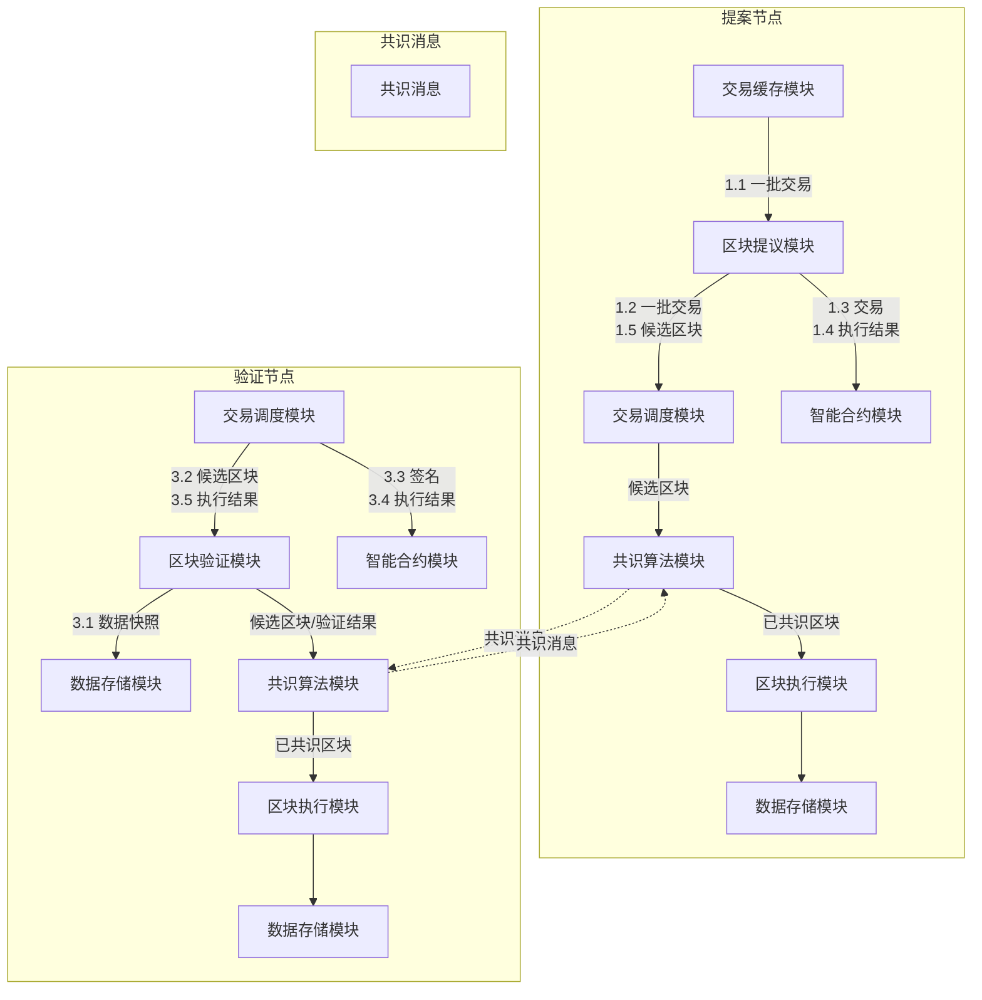
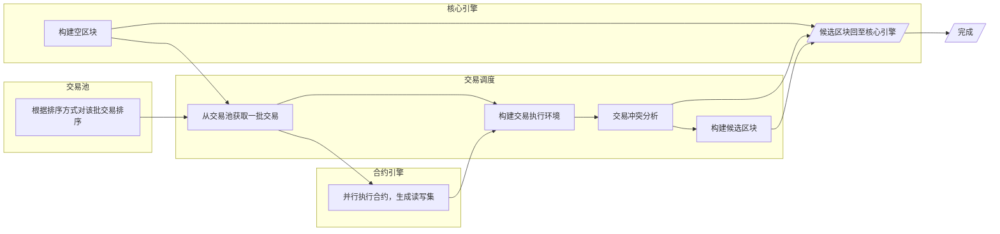
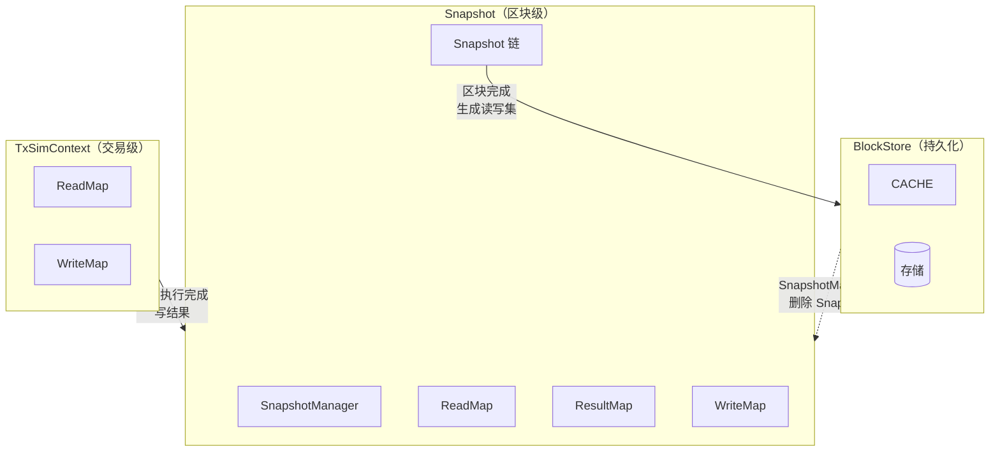
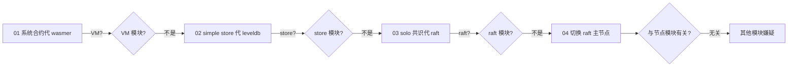
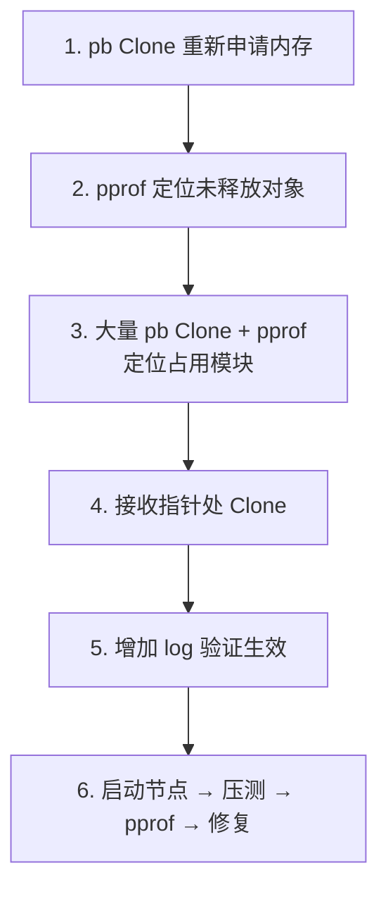
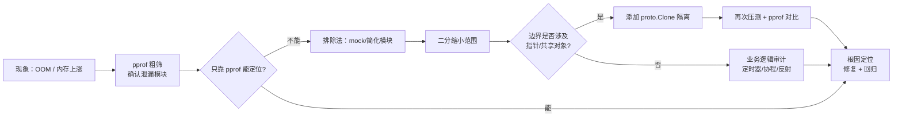

来源：2021-12-21 腾讯 · 曾毅 内部技术分享（PPT 现场笔记）
核心议题：ChainMaker 2.1.0_alpha 压测时节点 OOM 崩溃，对比 2.0.0 无此问题，定位过程持续两周
关键结论：根因不在交易池而在 Snapshot 模块；Snapshot 内部 map 的 put/get key 计算逻辑不一致（CalcBlockFingerPrint vs calcSnapshotFingerPrint），导致数据只入不删。配合 protobuf.Clone 显式深拷贝 + pprof 才得以定位。
整理版本：v1.0 · 2026-08-20

### 1. 问题背景

|||
|---|---|
|现象|2.1.0_alpha 版本压测，节点内存持续上涨，不足 2 小时即 panic（OOM）|
|关键对比|2.0.0 版本无此问题|
|定位耗时|持续两周|
|表面假象|起初通过 pprof 分析认为是 交易池 内存溢出，实际为 Snapshot 模块|


### 2. 定位工具：pprof 简介

pprof 是 Go 官方提供的可视化图形性能分析工具，包含在 net/http/pprof 和 runtime/pprof 两个包中。

#### 2.1 两种包的使用场景

|||
|---|---|
|runtime/pprof|可结束的代码块（如一次编解码操作）|
|net/http/pprof|不可结束的代码块（如 web 应用），对 runtime/pprof 的二次封装|


配图：01-pprof获取数据.png（pprof 介绍与三种数据获取方式对照表）

#### 2.2 三种数据获取方式

||||
|---|---|---|
|go test|函数级基准测试|-cpuprofile / -memprofile|
|HTTP|任意运行中的服务|go tool pprof http://127.0.0.1:9090/debug/pprof/heapgo tool pprof --seconds 10 http://127.0.0.1:9090/debug/pprof/profile|
|输出文件|非常驻服务|pprof.StartCPUProfile / pprof.WriteHeapProfile|


配图：01-pprof获取数据.png 同样展示了上表原始 PPT 排版。

#### 2.3 最简单的启用方式

```go
import _ "net/http/pprof"

go func() {
    http.ListenAndServe("0.0.0.0:6060", nil)
}()
```

随后通过 go tool pprof 分析：

```bash
# 堆内存分析
go tool pprof http://localhost:6060/debug/pprof/heap

# 30 秒 CPU profile
go tool pprof http://localhost:6060/debug/pprof/profile?seconds=30
```


配图：02-启用pprof.png（含官方 blog 链接 https://go.dev/blog/pprof）

### 3. 长安链模块基础（理解内存问题的前提）

分析内存问题前必须熟悉长安链核心模块结构。

#### 3.1 产块流程总览（提案节点 + 验证节点）



4 个阶段编号：

|||
|---|---|
|1|提议候选区块（提案节点）|
|2|共识候选区块|
|3|验证候选区块（验证节点）|
|4|执行候选区块|


配图：03-产块流程总览.png（完整模块交互原始图）

#### 3.2 产块节点详细泳道图




配图：04-产块节点泳道图.png（4 泳道原始版：核心引擎 / 交易调度 / 交易池 / 合约引擎）

#### 3.3 数据处理过程（核心内存路径）

数据流向（最关键的内存路径）：

||||
|---|---|---|
|前置区块|Store 模块|长期持久化|
|当前区块合约执行结果|Snapshot 模块|区块级|
|当前交易合约执行结果|TxSimContext|交易级|
|交易执行完毕|TxSimContext → Snapshot；TxSimContext 抛弃|—|
|区块执行完毕|Snapshot 产出 Txs + 读写集 → 生成结果区块|—|
|新区块写入|Store；SnapshotManager 删除对应 Snapshot|—|





配图：05-数据处理过程.png（UML 类图 + 文字说明原始版）

### 4. 内存溢出定位过程

#### 4.1 排查方向（8 类常见嫌疑）

||||
|---|---|---|
|1|内存溢出|OOM panic|
|2|内存大量申请/释放|GC 回收慢，内存过高时静置一小时左右会逐渐恢复|
|3|协程泄露|—|
|4|协程数量异常|几万 ~ 几十万|
|5|对象数量异常|—|
|6|反射使用|GC 问题；CGO 难以定位|
|7|定时器使用|内存泄露|
|8|业务逻辑问题|—|


#### 4.2 排除法研究（逐步缩小嫌疑范围）

||||
|---|---|---|
|01|用 系统合约 替代 wasmer 合约|内存溢出不是 VM 模块引起|
|02|用 simple 版 store 替代 leveldb|内存溢出不是 store 模块引起|
|03|切到 solo 共识 压测|内存溢出不是 raft 模块引起|
|04|切换 raft 主节点|内存溢出与压测节点模块无关|





配图：06-研究方法排除法.png

#### 4.3 合约问题验证

- 换一个合约（替换 EVM 或系统合约）是否还会触发内存溢出？
- 系统合约可以写成非常简单的形式
- 用最简单的合约方法验证是否仍会复现


配图：07-合约问题排查.png（GoLand IDE 截图：运行 TestGetGas 单测，PASS 0.00s）

### 5. 研究难点

||||
|---|---|---|
|I|内存溢出问题无法 Debug|一方面 OOM 无法通过 Debug 模式发现，另一方面 Goland 对 delve MI 支持不好，也支持常规 Debug|
|II|日志看上去正常|开启 DEBUG 日志后，对应的提交、删除等日志都有记录|
|III|代码不熟悉|核心模块本身较复杂，逻辑较多，且非本人设计与编写，很多细节不熟悉|
|IV|模块交错纵横|核心模块与共识模块通过 MessageBus 来回交互；还涉及交易池、Snapshot、TxSimContext 等，逻辑复杂，定位困难|


配图：08-研究难点.png

### 6. 解决方法（6 步）

||||
|---|---|---|
|1|pb 对象的 Clone|重新申请内存，构造独立对象|
|2|pprof|定位未释放的对象|
|3|大量 pb Clone + pprof|定位具体占用内存的模块|
|4|在接收指针参数的地方进行 Clone|切断指针引用传递导致的内存悬挂|
|5|增加 log|确保修改生效|
|6|启动节点 → 压测 → pprof 跟踪|找到 Bug，提醒相关开发修复|





配图：09-解决方法.png

### 7. 根因分析 & 总结

#### 7.1 根因（Snapshot 模块 key 不一致）

Snapshot 中存在一个 map：

- 放入数据时使用 *utils.CalcBlockFingerPrint* 计算 key
- 删除数据时使用 *calcSnapshotFingerPrint* 计算 key
- 两套 key 计算逻辑不同，导致 key 不一致
- 结果：数据只放入不删除，累计占满内存 → OOM

#### 7.2 四点经验

- 从 pprof 分析以为是交易池的内存溢出，实际上是 Snapshot 模块的内存溢出。只靠 pprof 完全无法定位这个问题。
- mock 或简化整个流程的各个模块，逐步缩小定位范围。
- protobuf 提供了深拷贝对象的方法（proto.Marshal / proto.Unmarshal，或 proto.Clone）：不使用对象指针而是使用新拷贝的对象，再配合 pprof 可定位真实的内存溢出点。
- Snapshot 中存在一个 map，其放入数据时使用 *utils.CalcBlockFingerPrint* 计算 key，删除数据时使用 *calcSnapshotFingerPrint* 计算 key，因为计算逻辑不同，导致 key 不同，从而数据只放入不删除。


配图：10-总结.png

### 8. 整理后补充（关键技术点）

#### 8.1 protobuf 深拷贝

当数据通过接口层层传递时，使用 指针引用 看似节省内存，但会在以下情况下埋下隐患：

- 生命周期不匹配：map put/get 跨模块时，若中间发生对象变更可能影响 key 一致性；
- 模块边界：跨模块接收指针时，对方可能长期持有引用导致无法 GC；
- map key 计算：对复杂结构体计算 fingerprint 时，同一对象的指针 vs 拷贝值 算出的 key 必须一致。

修复模式：在模块边界或 map 存储前 proto.Clone 一份独立对象。

#### 8.2 pprof 实战套路

|||
|---|---|
|进程持续运行（web/服务）|net/http/pprof + go tool pprof 远程采样|
|单次编解码/批处理|runtime/pprof.StartCPUProfile / WriteHeapProfile 落盘|
|函数级基准|go test -bench -cpuprofile -memprofile|
|分析方式|top / list / web（可视化火焰图）|
|多轮对比|对比 fix 前后的 alloc_space，定位新增增长点|


#### 8.3 内存问题定位通用流程



### 9. 原文出处

- 演讲：长安链内存溢出 BugFix 实践 · 腾讯 · 曾毅
- 时间：2021-12-21
- 形式：内部技术分享（PPT 17 页，截图 10 张）
- 原始笔记：C:\node\废寝忘食\Chainmaker\会议记录\2021-12-21_长安链内存溢出BugFix实践.md


整理版本：v1.0 · 2026-08-20
